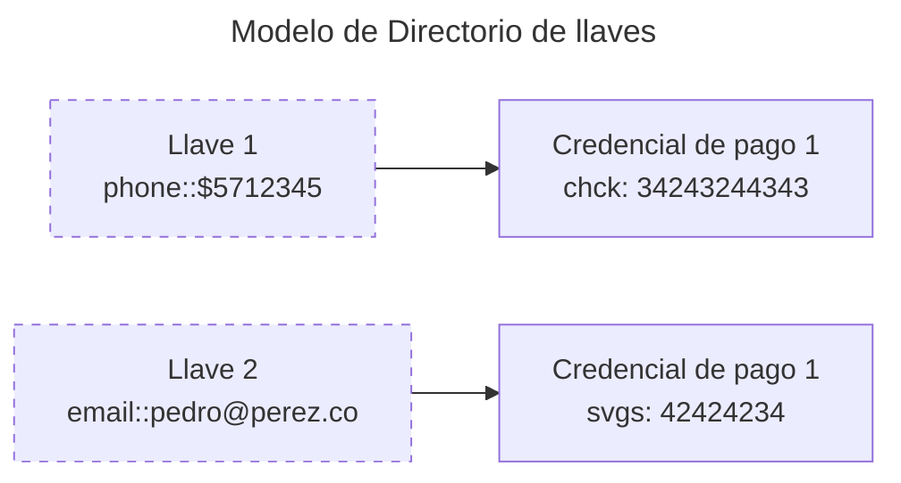

## Sobre las llaves y signers

Las llaves a nivel de regulación se mapearán a los signers de Transfiya en una relación uno a uno.

Transfiya soporta multiples llaves usando el modelo de signers que representan credenciales de pago que incluye datos personales, el tipo de cuenta y el estado de la cuenta.

Signers se pueden usar para transferencias reguladas y no reguladas. Una llave es equivalente a una credencial de pago o signer.

## Modelo de data

Modelo de data completo para signers se puede ver aca:

| Nombre | Transfiya | Requerido | Condición | Tipo | Validación | Comentario |
| --- | --- | --- | --- | --- | --- | --- |
| Tipo de llave | labels.aliasType | Requerido |  | Texto | Ver tabla `labels.aliasType` | Nuevo valor requerido por regulación. |
| Valor de llave | labels.aliasValue | Requerido |  | Texto | Ver tabla `labels.aliasValue` | No distingue entre mayúsculas y minúsculas, se almacena en mayúsculas. |
| Estado de llave | labels.status | Opcional con condición | No permitido en llamada de creación. | Texto | Ver tabla `labels.status` | ACTIVE por defecto. |
| Identificador | handle | Opcional |  | Texto | 26-35 caracteres alfanuméricos con estructura base58 |  |
| Tipo de identificación | labels.proprietary | Requerido |  | Texto | Ver tabla `labels.proprietary` |  |
| Descripción | labels.description | Opcional |  | Texto | Máximo 255 caracteres. |  |
| Número de identificación | labels.identification | Requerido |  | Texto | Máximo 18 caracteres alfanuméricos, caracteres especiales no permitidos. |  |
| Tipo de cliente | labels.type | Requerido |  | Texto | Uno de los valores:
PERSON, BUSINESS, TROUPE | Solo PERSON y BUSINESS son usados para transferencias reguladas. |
| Nombre de entidad legal del cliente | labels.name | Requerido con condición | labels.type = 'BUSINESS' | Texto | 1-140 caracteres |  |
| Primer nombre del cliente | labels.firstName | Requerido con condición | labels.type = 'PERSON' | Texto | 1-40 caracteres |  |
| Segundo nombre del cliente | labels.secondName | Opcional con condición | labels.type = 'PERSON' | Texto | 1-40 caracteres | Nuevo valor requerido por regulación. |
| Primer apellido del cliente | labels.lastName | Opcional con condición | labels.type = 'PERSON' | Texto | 1-40 caracteres | Cambiado a opcional para coincidir con la regulación. |
| Segundo apellido del cliente | labels.secondLastName | Opcional con condición | labels.type = 'PERSON' | Texto | 1-40 caracteres | Nuevo valor requerido por regulación. |
| País de residencia | labels.countryOfResidence | Opcional |  | Texto | Código ISO de país de 2 caracteres. [https://www.iso.org/obp/ui](https://www.iso.org/obp/ui/#search) |  |
| Identificación de entidad emisora | labels.createdBy | Generado por Transfiya |  | Texto | Referencia de participante Transfiya | Identificador de billetera del banco en Transfiya. |
| Tipo de método de pago | labels.bankAccountType | Requerido |  | Texto | Uno de los valores:
SVGS, CACC, DBMO, DORD, DBMI |  |
| Número de método de pago | labels.bankAccountNumber | Requerido |  | Texto | Máximo 34 dígitos |  |
| Código nacional del banco | labels.bankBicfi | Opcional |  | Texto | 4 dígitos |  |
| Nombre del banco | labels.bankName | Opcional |  | Texto | Máximo 64 caracteres |  |
| Número de identificación del banco | labels.bankId | Opcional |  | Texto | Máximo 9 caracteres numéricos | Representa un número NIT del banco sin dígito de verificación o un código asignado por BanRep. |
| Referencia del router del banco | labels.routerReference | Requerido |  | Texto | Máximo 34 caracteres alfanuméricos, debe comenzar con `$` | Identificador de billetera del banco en Transfiya. |
| Fecha/hora de creación del registro | labels.created | Generado por Transfiya |  | Texto | Fecha y hora en formato ISO 8601 |  |
| Fecha/hora de modificación del registro | labels.updated | Generado por Transfiya |  | Texto | Fecha y hora en formato ISO 8601 |  |
| Código SPBVI objetivo | labels.targetSpbviCode | Opcional |  | Texto | Ver tabla `labels.targetSpbviCode` | TFY por defecto. |
| Fecha/hora de consentimiento del usuario | labels.consented | Opcional |  | Texto | Fecha y hora en formato ISO 8601, será establecido por Transfiya si no se proporciona. | Nuevo campo para registrar el momento en que el usuario dio consentimiento para registrar datos. |
| Keeper | keeper | Requerido |  | Array | Ver tabla `keeper` | Llave pública del firmante. |

### Tipos de llaves

Para hacer que los signers sean compatibles con la regulación, se han añadido nuevas etiquetas que definen claramente el tipo y valor de cada alias (llave). Estas etiquetas permiten una integración fluida entre el sistema Transfiya y los requisitos regulatorios establecidos.

Signer label (`labels.aliasType`):

| Name | Transfiya | Regulation |
| --- | --- | --- |
| Phone number | PHONE | M |
| Alphanumeric | ALPHANUM | O |
| Email | EMAIL | E |
| Document number | NRIC | NRIC |
| Merchent Id | MERCHANT | B |

Elemplo y validaciones de alias label (`labels.aliasValue`):

| Tipo de alias | Ejemplo | Validación | Comentario |
| --- | --- | --- | --- |
| Número de teléfono | `3012344567` | Debe comenzar con `3` y tener 9 dígitos después de este prefijo. |  |
| Alfanumérico | `@JORGE35` | Comienza con el símbolo `@`. Máximo 20 caracteres alfanuméricos y mínimo 5 caracteres alfanuméricos después del símbolo `@`. | El símbolo `@` está reservado para IDs alfanuméricos, nombres de usuario, etc. |
| Correo electrónico | `TEST@COMPANY.IO` | Máximo 92 caracteres. Debe tener un único carácter `@`. Máximo 30 caracteres antes del `@` y 61 después. |  |
| Número de documento | `PR5002499` | Mínimo 3 y máximo 18 caracteres alfanuméricos, no se permiten caracteres especiales. | El número de identificación del documento debe ser único en el sistema, incluso si se repite en Colombia. |
| ID de comerciante | `0012345678` | Comienza con `00` y tiene 10 dígitos en total. |  |

<Warning>
    Para habilitar compatibilidad con el sistema actual, validaciones de signers relacionados con los llaves regulatorios se van a mostrar en forma de warnings en REST API.
</Warning>

### Status de signers (llaves regulatorias)

Signers van a incluir el estado de las llaves regulatorias asociadas a cada signer.

Los estados se manejan usando el label staus an nivel de signer (`labels.status`):

| Name | Transfiya | Regulation |
| --- | --- | --- |
| Active | ACTIVE | ACTV |
| Blocked by client | SUSPENDED_BY_CLIENT | SUSP |
| Blocked by participant | SUSPENDED_BY_PARTICIPANT | SUSB |
| Inactive (cancelled) | INACTIVE | ICTV |
| Active by participant | ACTIVE_BY_PARTICIPANT | ACTB |

### Tipo de documento

Document type enum (`labels.proprietary`):

| Name | Transfiya | Regulation | Comment |
| --- | --- | --- | --- |
| Citizenship Card | CC | CC |  |
| Foreign ID Card | CE | CE |  |
| Passport Number | PA | PAS |  |
| Identity Card | TI | TDI |  |
| Unique Personal Identification Number | NUIP | NUIP |  |
| Tax Identification Number | NIT | NIT |  |
| Other | OTR | - | Not supported by regulation |
| Temporary Protection Permit | PPT | PPT | New value required by regulation |
| Special Stay Permit | PEP | PEP | New value required by regulation |

### Tipo de cuenta

Tipo de cuenta (`labels.bankAccountType`):

| Name | Transfiya | Regulation | Comment |
| --- | --- | --- | --- |
| Savings accounts | SVGS | CAHO |  |
| Cash trading account | TRAS | - | Not supported by regulation |
| Current account | CACC | CCTE |  |
| Other | OTHR | - | Not supported by regulation |
| Low-amount deposits | DBMO | DBMO | New value required by regulation |
| Ordinary deposits | DORD | DORD | New value required by regulation |
| Inclusive low-amount deposits | DBMI | DBMI | New value required by regulation |

### Codigos de participantes SPBVI

SPBVI codes (`labels.targetSpbviCode`):

| Name | Code |
| --- | --- |
| Transfiya | TFY |
| Entre cuentas | ENT |
| Credibanco | CRB |
| Visionamos | VIS |

### Keeper (firmas digitales)

El objeto Keeper contiene información de la llave almacenada en el lado del banco que se utiliza para asegurar este firmante y autorizar los pagos relacionados con él.

Los campos del keeper se definen a continuación y siguen en el modelo actual:

| Nombre | Campo | Tipo | Requerido | Validación |
| --- | --- | --- | --- | --- |
| Tipo de llave | scheme | Texto | Requerido | Uno de:
`ecdsa-ed25519`, `eddsa-ed25519` |
| Llave pública | public | Texto | Requerido | 64-130 caracteres |

## Sobre billeteras o wallets

Billeteres permiten almacenar y gestionar múltiples llaves o signers de manera segura y conveniente.

<Note>
    La plataforma va mantener compatiblidad con entidades que cuentan con el modelo actual de billeteras, pero para casos regulados no se van a usar despues de salida en producción.
</Note>
