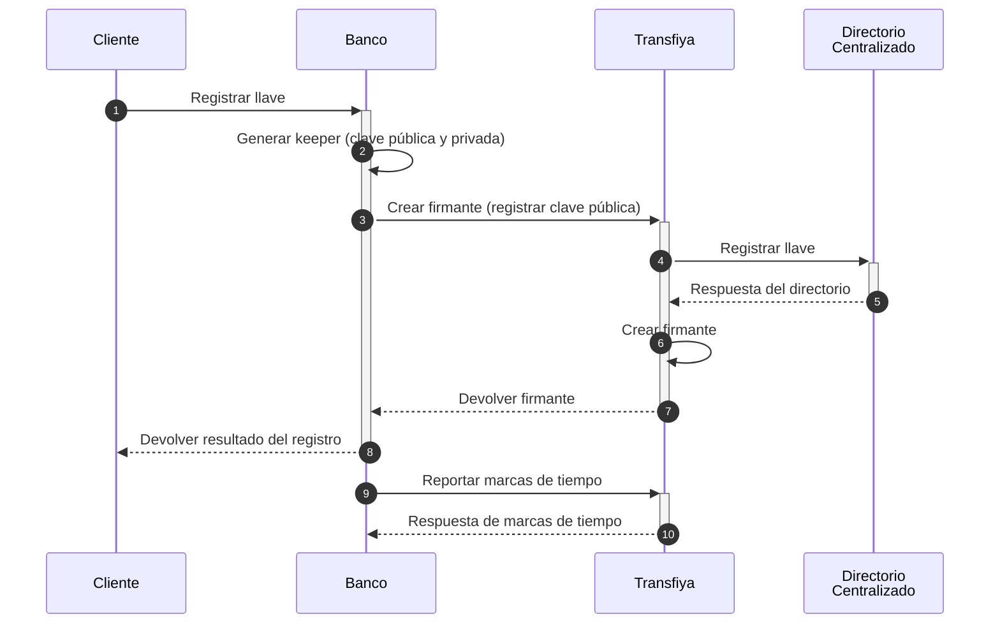
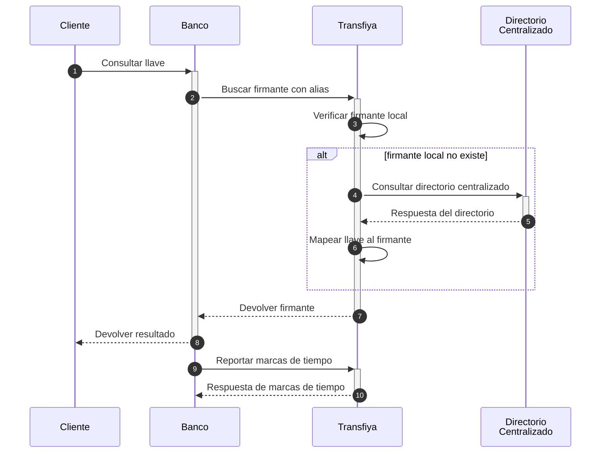

DICE utiliza marcas de tiempo para dos operaciones clave: creación (**onboarding**) y resolución de llaves (**key resolution**).

### Creación de Llaves

Para cubrir el caso de creación, Transfiya define un nuevo endpoint:

`POST /v1/signer/<handle>/timestamps`

Este endpoint requiere que los participantes envíen las dos marcas de tiempo finales asociadas al proceso de creación del firmante:

<Steps>
  <Step title="received">
    Momento en que el participante recibió una respuesta de incorporación de firmante desde Transfiya.
  </Step>
  <Step title="dispatched">
    Momento en que el participante notificó a su usuario el resultado de la operación de incorporación.
  </Step>
</Steps>



<Tabs>
  <Tab title="Request">
    ```json
    curl -X POST \
     -H "x-api-key: <API_KEY>" \
     -H "Authorization: Bearer <TOKEN>" \
     -H "Content-Type: application/json" \
     -d '{
      "received": "2024-10-11T11:59:22.241-05:00",
      "dispatched": "2024-10-11T11:59:22.517-05:00"
     }' "<TRANSFIYA URL>/v1/signer/wRFmYXS2sP9ho9VCZ3j4FuP1j55ABeFvsF/timestamps"
    ```
  </Tab>
  <Tab title="Response">
    ```json
    {
      "error": {
        "code": 0,
        "message": "Success"
      }
    }
    ```
  </Tab>
</Tabs>

## Codigos de Error

| Código de error | Descripción                                                   | HTTP Status |
| --------------- | ------------------------------------------------------------- | ----------- |
| 99              | Unexpected server error                                       | 400         |
| 100             | You don't have permissions to access this method              | 403         |
| 101             | Unauthorized request, invalid or expired token                | 401         |
| 118             | Resource schema validation error, field format is not correct | 400         |
| 121             | Signer not found in database                                  | 400         |
| 123             | Domain rules error, timestamps are not in the expected range  | 400         |

### Resolución de llave

Las marcas de tiempo requeridas para la resolución de llaves son similares a las que se utilizan durante el proceso de incorporación (onboarding). Dado que una solicitud de resolución no crea un firmante en el sistema, las marcas de tiempo finales se deben reportar utilizando el `request id` que se devuelve como parte de la respuesta de la resolución.

**POST /v1/signer/lookup.dice**

<Tabs>
  <Tab title="Request">
    ```json
    curl -X POST \
      -H "Content-Type: application/json" \
      -H "x-api-key: <API_KEY>" \
      -H "Authorization: Bearer <TOKEN>" \
      -d '{
        "aliasValue": "@jorge22",
        "received": "2025-01-14T20:39:17.827-05:00",
        "dispatched": "2025-01-14T20:39:18.005-05:00"
      }' "<TRANSFIYA URL>/v1/signer/lookup.dice"
    ```
  </Tab>
  <Tab title="Response">
    ```json
    {
      "requestId": "01961b67-ebad-7997-87b8-d7f663dca76a",
      "signer_id": "4c57ac39-16f0-489b-89d9-bddfcd352a36",
      "handle": "wRFmYXS2sP9ho9VCZ3j4FuP1j55ABeFvsF",
      "labels": {
        "aliasType": "ALPHANUM",
        "aliasValue": "@JORGE22",
        "status": "ACTIVE",
        "type": "PERSON",
        "firstName": "Jorge",
        "proprietary": "CC",
        "identification": "1010101010",
        "bankAccountType": "SVGS",
        "bankAccountNumber": "12345654321",
        "bankBicfi": "7095",
        "bankName": "Banco Rojo",
        "bankId": "891234918",
        "routerReference": "$bancorojo",
        "createdBy": "$minka",
        "targetSpbviCode": "TFY",
        "created": "2024-10-11T11:59:24.241-05:00",
        "consented": "2024-10-11T11:59:24.241-05:00"
      },
      "keeper": [
        {
          "scheme": "ecdsa-ed25519",
          "public": "0463e75c8b975f069813ca8e6c36c0b6fd246eac708affb7ed2c6480fa201defe8725322d6380ec66e94f6dcb49f635c0ca51296e48da4a12b3ec66582a1297adf"
        }
      ],
      "error": {
        "code": 0,
        "message": "Success"
      }
    }
    
    ```
  </Tab>
</Tabs>



<Info>
  

  Las marcas de tiempo finales se reportan en el paso 9.
</Info>

Las marcas de tiempo que los participantes deben enviar a Transfiya son las mismas utilizadas en el flujo de resolución:

- `received` → momento en que el participante recibió una respuesta de resolución de firmante desde Transfiya.
- `dispatched` → momento en que el participante notificó al usuario sobre el resultado de la operación de resolución.

**Ejemplo de API:**

**POST /v1/signer/lookup.dice/\<requestId\>/timestamps**

<Tabs>
  <Tab title="Request">
    ```json
    curl -X POST \
     -H "x-api-key: <API_KEY>" \
     -H "Authorization: Bearer <TOKEN>" \
     -H "Content-Type: application/json" \
     -d '{
      "received": "2024-10-11T11:59:22.241-05:00",
      "dispatched": "2024-10-11T11:59:22.517-05:00"
     }' "<TRANSFIYA URL>/v1/signer/lookup.dice/01961b67-ebad-7997-87b8-d7f663dca76a/timestamps"
    ```
  </Tab>
  <Tab title="Response">
    ```json
    {
      "error": {
        "code": 0,
        "message": "Success"
      }
    }
    ```
  </Tab>
</Tabs>

## Codigos de Error

| Código de error | Descripción                                                   | HTTP Status |
| --------------- | ------------------------------------------------------------- | ----------- |
| 99              | Unexpected server error                                       | 400         |
| 100             | You don't have permissions to access this method              | 403         |
| 101             | Unauthorized request, invalid or expired token                | 401         |
| 118             | Resource schema validation error, field format is not correct | 400         |
| 121             | Signer not found in database                                  | 400         |
| 123             | Domain rules error, timestamps are not in the expected range  | 400         |