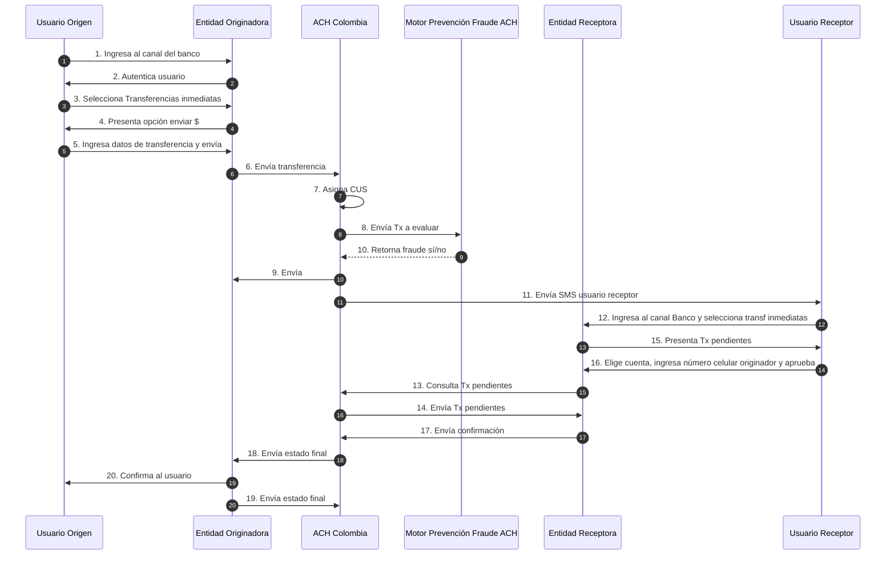
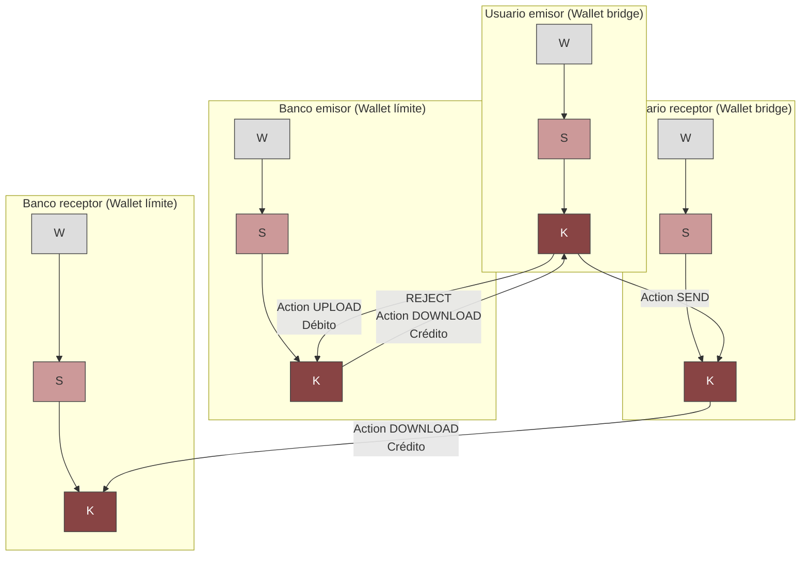
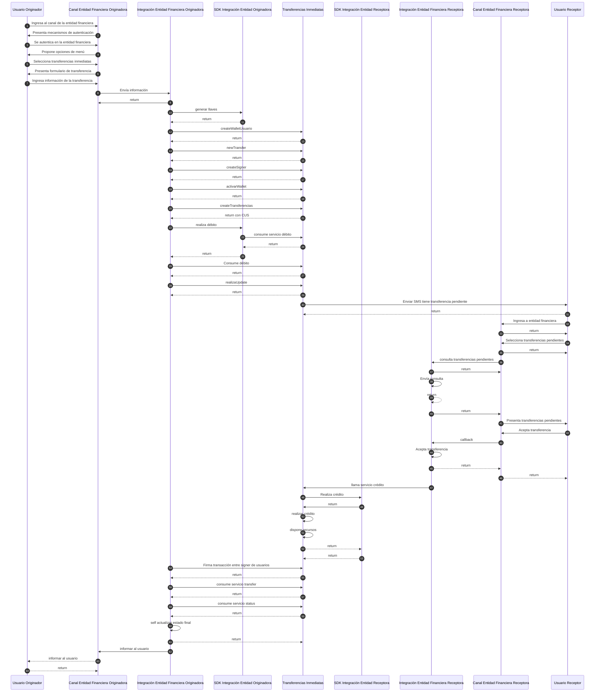
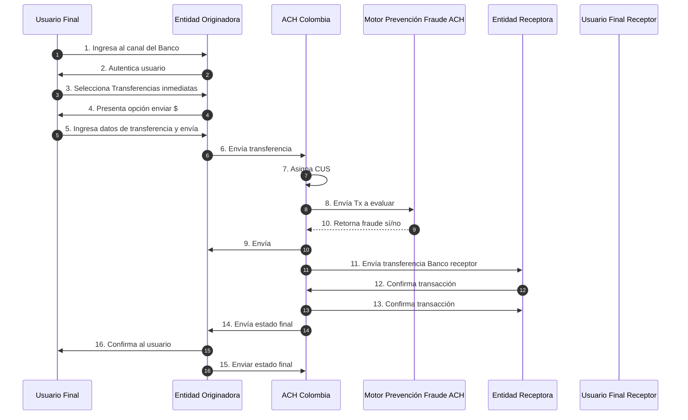
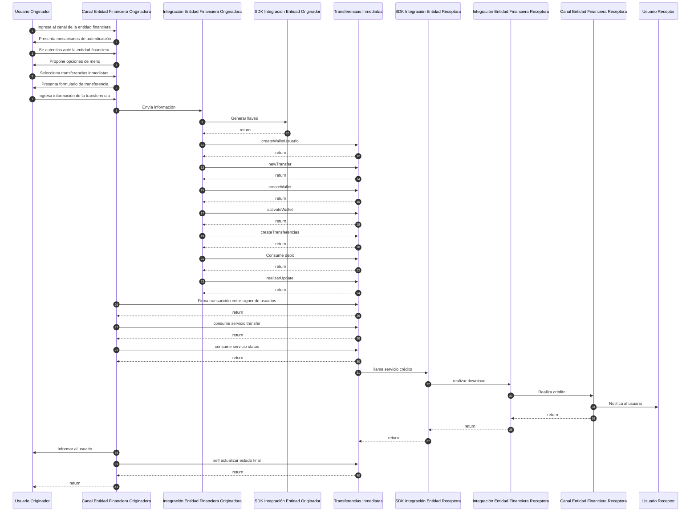
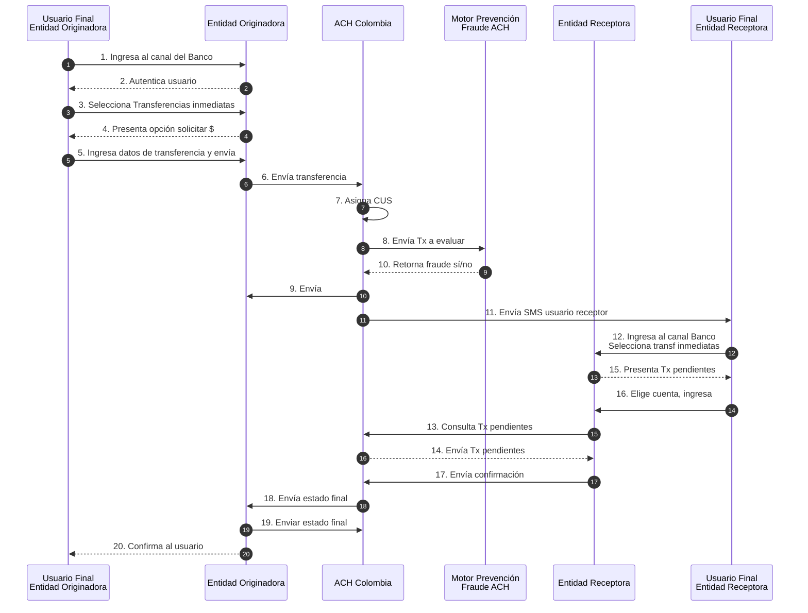
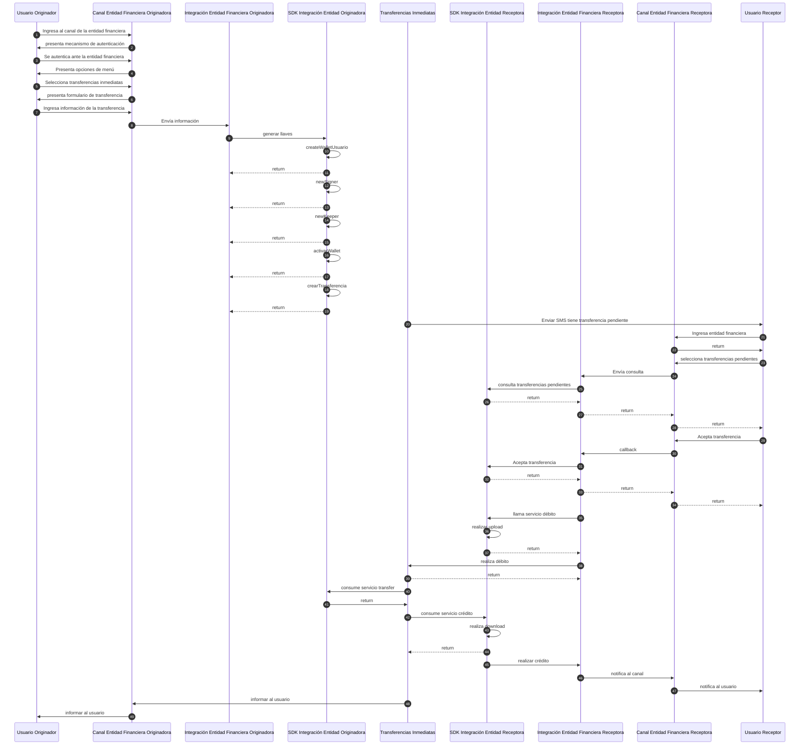
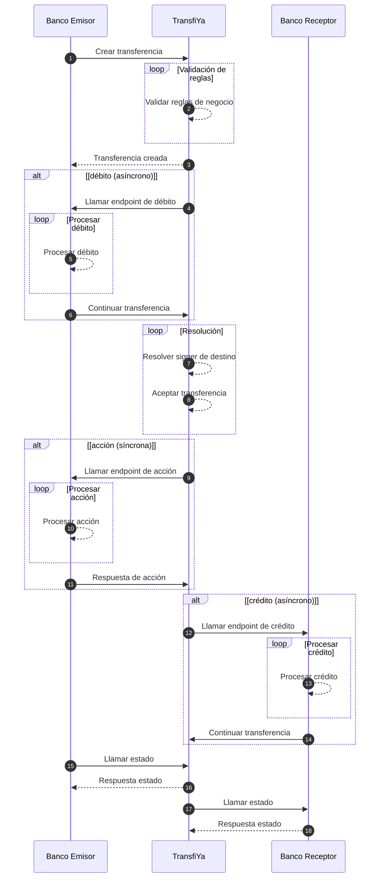
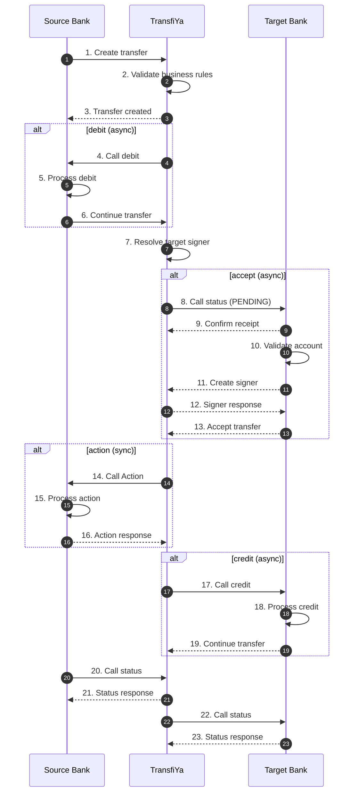

**TIN Cloud** soporta 5 tipos diferentes de flujos de transferencia inmediata. Dos de ellos están orientados al envío de dinero y tres al uso de solicitudes de pago P2P.

### Tipos de flujo

- **Tipo 1**: Transferencia P2P SEND, con SMS y aceptación (sin relación de confianza)
- **Tipo 2**: Transferencia P2P SEND, transferencia inmediata (con relación de confianza)
- **Tipo 3**: Transferencia P2P REQUEST
- **Tipo 4**: Transferencia P2P SEND, transferencia inmediata a número de cuenta
- **Tipo 5**: Transferencia P2P REQUEST, solicitud a un número de cuenta

Cada transferencia P2P se representa con **3 acciones** dentro del núcleo de TIN Cloud:

- **UPLOAD**: Débito de la cuenta bancaria del usuario origen y creación de la acción UPLOAD.
- **SEND o REQUEST**: Movimiento de fondos entre cuentas de usuario.
- **DOWNLOAD**: Crédito en la cuenta bancaria del usuario destino y creación de la acción DOWNLOAD.

---

### Relaciones de Confianza

Los usuarios pueden optar por crear una relación de confianza con otros usuarios. Esta relación de confianza se establece entre el **wallet del usuario origen** (número de teléfono) y el **signer del usuario destino** (cuenta bancaria). Es una relación unidireccional. Que el signer destino confíe en el wallet del origen **no implica** que el origen confíe en el destino.

- Si **existe** relación de confianza, TIN Cloud ejecuta el flujo completo de forma automática y el usuario destino recibe el dinero inmediatamente. En este caso, **no se envía un SMS** desde TIN Cloud. Esta funcionalidad puede ser implementada opcionalmente por la aplicación del banco.

- Si **no existe** relación de confianza:
  - El usuario destino debe **aceptar o rechazar** manualmente la transferencia pendiente.
  - TIN Cloud enviará un **SMS** notificando al usuario destino sobre la transferencia pendiente.
  - El usuario destino tiene **24 horas** para ingresar a la aplicación del banco y aceptar la transferencia. Si no lo hace, la transferencia será automáticamente **rechazada**.

---

### Tipo 1: Transferencia P2P SEND con aceptación (sin relación de confianza)

Este flujo se ejecuta en dos casos:

1. El wallet del usuario destino **no tiene una relación de confianza** con el signer del usuario origen.
2. El wallet del usuario destino **no tiene un signer registrado** (cuenta bancaria) para recibir transferencias TIN.

## Flujos de Acción 

## Codigo de Flujo

## Tipo 2: Transferencia P2P - Envío inmediato (con relación de confianza)

Este flujo ejecuta una transferencia P2P inmediata de extremo a extremo en el caso de que el **firmante del usuario destino tenga una relación de confianza con el wallet del usuario origen**.

<Info>
Cuando existe una relación de confianza, el sistema Transfiya realiza automáticamente el flujo completo de la transferencia sin necesidad de aceptación manual por parte del usuario receptor.
</Info>

## Flujo de Acción

##Flujo de Código

## TIPO 3: Transferencia P2P de Solicitud (Request)

Este flujo se ejecuta en el caso en que el firmante del usuario receptor está solicitando un pago desde el monedero del usuario originador.

## Flujo de Acción

## Flujo de Código

### Tipo 4: Transferencia P2P SEND, transferencia inmediata a un número de cuenta

Este flujo se ejecuta en el caso en que el destino de una transferencia SEND sea una referencia de cuenta (`<tipo>:<número>@<banco>`). El flujo de procesamiento es el mismo que para transferencias SEND regulares, con la única diferencia en el comportamiento de aceptación.

En lugar de notificar al usuario mediante SMS, el sistema notificará directamente al banco de destino a través del bridge para registrar al usuario y aceptar la transferencia. Este modelo de aceptación nos permite procesar pagos hacia cualquier cuenta sin que los usuarios tengan que registrarse manualmente en el sistema antes de recibir transferencias.

> 💡 **Nota:** Si el usuario ya se encuentra registrado en el sistema, el flujo de la transferencia es idéntico al de las transferencias Tipo 2.

<Info>

El procesamiento de la transferencia en el caso en que el usuario destinatario **no esté registrado en el sistema** es similar, con la única diferencia de que **la transferencia no se aceptará automáticamente**. En su lugar, **TransfiYa notificará al banco receptor para registrar al usuario**, y el banco deberá aceptar la transferencia una vez finalizado el proceso de onboarding.

</Info>
