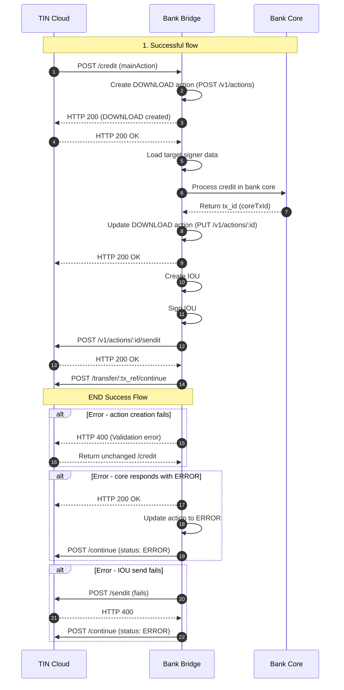

Este endpoint ejecuta la descarga (download) en el sistema de TIN Cloud y acredita los fondos en el núcleo bancario (`core bancario`) de la entidad financiera.

<Warning>
**IMPORTANTE:** Para evitar el riesgo de procesar créditos duplicados, es indispensable que el banco valide si la operación de crédito **ya ha sido procesada** para esta transferencia.

Esta verificación puede implementarse consultando si existe una acción de tipo `DOWNLOAD` con el ID correspondiente (CUS) en la base de datos del banco.
</Warning>

<Warning>
**IMPORTANTE:** Los objetos de error mostrados en los diagramas son **ilustrativos**. Pueden variar según la causa del error.

El banco debe construir y enviar el objeto de error correspondiente a la causa real del fallo.
</Warning>



## Casos de crédito
<Steps>
<Step title="Caso 1: Transferencia de crédito regular">
En este caso, el banco acredita la cuenta del usuario **destino** como parte de un flujo exitoso `SEND` o `REQUEST`. Este paso representa el tercero en el flujo `UPLOAD → SEND → DOWNLOAD` (o `DEBIT → SEND → CREDIT`).
</Step>

<Step title="Caso 2: Reversión de débito">
Aquí, el banco acredita nuevamente la cuenta del **usuario origen** como parte de un flujo fallido de `SEND` o `REQUEST`. Es decir, el usuario original recupera el dinero como parte del proceso de reversión (`REJECT`).
</Step>
</Steps>
## Pasos para procesar el crédito

<Steps>
<Step title="Crear acción DOWNLOAD">
Crear la acción con los siguientes valores:

```json
{
  "source": "Action.target",
  "target": "bank_limit_account",
  "amount": "Action.amount"
}
```
</Step> 
<Step title="Consultar datos del firmante objetivo"> 
Usar la información de `Action.snapshot.target.signer.handle` y recuperar los datos de la cuenta bancaria localmente. 
</Step> 
<Step title="Analizar tipo de operación"> 
Analizar `Action.labels.type` para determinar si se trata de un crédito normal por `SEND`, `REQUEST` o una reversión por `REJECT`. 
</Step> 
<Step title="Decidir aceptar o rechazar la transferencia"> 
Si se decide rechazar, devolver la acción con `status: "REJECT"`. Si se acepta, retornar con `status: "PENDING"`. 
</Step> 
<Step title="Cargar Keeper del firmante objetivo"> 
Cargar el firmante relacionado con el campo `Action.snapshot.target.signer.handle`. 
</Step> 
<Step title="Actualizar etiquetas de la acción"> 
Actualizar `labels` de la acción con información necesaria como `tx_ref`, `description`, `domain`, entre otros. 
</Step> 
<Step title="Firmar acción DOWNLOAD"> 
Firmar la acción usando el Keeper del firmante. 
</Step> 
<Step title="Enviar acción firmada a /v1/transfer/:tx_ref/continue"> 
Enviar la acción con estado `COMPLETED` al endpoint de TIN Cloud para continuar el flujo. 
</Step>
</Steps>
## Continuar procesamiento
<Info>
⚠️ IMPORTANTE: La referencia de la transacción en el sistema bancario debe ser guardada en labels.tx_id. Esta referencia será usada en el proceso de conciliación y debe ser única por cada acción DOWNLOAD.

💡 NOTA: La llamada al endpoint /v1/transfer/:tx_ref/continue debe ejecutarse antes de 8 minutos después de la aceptación de la transferencia. Si no se hace, el estado de la transferencia se actualizará automáticamente a ERROR.

</Info> 

## Flujo Exitoso

<Steps>
<Step title="TIN Cloud envía solicitud de crédito">
TIN Cloud calls `/credit` bank endpoint.
```json
{
  "source": "wLd9MEASjQQTYywoXnDNwTRpgwiDfyHj6U",
  "target": "$573123224353",
  "amount": "200.00",
  "symbol": "$tin",
  "labels": {
    "hash": "0e2dd63b3132df7e6f5224983c0beb47ab5fa1e97c40f9d1960d8cfe6e856cda",
    "type": "SEND",
    "domain": "tin",
    "flowId": "buDwBxynDK4hvumBG",
    "status": "COMPLETED",
    "tx_ref": "buDwBxynDK4hvumBG",
    "created": "2022-08-04T10:46:51-05:00",
    "iouHash": "0c50763b8627e796dd7680cbca5fdeeb8e3cfa0d847d1cc1dcbcfa3e85caec64",
    "updated": "2022-08-04T10:48:01-05:00",
    "description": "DEV - REQUEST trx 01",
    "sourceChannel": "APP",
    "deviceFingerPrint": {
      "city": "Bogotá",
      "hash": "26fff5af6441f8e15a71e8d62c361714484b1b308c99e8eb68ca85e2a7e0dc58",
      "model": "Huawei Mate 20 Pro",
      "country": "Colombia",
      "operator": "Bharti Airtel Limited",
      "SIMCardId": "8991101200003204510",
      "ipAddress": "2001:0db8:85a3:0000:0000:8a2e:0370:7334",
      "mobileDevice": "990000862471854"
    }
  },
  "snapshot": {
    "source": {
      "signer": {
        "handle": "wLd9MEASjQQTYywoXnDNwTRpgwiDfyHj6U",
        "labels": {
          "firstName": "Cale",
          "lastName": "Sanford",
          "identification": "1231231",
          "bankBicfi": "9574",
          "bankName": "bancosanti",
          "proprietary": "CC"
        }
      },
      "wallet": {
        "handle": "$573123224352",
        "labels": {
          "type": "PERSON",
          "created": "2022-06-10T09:54:42-05:00",
          "updated": "2022-06-10T09:54:42-05:00"
        },
        "signer": ["wLd9MEASjQQTYywoXnDNwTRpgwiDfyHj6U"]
      }
    },
    "symbol": {
      "signer": {
        "handle": "wMxKCAzsQBiUURDU3xD3xuSbVo1S9jmf3d",
        "labels": {
          "created": "2018-10-19T20:23:22.041Z",
          "createdBy": "ZhrQA3vcm17h2RRO4LrJ"
        }
      },
      "wallet": {
        "handle": "$tin",
        "labels": {
          "type": "SYMBOL",
          "created": "2018-10-19T20:22:48.350Z",
          "updated": "1970-01-01T15:38:20-05:00",
          "createdBy": "ZhrQA3vcm17h2RRO4LrJ"
        },
        "signer": ["wMxKCAzsQBiUURDU3xD3xuSbVo1S9jmf3d"],
        "default": "wMxKCAzsQBiUURDU3xD3xuSbVo1S9jmf3d"
      }
    },
    "target": {
      "signer": {
        "handle": "wVVPzAGAkv5a2AANEdmeActMpWhbByQ81v",
        "labels": {
          "type": "PERSON",
          "email": "Noemi_Ruecker18@yahoo.com",
          "mobile": "573123224353",
          "bankName": "bancosanti",
          "lastName": "Lehner",
          "bankBicfi": "9574",
          "createdBy": "A16iU3t38Tygr70uO1qf",
          "firstName": "Otha",
          "description": "Global",
          "proprietary": "CC",
          "identification": "123456",
          "bankAccountType": "SVGS",
          "routerReference": "$bancosanti",
          "bankAccountNumber": "971",
          "countryOfResidence": "CO"
        }
      },
      "wallet": {
        "handle": "$573123224353",
        "labels": {
          "type": "PERSON",
          "created": "2022-06-10T09:57:21-05:00",
          "updated": "2022-06-10T11:19:10-05:00",
          "channelSms": "573123224353"
        },
        "signer": [
          "wVVPzAGAkv5a2AANEdmeActMpWhbByQ81v",
          "wVXQDT59RzXdPZD4CyK6z8FWebZmyZ9aHm"
        ]
      }
    }
  },
  "action_id": "bbffb8db-466c-403f-8c60-0bbd06261a6e",
  "error": {
    "code": 0,
    "message": "Success"
  },
  "id": "bbffb8db-466c-403f-8c60-0bbd06261a6e"
}
```
</Step>
<Step title="El banco crea la acción DOWNLOAD">
    The Bank creates the action `DOWNLOAD` by making a `POST` request to `/v1/action`.
```json
{
    "source": mainAction.snapshot.target.signer.handle,
    "target": bankKey.signer
    "symbol": mainAction.symbol,
    "amount": mainAction.amount,
    "labels": {
      "type": "DOWNLOAD",
      "deviceFingerPrint": mainAction.labels.deviceFingerPrint,
      "domain": mainAction.labels.domain,
      "tx_ref": mainAction.labels.tx_ref
    }
 }
```
</Step>
<Step title="El banco responde a la solicitud de creación de la acción">
    El endpoint del banco devuelve a TIN Cloud la acción `DOWNLOAD` con el estado `PENDING` en el cuerpo de la respuesta.  
    La respuesta debe incluir un objeto `error` con código `0` y el mensaje `"success"`.
```json
{
  "action_id": "2aa49d5d-3dcc-4841-bb3e-baeb9fef4278",
  "source": "wVVPzAGAkv5a2AANEdmeActMpWhbByQ81v",
  "target": "wNbBi3CcZzggFJ9dvDWk35srVGgaAVLzUr",
  "amount": "200.00",
  "symbol": "$tin",
  "labels": {
    "type": "DOWNLOAD",
    "deviceFingerPrint": {
      "city": "Bogotá",
      "hash": "26fff5af6441f8e15a71e8d62c361714484b1b308c99e8eb68ca85e2a7e0dc58",
      "model": "Huawei Mate 20 Pro",
      "country": "Colombia",
      "operator": "Bharti Airtel Limited",
      "SIMCardId": "8991101200003204510",
      "ipAddress": "2001:0db8:85a3:0000:0000:8a2e:0370:7334",
      "mobileDevice": "990000862471854"
    },
    "domain": "tin",
    "tx_ref": "buDwBxynDK4hvumBG",
    "description": "",
    "status": "PENDING",
    "hash": "PENDING",
    "created": "2022-08-04T10:48:03-05:00",
    "updated": "2022-08-04T10:48:03-05:00"
  },
  "snapshot": {
    "source": {
      "wallet": {
        "handle": "$573123224353",
        "labels": {
          "updated": "2022-06-10T11:19:10-05:00",
          "type": "PERSON",
          "channelSms": "573123224353",
          "created": "2022-06-10T09:57:21-05:00"
        },
        "signer": [
          "wVVPzAGAkv5a2AANEdmeActMpWhbByQ81v",
          "wVXQDT59RzXdPZD4CyK6z8FWebZmyZ9aHm"
        ]
      },
      "signer": {
        "labels": {
          "type": "PERSON",
          "bankAccountNumber": "971",
          "bankBicfi": "9574",
          "bankName": "bancosanti",
          "lastName": "Lehner",
          "countryOfResidence": "CO",
          "created": "2022-06-10T09:57:02-05:00",
          "identification": "123456",
          "mobile": "573123224353",
          "email": "Noemi_Ruecker18@yahoo.com",
          "routerReference": "$bancosanti",
          "firstName": "Otha",
          "bankAccountType": "SVGS",
          "proprietary": "CC",
          "createdBy": "A16iU3t38Tygr70uO1qf",
          "description": "Global"
        },
        "handle": "wVVPzAGAkv5a2AANEdmeActMpWhbByQ81v"
      }
    },
    "target": {
      "wallet": {
        "signer": [
          "wcyq8otjHN789tVTMQ4Xx7Dyk7GB9FUsUj",
          "wNbBi3CcZzggFJ9dvDWk35srVGgaAVLzUr"
        ],
        "handle": "$bancosanti",
        "default": "wNbBi3CcZzggFJ9dvDWk35srVGgaAVLzUr",
        "labels": {
          "url": "http://bancosanti.com",
          "limitAlert": "5000000",
          "routerStatus": "https://3ad0-186-170-222-190.ngrok.io/status",
          "routerUpload": "https://3ad0-186-170-222-190.ngrok.io/debit",
          "bankName": "bancosanti",
          "bankBicfi": "9574",
          "routerAuthParams": {},
          "createdBy": "A16iU3t38Tygr70uO1qf",
          "type": "TROUPE",
          "domain": "tin",
          "routerDownload": "https://3ad0-186-170-222-190.ngrok.io/credit",
          "routerAuthMethod": "NONE",
          "routerAction": "https://3ad0-186-170-222-190.ngrok.io/action",
          "created": "2022-06-09T14:55:38-05:00",
          "entityType": "Bancos",
          "updated": "2022-08-04T07:03:45-05:00"
        }
      },
      "signer": {
        "labels": {
          "bankAccountNumber": "160101",
          "bankBicfi": "9574",
          "routerReference": "$bancosanti",
          "created": "2022-06-10T10:46:35-05:00",
          "createdBy": "A16iU3t38Tygr70uO1qf",
          "bankName": "bancosanti",
          "description": "Bank",
          "type": "TROUPE"
        },
        "handle": "wNbBi3CcZzggFJ9dvDWk35srVGgaAVLzUr"
      }
    },
    "symbol": {
      "wallet": {
        "handle": "$tin",
        "default": "wMxKCAzsQBiUURDU3xD3xuSbVo1S9jmf3d",
        "labels": {
          "created": "2018-10-19T20:22:48.350Z",
          "type": "SYMBOL",
          "updated": "1970-01-01T15:38:20-05:00",
          "createdBy": "ZhrQA3vcm17h2RRO4LrJ"
        },
        "signer": ["wMxKCAzsQBiUURDU3xD3xuSbVo1S9jmf3d"]
      },
      "signer": {
        "labels": {
          "createdBy": "ZhrQA3vcm17h2RRO4LrJ",
          "created": "2018-10-19T20:23:22.041Z"
        },
        "handle": "wMxKCAzsQBiUURDU3xD3xuSbVo1S9jmf3d"
      }
    }
  },
  "error": {
    "code": 0,
    "message": "Success"
  }
}
```
</Step>
<Step title="El banco procesa el abono y actualiza la acción">
El banco procesa la operación de crédito en su Core bancario.  
El sistema bancario responde con una referencia de la transacción que debe almacenarse en el campo `labels.tx_id` de la acción `DOWNLOAD`.  

Esta referencia será utilizada posteriormente en los procesos de conciliación y debe identificar de forma clara y única la transacción en el banco asociada a esta acción.  

El banco debe actualizar la acción `DOWNLOAD` utilizando la referencia proporcionada, realizando una llamada `PUT` a `/v1/action/{downloadAction_id}`.

<Tabs>
<Tab title="request">
```json
{
  "labels": {
    "tx_id": "BANKING_CORE_TX_ID"
  }
}
```
</Tab>
<Tab title="response">
```json
{
  "source": "wVVPzAGAkv5a2AANEdmeActMpWhbByQ81v",
  "target": "wNbBi3CcZzggFJ9dvDWk35srVGgaAVLzUr",
  "amount": "200.00",
  "symbol": "$tin",
  "labels": {
    "hash": "PENDING",
    "type": "DOWNLOAD",
    "domain": "tin",
    "status": "PENDING",
    "tx_ref": "buDwBxynDK4hvumBG",
    "created": "2022-08-04T10:48:03-05:00",
    "updated": "2022-08-04T10:48:03-05:00",
    "description": "",
    "deviceFingerPrint": {
      "city": "Bogotá",
      "hash": "26fff5af6441f8e15a71e8d62c361714484b1b308c99e8eb68ca85e2a7e0dc58",
      "model": "Huawei Mate 20 Pro",
      "country": "Colombia",
      "operator": "Bharti Airtel Limited",
      "SIMCardId": "8991101200003204510",
      "ipAddress": "2001:0db8:85a3:0000:0000:8a2e:0370:7334",
      "mobileDevice": "990000862471854"
    },
    "tx_id": 0.4979154374821342
  },
  "snapshot": {
    "source": {
      "signer": {
        "handle": "wVVPzAGAkv5a2AANEdmeActMpWhbByQ81v",
        "labels": {
          "type": "PERSON",
          "email": "Noemi_Ruecker18@yahoo.com",
          "mobile": "573123224353",
          "created": "2022-06-10T09:57:02-05:00",
          "bankName": "bancosanti",
          "lastName": "Lehner",
          "bankBicfi": "9574",
          "createdBy": "A16iU3t38Tygr70uO1qf",
          "firstName": "Otha",
          "description": "Global",
          "proprietary": "CC",
          "identification": "123456",
          "bankAccountType": "SVGS",
          "routerReference": "$bancosanti",
          "bankAccountNumber": "971",
          "countryOfResidence": "CO"
        }
      },
      "wallet": {
        "handle": "$573123224353",
        "labels": {
          "type": "PERSON",
          "created": "2022-06-10T09:57:21-05:00",
          "updated": "2022-06-10T11:19:10-05:00",
          "channelSms": "573123224353"
        },
        "signer": [
          "wVVPzAGAkv5a2AANEdmeActMpWhbByQ81v",
          "wVXQDT59RzXdPZD4CyK6z8FWebZmyZ9aHm"
        ]
      }
    },
    "symbol": {
      "signer": {
        "handle": "wMxKCAzsQBiUURDU3xD3xuSbVo1S9jmf3d",
        "labels": {
          "created": "2018-10-19T20:23:22.041Z",
          "createdBy": "ZhrQA3vcm17h2RRO4LrJ"
        }
      },
      "wallet": {
        "handle": "$tin",
        "labels": {
          "type": "SYMBOL",
          "created": "2018-10-19T20:22:48.350Z",
          "updated": "1970-01-01T15:38:20-05:00",
          "createdBy": "ZhrQA3vcm17h2RRO4LrJ"
        },
        "signer": ["wMxKCAzsQBiUURDU3xD3xuSbVo1S9jmf3d"],
        "default": "wMxKCAzsQBiUURDU3xD3xuSbVo1S9jmf3d"
      }
    },
    "target": {
      "signer": {
        "handle": "wNbBi3CcZzggFJ9dvDWk35srVGgaAVLzUr",
        "labels": {
          "type": "TROUPE",
          "created": "2022-06-10T10:46:35-05:00",
          "bankName": "bancosanti",
          "bankBicfi": "9574",
          "createdBy": "A16iU3t38Tygr70uO1qf",
          "description": "Bank",
          "routerReference": "$bancosanti",
          "bankAccountNumber": "160101"
        }
      },
      "wallet": {
        "handle": "$bancosanti",
        "labels": {
          "url": "http://bancosanti.com",
          "type": "TROUPE",
          "domain": "tin",
          "created": "2022-06-09T14:55:38-05:00",
          "updated": "2022-08-04T07:03:45-05:00",
          "bankName": "bancosanti",
          "bankBicfi": "9574",
          "createdBy": "A16iU3t38Tygr70uO1qf",
          "entityType": "Bancos",
          "limitAlert": "5000000",
          "routerAction": "https://3ad0-186-170-222-190.ngrok.io/action",
          "routerStatus": "https://3ad0-186-170-222-190.ngrok.io/status",
          "routerUpload": "https://3ad0-186-170-222-190.ngrok.io/debit",
          "routerDownload": "https://3ad0-186-170-222-190.ngrok.io/credit",
          "routerAuthMethod": "NONE",
          "routerAuthParams": {}
        },
        "signer": [
          "wcyq8otjHN789tVTMQ4Xx7Dyk7GB9FUsUj",
          "wNbBi3CcZzggFJ9dvDWk35srVGgaAVLzUr"
        ],
        "default": "wNbBi3CcZzggFJ9dvDWk35srVGgaAVLzUr"
      }
    }
  },
  "action_id": "2aa49d5d-3dcc-4841-bb3e-baeb9fef4278",
  "error": {
    "code": 0,
    "message": "Success"
  },
  "id": "2aa49d5d-3dcc-4841-bb3e-baeb9fef4278"
}
```
</Tab>
</Tabs>
</Step>
<Step title="Firmar la acción DOWNLOAD y enviar IOU firmado">
El banco debe firmar la acción `DOWNLOAD` utilizando las llaves de la cuenta del usuario (es decir, las llaves del firmante `source`).  
Luego, debe enviar el IOU firmado a través de una llamada `POST` a `/v1/action/{downloadAction_id}/sendit`.  
Al hacerlo correctamente, recibirá la acción `DOWNLOAD` con estado `COMPLETED` y un `hash` de transacción en la etiqueta `labels.hash`.

Los pasos detallados para completar esta operación son:

1. **Crear el objeto Claims (IOU)**  
   Utiliza los campos de la acción `DOWNLOAD` para construir el objeto con `source`, `target`, `amount`, `symbol`, `domain`, y `expiry`.
```json
{
  "source": downloadAction.snapshot.source.signer.handle, //Target user signer handle from MAINACTION (Same as source from DOWNLOAD action)
  "target": downloadAction.snapshot.target.signer.handle, //Bank Signer Handle
  "symbol": downloadAction.snapshot.symbol.signer.handle, //Symbol Signer Handle
  "amount": downloadAction.amount,
  "domain": "tin",
  "expiry": "${expirationTime}" // currentTime + 1 minute in ISO8601 format, example "2021-11-03T13:50:41.431Z"
}
```

2. **Cargar las llaves del firmante**  
   Carga las llaves públicas y privadas del firmante correspondiente (cuenta de usuario).
```json
keys = [
  {
    "public": "TARGET_USER_PUBLIC_KEY",
    "secret": "TARGET_USER_SECRET_KEY",
    "scheme": "TARGET_USER_KEEPER_SCHEME",
    "signer": "TARGET_USER_SIGNER_HANDLE"
  }
]
```   

3. **Firmar el IOU**  
   Aplica la firma criptográfica sobre el `hash` del objeto `Claims`, generando una estructura con la metadata de la firma.
```json
{
  "hash": {
    "types": "sha256:sha256",
    "steps": "stringify:data",
    "value": "cacb220e5efe342b0a82f3e932fd3eb22d8d153de210736b80050e4fc2b488ab"
  },
  "data": {
    "source": "wVVPzAGAkv5a2AANEdmeActMpWhbByQ81v",
    "target": "wNbBi3CcZzggFJ9dvDWk35srVGgaAVLzUr",
    "symbol": "wMxKCAzsQBiUURDU3xD3xuSbVo1S9jmf3d",
    "amount": "200.00",
    "domain": "tin",
    "expiry": "2022-08-04T15:49:03.328Z",
    "random": "226bf3dd2033ff6ae837"
  },
  "meta": {
    "signatures": [
      {
        "scheme": "ecdsa-ed25519",
        "signer": "wVVPzAGAkv5a2AANEdmeActMpWhbByQ81v",
        "public": "040644265c15370ddc3e73f86699bbe0e221bec50ff06862787408c63aa835306278acccce5b4e6765018aee748cd7682e7100b915590ee074138d4ec60a2e0fd5",
        "string": "3044022002d97125f106bf60c652152d19387ec4f503e6e8710214d37993dbe9571a8098022003890339168fde030100402cda929883ca7ba815a971cf4ad7cce48c128e8ac9",
        "linker": "sha256:ripemd160"
      }
    ]
  }
}
```
4. **Enviar el IOU firmado**  
   Realiza la llamada `POST /v1/action/{downloadAction_id}/sendit` con el contenido firmado.
```json
{
  "source": "wVVPzAGAkv5a2AANEdmeActMpWhbByQ81v",
  "target": "wNbBi3CcZzggFJ9dvDWk35srVGgaAVLzUr",
  "amount": "200.00",
  "symbol": "$tin",
  "labels": {
    "hash": "320224cb6dd4b8a656baea948222c1263c1dd49f7151f4304880fe3226728579",
    "type": "DOWNLOAD",
    "tx_id": 0.4979154374821342,
    "domain": "tin",
    "status": "COMPLETED",
    "tx_ref": "buDwBxynDK4hvumBG",
    "created": "2022-08-04T10:48:03-05:00",
    "updated": "2022-08-04T10:48:03-05:00",
    "description": "",
    "deviceFingerPrint": {
      "city": "Bogotá",
      "hash": "26fff5af6441f8e15a71e8d62c361714484b1b308c99e8eb68ca85e2a7e0dc58",
      "model": "Huawei Mate 20 Pro",
      "country": "Colombia",
      "operator": "Bharti Airtel Limited",
      "SIMCardId": "8991101200003204510",
      "ipAddress": "2001:0db8:85a3:0000:0000:8a2e:0370:7334",
      "mobileDevice": "990000862471854"
    },
    "iouHash": "cacb220e5efe342b0a82f3e932fd3eb22d8d153de210736b80050e4fc2b488ab"
  },
  "snapshot": {
    "source": {
      "signer": {
        "handle": "wVVPzAGAkv5a2AANEdmeActMpWhbByQ81v",
        "labels": {
          "type": "PERSON",
          "email": "Noemi_Ruecker18@yahoo.com",
          "mobile": "573123224353",
          "created": "2022-06-10T09:57:02-05:00",
          "bankName": "bancosanti",
          "lastName": "Lehner",
          "bankBicfi": "9574",
          "createdBy": "A16iU3t38Tygr70uO1qf",
          "firstName": "Otha",
          "description": "Global",
          "proprietary": "CC",
          "identification": "123456",
          "bankAccountType": "SVGS",
          "routerReference": "$bancosanti",
          "bankAccountNumber": "971",
          "countryOfResidence": "CO"
        }
      },
      "wallet": {
        "handle": "$573123224353",
        "labels": {
          "type": "PERSON",
          "created": "2022-06-10T09:57:21-05:00",
          "updated": "2022-06-10T11:19:10-05:00",
          "channelSms": "573123224353"
        },
        "signer": [
          "wVVPzAGAkv5a2AANEdmeActMpWhbByQ81v",
          "wVXQDT59RzXdPZD4CyK6z8FWebZmyZ9aHm"
        ]
      }
    },
    "symbol": {
      "signer": {
        "handle": "wMxKCAzsQBiUURDU3xD3xuSbVo1S9jmf3d",
        "labels": {
          "created": "2018-10-19T20:23:22.041Z",
          "createdBy": "ZhrQA3vcm17h2RRO4LrJ"
        }
      },
      "wallet": {
        "handle": "$tin",
        "labels": {
          "type": "SYMBOL",
          "created": "2018-10-19T20:22:48.350Z",
          "updated": "1970-01-01T15:38:20-05:00",
          "createdBy": "ZhrQA3vcm17h2RRO4LrJ"
        },
        "signer": ["wMxKCAzsQBiUURDU3xD3xuSbVo1S9jmf3d"],
        "default": "wMxKCAzsQBiUURDU3xD3xuSbVo1S9jmf3d"
      }
    },
    "target": {
      "signer": {
        "handle": "wNbBi3CcZzggFJ9dvDWk35srVGgaAVLzUr",
        "labels": {
          "type": "TROUPE",
          "created": "2022-06-10T10:46:35-05:00",
          "bankName": "bancosanti",
          "bankBicfi": "9574",
          "createdBy": "A16iU3t38Tygr70uO1qf",
          "description": "Bank",
          "routerReference": "$bancosanti",
          "bankAccountNumber": "160101"
        }
      },
      "wallet": {
        "handle": "$bancosanti",
        "labels": {
          "url": "http://bancosanti.com",
          "type": "TROUPE",
          "domain": "tin",
          "created": "2022-06-09T14:55:38-05:00",
          "updated": "2022-08-04T07:03:45-05:00",
          "bankName": "bancosanti",
          "bankBicfi": "9574",
          "createdBy": "A16iU3t38Tygr70uO1qf",
          "entityType": "Bancos",
          "limitAlert": "5000000",
          "routerAction": "https://3ad0-186-170-222-190.ngrok.io/action",
          "routerStatus": "https://3ad0-186-170-222-190.ngrok.io/status",
          "routerUpload": "https://3ad0-186-170-222-190.ngrok.io/debit",
          "routerDownload": "https://3ad0-186-170-222-190.ngrok.io/credit",
          "routerAuthMethod": "NONE",
          "routerAuthParams": {}
        },
        "signer": [
          "wcyq8otjHN789tVTMQ4Xx7Dyk7GB9FUsUj",
          "wNbBi3CcZzggFJ9dvDWk35srVGgaAVLzUr"
        ],
        "default": "wNbBi3CcZzggFJ9dvDWk35srVGgaAVLzUr"
      }
    }
  },
  "action_id": "2aa49d5d-3dcc-4841-bb3e-baeb9fef4278",
  "error": {
    "code": 0,
    "message": "Success"
  },
  "id": "2aa49d5d-3dcc-4841-bb3e-baeb9fef4278"
}
```
Una vez enviada y validada la firma correctamente, TransfiYa devolverá la acción firmada con estado `COMPLETED` y el `hash` correspondiente.
</Step>
<Step title="Llamar al endpoint /continue con la acción DOWNLOAD firmada">
El banco debe llamar al endpoint `/v1/transfer/{mainAction_id}/continue` o `/v1/transfer/{tx_ref}/continue` (ambos son válidos) utilizando como cuerpo del mensaje la acción `DOWNLOAD` firmada previamente en el paso anterior.

Esta acción `DOWNLOAD` debe tener:

- `status` con valor `COMPLETED`
- el `hash` firmado en el campo `labels.hash`

Esta llamada sirve para notificar a TIN Cloud que la transferencia fue acreditada correctamente y que el flujo puede continuar su procesamiento.

✅ La respuesta esperada por parte del banco debe incluir el objeto `error` con:

```json
{
  "source": "wVVPzAGAkv5a2AANEdmeActMpWhbByQ81v",
  "target": "wNbBi3CcZzggFJ9dvDWk35srVGgaAVLzUr",
  "amount": "200.00",
  "symbol": "$tin",
  "labels": {
    "hash": "320224cb6dd4b8a656baea948222c1263c1dd49f7151f4304880fe3226728579",
    "type": "DOWNLOAD",
    "tx_id": 0.4979154374821342,
    "domain": "tin",
    "status": "COMPLETED",
    "tx_ref": "buDwBxynDK4hvumBG",
    "created": "2022-08-04T10:48:03-05:00",
    "updated": "2022-08-04T10:48:03-05:00",
    "description": "",
    "deviceFingerPrint": {
      "city": "Bogotá",
      "hash": "26fff5af6441f8e15a71e8d62c361714484b1b308c99e8eb68ca85e2a7e0dc58",
      "model": "Huawei Mate 20 Pro",
      "country": "Colombia",
      "operator": "Bharti Airtel Limited",
      "SIMCardId": "8991101200003204510",
      "ipAddress": "2001:0db8:85a3:0000:0000:8a2e:0370:7334",
      "mobileDevice": "990000862471854"
    },
    "iouHash": "cacb220e5efe342b0a82f3e932fd3eb22d8d153de210736b80050e4fc2b488ab"
  },
  "snapshot": {
    "source": {
      "signer": {
        "handle": "wVVPzAGAkv5a2AANEdmeActMpWhbByQ81v",
        "labels": {
          "type": "PERSON",
          "email": "Noemi_Ruecker18@yahoo.com",
          "mobile": "573123224353",
          "created": "2022-06-10T09:57:02-05:00",
          "bankName": "bancosanti",
          "lastName": "Lehner",
          "bankBicfi": "9574",
          "createdBy": "A16iU3t38Tygr70uO1qf",
          "firstName": "Otha",
          "description": "Global",
          "proprietary": "CC",
          "identification": "123456",
          "bankAccountType": "SVGS",
          "routerReference": "$bancosanti",
          "bankAccountNumber": "971",
          "countryOfResidence": "CO"
        }
      },
      "wallet": {
        "handle": "$573123224353",
        "labels": {
          "type": "PERSON",
          "created": "2022-06-10T09:57:21-05:00",
          "updated": "2022-06-10T11:19:10-05:00",
          "channelSms": "573123224353"
        },
        "signer": [
          "wVVPzAGAkv5a2AANEdmeActMpWhbByQ81v",
          "wVXQDT59RzXdPZD4CyK6z8FWebZmyZ9aHm"
        ]
      }
    },
    "symbol": {
      "signer": {
        "handle": "wMxKCAzsQBiUURDU3xD3xuSbVo1S9jmf3d",
        "labels": {
          "created": "2018-10-19T20:23:22.041Z",
          "createdBy": "ZhrQA3vcm17h2RRO4LrJ"
        }
      },
      "wallet": {
        "handle": "$tin",
        "labels": {
          "type": "SYMBOL",
          "created": "2018-10-19T20:22:48.350Z",
          "updated": "1970-01-01T15:38:20-05:00",
          "createdBy": "ZhrQA3vcm17h2RRO4LrJ"
        },
        "signer": ["wMxKCAzsQBiUURDU3xD3xuSbVo1S9jmf3d"],
        "default": "wMxKCAzsQBiUURDU3xD3xuSbVo1S9jmf3d"
      }
    },
    "target": {
      "signer": {
        "handle": "wNbBi3CcZzggFJ9dvDWk35srVGgaAVLzUr",
        "labels": {
          "type": "TROUPE",
          "created": "2022-06-10T10:46:35-05:00",
          "bankName": "bancosanti",
          "bankBicfi": "9574",
          "createdBy": "A16iU3t38Tygr70uO1qf",
          "description": "Bank",
          "routerReference": "$bancosanti",
          "bankAccountNumber": "160101"
        }
      },
      "wallet": {
        "handle": "$bancosanti",
        "labels": {
          "url": "http://bancosanti.com",
          "type": "TROUPE",
          "domain": "tin",
          "created": "2022-06-09T14:55:38-05:00",
          "updated": "2022-08-04T07:03:45-05:00",
          "bankName": "bancosanti",
          "bankBicfi": "9574",
          "createdBy": "A16iU3t38Tygr70uO1qf",
          "entityType": "Bancos",
          "limitAlert": "5000000",
          "routerAction": "https://3ad0-186-170-222-190.ngrok.io/action",
          "routerStatus": "https://3ad0-186-170-222-190.ngrok.io/status",
          "routerUpload": "https://3ad0-186-170-222-190.ngrok.io/debit",
          "routerDownload": "https://3ad0-186-170-222-190.ngrok.io/credit",
          "routerAuthMethod": "NONE",
          "routerAuthParams": {}
        },
        "signer": [
          "wcyq8otjHN789tVTMQ4Xx7Dyk7GB9FUsUj",
          "wNbBi3CcZzggFJ9dvDWk35srVGgaAVLzUr"
        ],
        "default": "wNbBi3CcZzggFJ9dvDWk35srVGgaAVLzUr"
      }
    }
  },
  "action_id": "2aa49d5d-3dcc-4841-bb3e-baeb9fef4278",
  "error": {
    "code": 0,
    "message": "Success"
  },
  "id": "2aa49d5d-3dcc-4841-bb3e-baeb9fef4278"
}
```
Una vez realizada esta llamada correctamente, la operación queda oficialmente registrada y completada en el sistema.
</Step>
</Steps>

<Steps>
<Step title="Flujo de error - Inicio del proceso de acreditación">
TIN Cloud llama al endpoint `/credit` del banco para iniciar el proceso de acreditación de fondos.
</Step>

<Step title="Flujo de error - Creación de la acción DOWNLOAD">
El banco crea una acción de tipo `DOWNLOAD` basada en la información de la transferencia principal.
</Step>

<Step title="Flujo de error - Respuesta con acción DOWNLOAD pendiente">
El banco responde a TIN Cloud con la acción `DOWNLOAD` en el cuerpo, con estado `PENDING` y un objeto `error` con código `0` y mensaje `Success`.
</Step>

<Step title="Flujo de error - Error en el procesamiento del Core bancario">
El banco intenta acreditar los fondos en su sistema Core, pero ocurre un error durante el procesamiento.
</Step>

<Step title="Flujo de error - Llamada al endpoint /continue con estado ERROR">
El banco debe invocar el endpoint `/v1/transfer/{tx_ref}/continue` para continuar el flujo, incluyendo:

- El `action_id` de la acción principal (`SEND` o `REQUEST`)
- La acción `DOWNLOAD` con el estado `ERROR` en `labels.status`
- Un objeto `error` con el `code` y `message` que describen la causa del error

> ⚠️ Nota: Esta llamada es obligatoria cuando el proceso en el Core retorna un error. Permite que TIN Cloud actualice el estado de la transferencia de manera adecuada.
</Step>

</Steps>

## Ejemplo de respuesta de Error

```json
{
  "action_id": "DOWNLOAD action_id",
  "source": "wsource_signer_user",
  "target": "wsigner_bank",
  "symbol": "$tin",
  "amount": "AMOUNT",
  "labels": {
    "tx_ref": "As8BVbC2kDa62P1DL",
    "type": "DOWNLOAD",
    "status": "ERROR"
  },
  "error": {
    "code": "described below",
    "message": "described below"
  }
}
```
<Info>
**Código:** El código de error debe estar basado en la tabla de códigos de error definida en la documentación técnica del servicio. En caso exitoso, debe enviarse el código `0`.

**Mensaje:** El mensaje de error debe corresponder al código utilizado, también basado en la tabla de errores. En caso exitoso, debe enviarse el mensaje `"Success"`.
</Info>

<Info>
**Conclusión:**  
El banco realiza una llamada al endpoint `/continue` enviando una acción de tipo `UPLOAD` o `DOWNLOAD` con estado `COMPLETED` o `ERROR`. A partir de esta llamada, TIN Cloud puede determinar cómo continuar el flujo de la transferencia. Las posibles rutas son:

- Continuar con el proceso (flujo exitoso)
- Dejar la transferencia en estado `ERROR`
- Revertir la transferencia (flujo de reversa)
</Info>


