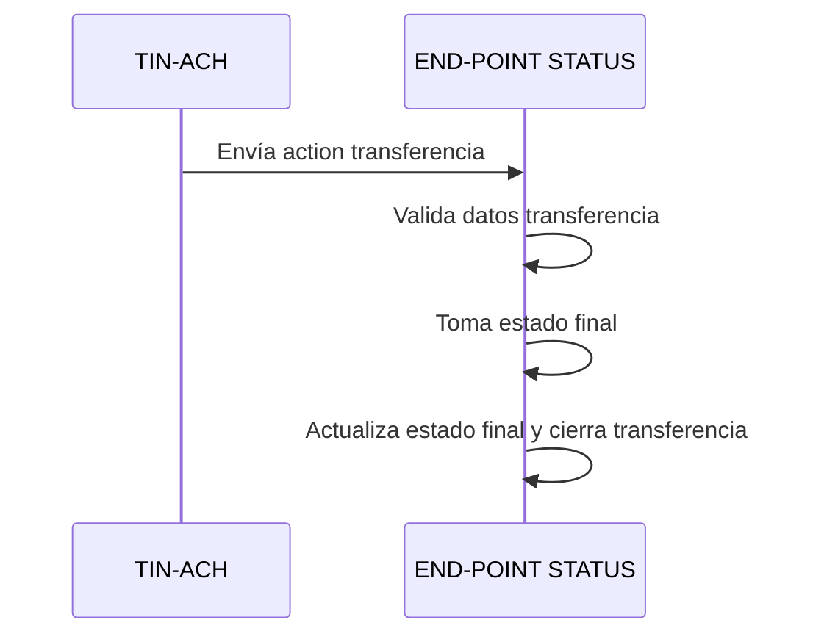

<Warning>
Los objetos de error mostrados en los diagramas son ilustrativos. Pueden variar dependiendo de la causa del error. El banco **debe enviar** el objeto `error` con la información correspondiente a la causa real del fallo.
</Warning>

## Endpoint `/status`

Este endpoint funciona como **canal de notificación**. TransfiYa lo utiliza para enviar una acción (`action`) como confirmación de aceptación o rechazo de la transferencia por parte del destinatario.

El banco puede implementar lógica personalizada para procesar estas notificaciones según su arquitectura o necesidades operativas.



<Tabs>
<Tab title="Status Request">
```json
{
  "source": "wLd9MEASjQQTYywoXnDNwTRpgwiDfyHj6U",
  "target": "$573123224353",
  "amount": "200.00",
  "symbol": "$tin",
  "labels": {
    "hash": "51e8c19c57e846d7dc5665203665f5202df549bed703fe63ad7511c44606843d",
    "type": "SEND",
    "domain": "tin",
    "flowId": "BeK495NIBA4j7x48z",
    "status": "COMPLETED",
    "tx_ref": "BeK495NIBA4j7x48z",
    "created": "2022-08-04T11:57:50-05:00",
    "iouHash": "cca34be82af60bf6aa262cf86249d97e07367bc1b367f5416659b4a0f9e321e4",
    "updated": "2022-08-04T11:58:10-05:00",
    "description": "DEV - REQUEST trx 01",
    "sourceChannel": "APP",
    "deviceFingerPrint": {
      "city": "Bogotá",
      "hash": "26fff5af6441f8e15a71e8d62c361714484b1b308c99e8eb68ca85e2a7e0dc58",
      "model": "Huawei Mate 20 Pro",
      "country": "Colombia",
      "operator": "Bharti Airtel Limited",
      "SIMCardId": "8991101200003204510",
      "ipAddress": "2001:0db8:85a3:0000:0000:8a2e:0370:7334",
      "mobileDevice": "990000862471854"
    }
  },
  "snapshot": {
    "source": {
      "signer": {
        "handle": "wLd9MEASjQQTYywoXnDNwTRpgwiDfyHj6U",
        "labels": {
          "firstName": "Cale",
          "lastName": "Sanford",
          "identification": "1231231",
          "bankBicfi": "9574",
          "bankName": "bancosanti",
          "proprietary": "CC"
        }
      },
      "wallet": {
        "handle": "$573123224352",
        "labels": {
          "type": "PERSON",
          "created": "2022-06-10T09:54:42-05:00",
          "updated": "2022-06-10T09:54:42-05:00"
        },
        "signer": ["wLd9MEASjQQTYywoXnDNwTRpgwiDfyHj6U"]
      }
    },
    "symbol": {
      "signer": {
        "handle": "wMxKCAzsQBiUURDU3xD3xuSbVo1S9jmf3d",
        "labels": {
          "created": "2018-10-19T20:23:22.041Z",
          "createdBy": "ZhrQA3vcm17h2RRO4LrJ"
        }
      },
      "wallet": {
        "handle": "$tin",
        "labels": {
          "type": "SYMBOL",
          "created": "2018-10-19T20:22:48.350Z",
          "updated": "1970-01-01T15:38:20-05:00",
          "createdBy": "ZhrQA3vcm17h2RRO4LrJ"
        },
        "signer": ["wMxKCAzsQBiUURDU3xD3xuSbVo1S9jmf3d"],
        "default": "wMxKCAzsQBiUURDU3xD3xuSbVo1S9jmf3d"
      }
    },
    "target": {
      "signer": {
        "handle": "wVVPzAGAkv5a2AANEdmeActMpWhbByQ81v",
        "labels": {
          "firstName": "Otha",
          "lastName": "Lehner",
          "identification": "123456",
          "bankBicfi": "9574",
          "bankName": "bancosanti",
          "proprietary": "CC"
        }
      },
      "wallet": {
        "handle": "$573123224353",
        "labels": {
          "type": "PERSON",
          "created": "2022-06-10T09:57:21-05:00",
          "updated": "2022-06-10T11:19:10-05:00"
        },
        "signer": [
          "wVVPzAGAkv5a2AANEdmeActMpWhbByQ81v",
          "wVXQDT59RzXdPZD4CyK6z8FWebZmyZ9aHm"
        ]
      }
    }
  },
  "action_id": "98f2f910-fcf2-4937-9ba3-6fb5f9080a17",
  "error": {
    "code": 0,
    "message": "Success"
  },
  "id": "98f2f910-fcf2-4937-9ba3-6fb5f9080a17"
}
```
</Tab>
<Tab title="Response">
```json
{
	"error": {
		"code": 0,
		"message": "Success"
	}
}
```
</Tab>
<Tab title="Error Response 400">
```json
{
	"error": {
		"code": 600,
		"message": "Error receiving status notification."
	}
}
```
</Tab>
</Tabs>

<Info>
**Nota:**

La información privada contenida en `signer.labels` y `wallet.labels` se incluye en la acción enviada al endpoint `/status` **solo si el `source` y el `target` pertenecen al mismo banco**. En caso contrario, el banco receptor únicamente recibe información **pública**.

Además, la información del usuario `target` **solo se incluye si la transferencia fue aceptada**.

A continuación se detallan los campos considerados públicos y privados:

**Campos públicos del signer (todo lo no listado se considera privado):**
- `firstName`
- `lastName`
- `identification`
- `bankBicfi`
- `bankName`
- `proprietary`

**Campos privados del wallet (todo lo no listado se considera público):**
- `channelSms`
</Info>

