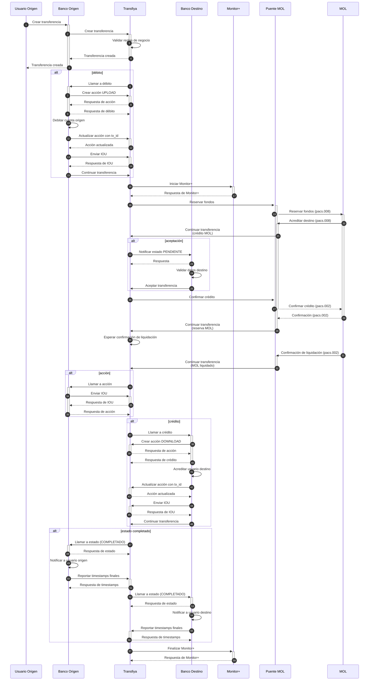

<Info>
  Aunque la regulación exige únicamente al banco originador reportar las marcas de tiempo finales, solicitamos que tanto el banco origen como el banco destino las reporten para mantener consistencia en el proceso.

  Para reportar estas marcas de tiempo finales del procesamiento de una transferencia, se ha agregado un nuevo endpoint:

  **POST /v1/transfer/:txRef/timestamps**

  Las marcas de tiempo a enviar mantienen los mismos nombres utilizados en los casos anteriores:

  - `received` → momento en que el participante recibió la notificación de estado final por parte de Transfiya.
  - `dispatched` → momento en que el participante notificó al usuario sobre el resultado de la transferencia.
</Info>



<Info>
  Los timestamps finales

  son reportados por los bancos origen y destino en los pasos 50

  y 55

  .
</Info>

### Ejemplo de API

**POST /v1/transfer/:txRef/timestamps**

<Tabs>
  <Tab title="Request">
    ```json expandable
    curl -X POST \
     -H "x-api-key: <API_KEY>" \
     -H "Authorization: Bearer <TOKEN>" \
     -H "Content-Type: application/json" \
     -d '{
      "received": "2024-10-11T11:59:22.241-05:00",
      "dispatched": "2024-10-11T11:59:22.517-05:00"
     }' "<TRANSFIYA URL>/v1/transfer/Lf13jsK83omPv3bOt/timestamps"
    ```
  </Tab>
  <Tab title="Response">
    ```json expandable
    {
      "error": {
        "code": 0,
        "message": "Success"
      }
    }
    ```
  </Tab>
</Tabs>

## Codigos de Error

| Código de error | Descripción                                                   | HTTP Status |
| --------------- | ------------------------------------------------------------- | ----------- |
| 99              | Unexpected server error                                       | 400         |
| 100             | You don't have permissions to access this method              | 403         |
| 101             | Unauthorized request, invalid or expired token                | 401         |
| 118             | Resource schema validation error, field format is not correct | 400         |
| 121             | Signer not found in database                                  | 400         |
| 123             | Domain rules error, timestamps are not in the expected range  | 400         |