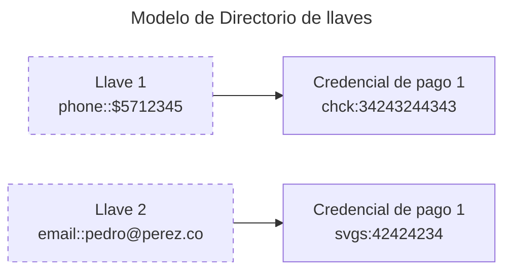

## Sobre las llaves y signers

Las llaves a nivel de regulación se mapearán a los signers de Transfiya en una relación uno a uno.

Transfiya soporta multiples llaves usando el modelo de signers que representan credenciales de pago que incluye datos personales, el tipo de cuenta y el estado de la cuenta.

Signers se pueden usar para transferencias reguladas y no reguladas.

Una llave es relacionada a un credencial de pago o signer.

