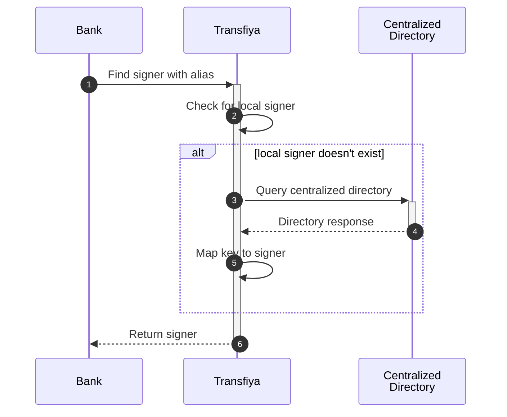

import Tabs from '@theme/Tabs'
import TabItem from '@theme/TabItem'

El modelo actual de Transfiya no está utilizando la resolución de directorios de alias. El flujo de Transfiya permite a los usuarios transferir dinero a alias y los usuarios destinatarios pueden decidir en cuál de sus cuentas desean aceptar las transferencias.

Transfiya también admite el envío de transferencias directamente a los signers, en este caso la transferencia se completa de inmediato, sin aceptación manual.

El API de Transfiya permite a los bancos verificar y resolver alias, el flujo para resolver manualmente un signer antes de crear una transferencia requiere que el banco obtenga este signer del API:



Después de obtener el signer del sistema, el participante utiliza el identificador del signer como el destino de la transferencia para crear una nueva transferencia. Si no se encuentra al signer, significa que el usuario no está registrado en el sistema y la transferencia no puede crearse bajo el modelo regulado.

Las transferencias a alias seguirán permitidas hasta que la regulación se implemente por completo, garantizando la compatibilidad con los participantes actuales del sistema. De este modo, cualquier nuevo participante podrá adoptar el modelo regulado y, al mismo tiempo, continuar enviando y recibiendo transferencias con los participantes existentes, sin importar si estos han migrado al nuevo flujo regulado.

:::info
Este modelo nos permite probar el flujo regulado utilizando todo el volumen transaccional de Transfiya mucho antes que la regulación entre en vigor. Los participantes pueden realizar la migración al nuevo flujo de forma independiente, sin necesidad de esperar a que otros lo hagan.
:::

## Ejemplos del API

### Obtener signers para un alias

```java HTTP
GET /v1/signer/?labels.aliasValue={alias}
```
Los signers pueden consultarse a través del endpoint v1/signer, aplicando los filtros correspondientes. Para verificar el estado de un signer, revisa el campo `labels.status`

---

| Parameter         | Type   | Description             |
| ----------------- | ------ | ----------------------- |
| labels.aliasValue | string | Filter signer by alias. |

---

<Tabs>
  <TabItem value="req" label="Request">
      ```js
        curl -X PUT \
        -H "x-api-key: <API_KEY>" \
        -H "Authorization: Bearer <TOKEN>" \
        -H "Content-Type: application/json" \
         "<base URL>/v1/signer/?labels.aliasValue=@jorge22"
      ```
  </TabItem>
  <TabItem value="res" label="Response">
      ```json
      {
        "entities": [
          {
            "signer_id": "4c57ac39-16f0-489b-89d9-bddfcd352a36",
            "handle": "wRFmYXS2sP9ho9VCZ3j4FuP1j55ABeFvsF",
            "labels": {
              "aliasType": "ALPHANUM",
              "aliasValue": "@JORGE22",
              "status": "ACTIVE",
              "type": "PERSON",
              "firstName": "Jorge",
              "lastName": "Rodriguez",
              "proprietary": "CC",
              "identification": "1010101010",
              "bankAccountType": "SVGS",
              "bankAccountNumber": "12345654321",
              "bankBicfi": "7095",
              "bankName": "Banco Rojo",
              "bankId": "891234918",
              "routerReference": "$bancorojo",
              "createdBy": "$minka",
              "targetSpbviCode": "TFY",
              "created": "2024-10-11T11:59:24.241-05:00",
              "updated": "2024-10-11T12:01:11.121-05:00",
              "consented": "2024-10-11T11:59:24.241-05:00"
            },
            "keeper": [
              {
                "scheme": "ecdsa-ed25519",
                "public": "0463e75c8b975f069813ca8e6c36c0b6fd246eac708affb7ed2c6480fa201defe8725322d6380ec66e94f6dcb49f635c0ca51296e48da4a12b3ec66582a1297adf"
              }
            ],
            "error": {
              "code": 0,
              "message": "Success"
            }
          }
        ]
}
      ```
  </TabItem>
</Tabs>

### Códigos de Error

---

| Error Code | HTTP Status | Description                                      |
| ---------- | ----------- | ------------------------------------------------ |
| 99         | 400         | Unexpected server error                          |
| 100        | 403         | You don't have permissions to access this method |

---

### Obtener un signer para un alias y tipo

```java HTTP
GET /v1/signer/?labels.aliasValue={alias}&labels.aliasType={type}
```

Los signers pueden ser consultados utilizando el endpoint v1/signer y proporcionando filtros. El ejemplo anterior realiza una búsqueda sobre todos los tipos de alias, también podemos consultar un tipo de alias específico. Esto se puede hacer utilizando los filtros **aliasType**, **aliasValue**.

---

| Parameter         | Type   | Description             |
| ----------------- | ------ | ----------------------- |
| labels.aliasType  | string | Filter by alias type.   |
| labels.aliasValue | string | Filter signer by alias. |

---

<Tabs>
  <TabItem value="request" label="Request">
      ```js
        curl -X PUT \
        -H "x-api-key: <API_KEY>" \
        -H "Authorization: Bearer <TOKEN>" \
        -H "Content-Type: application/json" \
         "<base URL>/v1/signer/?labels.aliasType=ALPHANUM&labels.aliasValue=@JORGE22"
      ```
  </TabItem>
  <TabItem value="response" label="Response">
      ```json
      {
        "entities": [
          {
            "signer_id": "4c57ac39-16f0-489b-89d9-bddfcd352a36",
            "handle": "wRFmYXS2sP9ho9VCZ3j4FuP1j55ABeFvsF",
            "labels": {
              "aliasType": "ALPHANUM",
              "aliasValue": "@JORGE22",
              "status": "ACTIVE",
              "type": "PERSON",
              "firstName": "Jorge",
              "proprietary": "CC",
              "identification": "1010101010",
              "bankAccountType": "SVGS",
              "bankAccountNumber": "12345654321",
              "bankBicfi": "7095",
              "bankName": "Banco Rojo",
              "bankId": "891234918",
              "routerReference": "$bancorojo",
              "createdBy": "$minka",
              "targetSpbviCode": "TFY",
              "created": "2024-10-11T11:59:24.241-05:00",
              "updated": "2024-10-11T12:01:11.121-05:00",
              "consented": "2024-10-11T11:59:24.241-05:00"
            },
            "keeper": [
              {
                "scheme": "ecdsa-ed25519",
                "public": "0463e75c8b975f069813ca8e6c36c0b6fd246eac708affb7ed2c6480fa201defe8725322d6380ec66e94f6dcb49f635c0ca51296e48da4a12b3ec66582a1297adf"
              }
            ],
            "error": {
              "code": 0,
              "message": "Success"
            }
          }
        ]
}
```

  </TabItem>
</Tabs>

### Códigos de Error

---

| Error Code | HTTP Status | Description                                      |
| ---------- | ----------- | ------------------------------------------------ |
| 99         | 400         | Unexpected server error                          |
| 100        | 403         | You don't have permissions to access this method |

---
