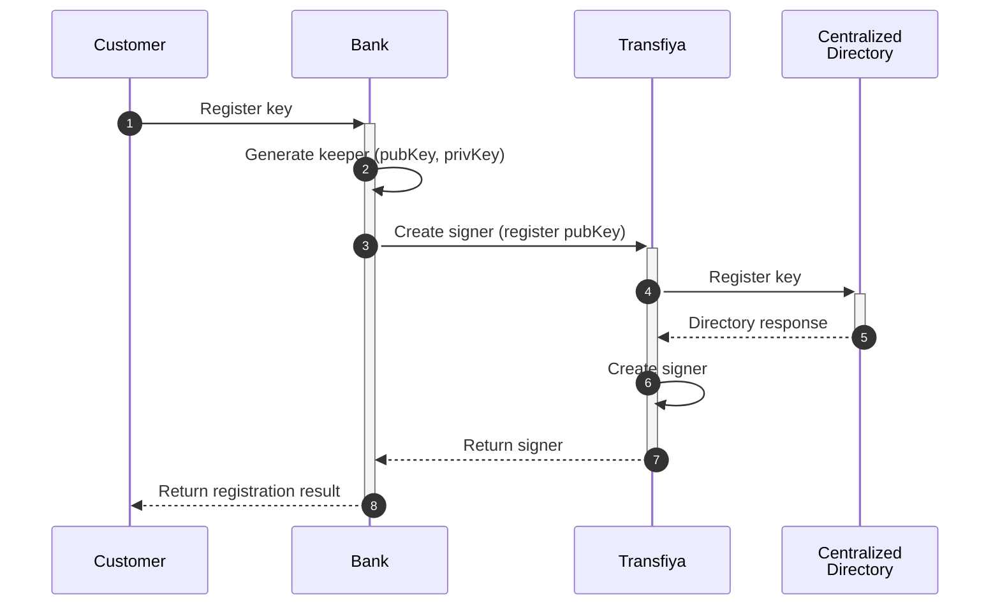
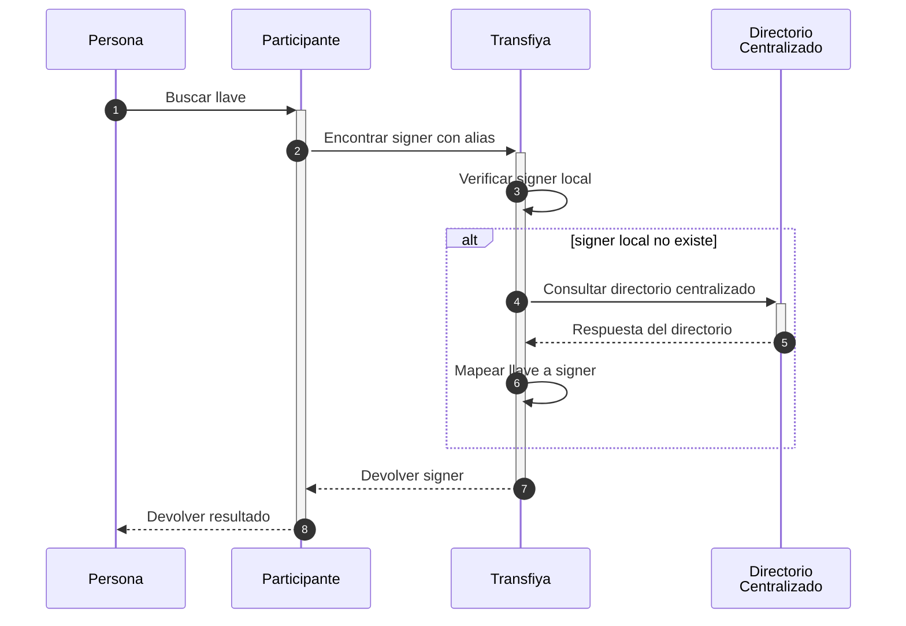

## Marcas de tiempo

### Objetivo Bre-B

Bre-B espera realizar un seguimiento preciso de los tiempos necesarios para resolver las claves y ejecutar las operaciones de transferencia.

El objetivo del banco central es eliminar la latencia de la red en los reportes de marcas de tiempo. La razón principal de este modelo es que la mayoría de los participantes utilizan un sistema basado en colas y comunicación síncrona.

### Monitoreo Transfiya

La plataforma Transfiya es una plataforma nativa en la nube que registra automáticamente todas las interacciones durante las solicitudes y respuestas a las llamadas API.

El monitoreo de las marcas de tiempo se realiza automáticamente por la plataforma, siendo opcional para los participantes la adición de marcas de tiempo específicas.

<Info>
    Mayoria de marcas de tiempo son registradas automáticamente por la plataforma.
</Info>

### DICE requerimentos

## Mapeo de marcas de tiempo

DICE timestamps cover only two operations: onboarding and key resolution.

This mapping is based on the following document:

| Código de mensaje | Nombre del mensaje | Descripción del mensaje | Partes involucradas |
| --- | --- | --- | --- |
| `admn.001.001.01` | Solicitud de gestión de red | Utilizado para conectar/desconectar y verificar el estado de la conexión. Operaciones: `SignOn`, `SignOff`, `EchoTest` | TransfiYa → DICE |
| `admn.002.001.01` | Respuesta de gestión de red | Respuesta a `admn.001` | DICE → Transfiya |
| `prxy.001.001.01` | Solicitud de registro de proxy | Utilizado para gestionar llaves. Operaciones:
`NEWR`, `AMND`, `DEAC`, `SUSP`, `SUSB`, `ACTV`, `ACTB` | Transfiya → DICE |
| `prxy.002.001.01` | Respuesta de registro de proxy | Respuesta a `prxy.001` | DICE → Transfiya |
| `admi.002.001.01` | Mensaje de rechazo | Parece ser un mensaje de error que puede devolverse como respuesta a otros mensajes. No hay flujos de ejemplo con este mensaje en la documentación. | DICE → TransfiYa |
| `prxy.003.001.01` | Solicitud de resolución de proxy | Utilizado para resolver llaves desde el directorio de alias | Transfiya → DICE |
| `prxy.004.001.01` | Respuesta de resolución de proxy | Respuesta a `prxy.003` | DICE → Transfiya |

### Registro de Llaves

El sistema transfiya ya permite consulta de llaves usando el protocolo de resolución de llaves y registro de marcas de tiempo.

Para cubrir el caso de incorporación (onboarding), TransfiYa añade nuevas etiquetas al payload del firmante. Estas etiquetas representan las marcas de tiempo que los participantes necesitan recopilar:

- `received` → el momento en que un participante recibió una solicitud del usuario para incorporarse, cuando el usuario hace clic en la aplicación
- `dispatched` → el momento en que un participante envió una solicitud de incorporación a Transfiya, cuando se llama a la API de creación de firmante



<Accordion title="Marcas de tiempo crear llave">
    | Paso del flujo de procesamiento | Marca de tiempo DICE | Mensaje DICE | Operación DICE | Campo de mensajería | Parte responsable | Descripción de marca de tiempo |
    | --- | --- | --- | --- | --- | --- | --- |
    | 1 (fin) | R101 | prxy.001.001.01 | NEWR | `signer.labels.received` | Participante | Un participante recibe una solicitud de registro de llave de un cliente. |
    | 3 (inicio) | R103 | prxy.001.001.01 | NEWR | `signer.labels.dispatched` | Participante | El participante envía una solicitud de registro de llave a Transfiya. |
    | 3 (fin) | R201 | prxy.001.001.01 | NEWR | no apclicable | Transfiya | Transfiya recibe una solicitud de registro de llave del participante. |
    | 4 (inicio) | R203 | prxy.001.001.01 | NEWR | no aplicable | Transfiya | Transfiya envía una solicitud de registro de llave a DICE. |
    | 4 (fin) | R301 | prxy.001.001.01 | NEWR | `prxy.002.001.01` (paso 5) `R301` | DICE | DICE recibe una solicitud de registro de llave de Transfiya. |
    | 5 (inicio) | R303 | prxy.002.001.01 | NEWR | `prxy.002.001.01` (paso 5) `R303` | DICE | DICE envía una respuesta de registro de llave a Transfiya. |
    | 5 (fin) | R205 | prxy.002.001.01 | NEWR | no aplicable | Transfiya | Transfiya recibe una respuesta de registro de llave de DICE. |
    | 7 (inicio) | R207 | prxy.002.001.01 | NEWR | no aplicable | Transfiya | Transfiya envía una respuesta de registro de llave al participante. |
    | 7 (fin) | R105 | prxy.002.001.01 | NEWR | no aplicable | Participante | El participante recibe una respuesta de registro de llave de Transfiya. |
    | 8 (inicio) | R107 | prxy.002.001.01 | NEWR | no aplicable | Participante | El participante notifica al cliente sobre el resultado del registro de llave. |
</Accordion>

### Resolución de Llaves

<Info>
    Este modelo es actualmente opcional y no se habilitará hasta que comencemos las pruebas de integración con MOL.
</Info>

Las marcas de tiempo necesarias para la resolución de llaves siguen un patrón similar a las requeridas durante el proceso de incorporación.

Los requisitos relacionados con los participantes pueden satisfacerse mediante la incorporación de los mismos dos campos mencionados anteriormente. Dado que los participantes deben enviar estos campos y efectivamente almacenan información adicional en el sistema con esta solicitud, la petición de resolución se implementa como una solicitud `POST` en lugar de `GET`:

**POST /v1/signer/lookup.dice**

El cuerpo de esta solicitud contiene el valor del llave que se está resolviendo y las marcas de tiempo requeridas:

```json
{
  "aliasValue": "@jorge22",
  "received": "2025-01-14T20:40:57.322-05:00",
  "dispatched": "2025-01-14T20:40:58.322-05:00"
}
```

Flujo de Resolución de Llaves:



<Accordion title="Marcas de tiempo resolución">
    | Marca de tiempo DICE | Mensaje DICE | Campo de mensajería | Paso del flujo de procesamiento | Parte responsable | Descripción de marca de tiempo |
    | --- | --- | --- | --- | --- | --- |
    | C110 | prxy.003.001.01 | solicitud de búsqueda de firmante `received` | 1 (fin) | Participante | Un participante recibe una solicitud de resolución de llave de un cliente. |
    | C120 | prxy.003.001.01 | solicitud de búsqueda de firmante `dispatched` | 2 (inicio) | Participante | El participante envía una solicitud de resolución de llave a Transfiya. |
    | C210 | prxy.003.001.01 | no disponible sobre API | 2 (fin) | Transfiya | Transfiya recibe una solicitud de resolución de llave del participante. |
    | C215 | prxy.003.001.01 | no disponible sobre API | 4 (inicio) | Transfiya | Transfiya envía una solicitud de resolución de llave a DICE. |
    | C310 | prxy.003.001.01 | `prxy.004.001.01` (paso 5) `C310` | 4 (fin) | DICE | DICE recibe una solicitud de resolución de llave de Transfiya. |
    | C320 | prxy.004.001.01 | `prxy.004.001.01` (paso 5) `C320` | 5 (inicio) | DICE | DICE envía una respuesta de resolución de llave a Transfiya. |
    | C230 | prxy.004.001.01 | no disponible sobre API | 5 (fin) | Transfiya | Transfiya recibe una respuesta de resolución de llave de DICE. |
    | C240 | prxy.004.001.01 | no disponible sobre API | 7 (inicio) | Transfiya | Transfiya envía una respuesta de resolución de llave al participante. |
    | C130 | prxy.004.001.01 | no disponible sobre API | 7 (fin) | Participante | El participante recibe una respuesta de resolución de llave de Transfiya. |
    | C140 | prxy.004.001.01 | no disponible sobre API | 8 (inicio) | Participante | El participante notifica al cliente sobre el resultado de la resolución de llave. |
</Accordion>

<Note>
    Documento de referencia -  Directorio Centralizado DICE Versión 2.2.1
</Note>
