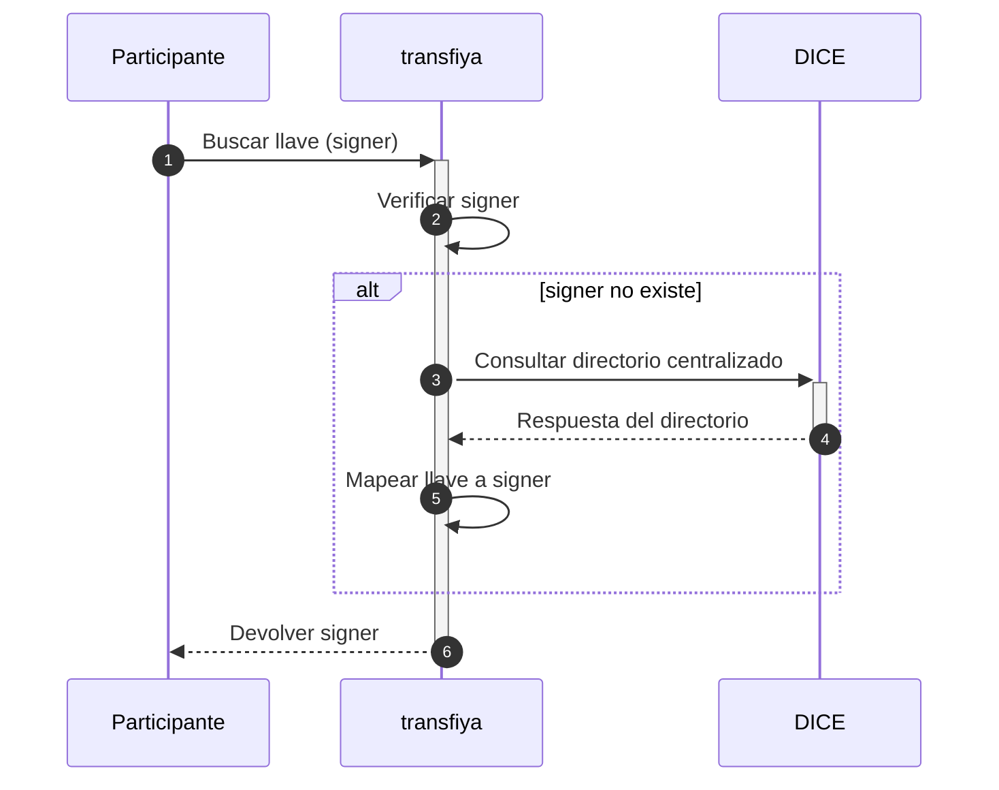

## Introducción

El flujo regulatorio exige la resolución de llaves como requisito previo al inicio de cualquier transferencia, constituyendo el cambio fundamental para los participantes de Transfiya.

Actualmente, el sistema Transfiya permite a los usuarios realizar transferencias monetarias a llaves sin necesidad de registro previo, lo que simplifica significativamente tanto la experiencia de usuario como el proceso de incorporación al sistema.

Transfiya permite el envío de transferencias directamente a los signers, lo que permite completar transacciones de forma inmediata sin requerir la aceptación del destinatario.

Este último modelo, regulado por la normativa Bre-B, establece como obligatoria la resolución de la llave antes de proceder con cualquier operación de transferencia.

Cualquier nuevo participante puede adoptar el modelo regulado y, simultáneamente, continuar enviando y recibiendo transferencias con los participantes existentes, independientemente de si éstos han migrado al nuevo flujo regulado.

## Flujo regulado

Los cambios de regulación requiren resolución de llaves antes de iniciar una transferencia.



Si no se encuentra la llave activa, significa que el usuario no está registrado en el sistema y la transferencia no puede procesarse bajo el modelo regulado.

Los participantes pueden migrar al nuevo flujo de forma independiente, sin necesidad de esperar otros participantes.

<Info>
	Las transferencias a billeteras con aceptación seguirán funcionando hasta la implementación completa de la regulación, garantizando la compatibilidad con los participantes actuales del sistema.
</Info>

## Ejemplos del API

### Obtener signers para un alias

```javascript HTTP
GET /v1/signer/?labels.aliasValue={alias}
```
Los signers pueden consultarse a través del endpoint v1/signer, aplicando los filtros correspondientes. Para verificar el estado de un signer, revise el campo `labels.status`

---

| Parameter         | Type   | Description             |
| ----------------- | ------ | ----------------------- |
| labels.aliasValue | string | Filter signer by alias. |

---

<Tabs>
		<Tab title="Request">
			```js
			curl -X PUT \
			  -H "x-api-key: <API_KEY>" \
			  -H "Authorization: Bearer <TOKEN>" \
			  -H "Content-Type: application/json" \
			  "<base URL>/v1/signer/?labels.aliasValue=@jorge22"
			```
		</Tab>
		<Tab title="Response">
      ```json
      {
        "entities": [
          {
            "signer_id": "4c57ac39-16f0-489b-89d9-bddfcd352a36",
            "handle": "wRFmYXS2sP9ho9VCZ3j4FuP1j55ABeFvsF",
            "labels": {
              "aliasType": "ALPHANUM",
              "aliasValue": "@JORGE22",
              "status": "ACTIVE",
              "type": "PERSON",
              "firstName": "Jorge",
              "lastName": "Rodriguez",
              "proprietary": "CC",
              "identification": "1010101010",
              "bankAccountType": "SVGS",
              "bankAccountNumber": "12345654321",
              "bankBicfi": "7095",
              "bankName": "Banco Rojo",
              "bankId": "891234918",
              "routerReference": "$bancorojo",
              "createdBy": "$minka",
              "targetSpbviCode": "TFY",
              "created": "2024-10-11T11:59:24.241-05:00",
              "updated": "2024-10-11T12:01:11.121-05:00",
              "consented": "2024-10-11T11:59:24.241-05:00"
            },
            "keeper": [
              {
                "scheme": "ecdsa-ed25519",
                "public": "0463e75c8b975f069813ca8e6c36c0b6fd246eac708affb7ed2c6480fa201defe8725322d6380ec66e94f6dcb49f635c0ca51296e48da4a12b3ec66582a1297adf"
              }
            ],
            "error": {
              "code": 0,
              "message": "Success"
            }
          }
        ]
      }
      ```
		</Tab>
</Tabs>

### Códigos de Error

---

| Error Code | HTTP Status | Description                                      |
| ---------- | ----------- | ------------------------------------------------ |
| 99         | 400         | Unexpected server error                          |
| 100        | 403         | You don't have permissions to access this method |

---

### Obtener un signer para un alias y tipo

```java HTTP
GET /v1/signer/?labels.aliasValue={alias}&labels.aliasType={type}
```

Los signers pueden consultarse mediante el endpoint v1/signer proporcionando los filtros adecuados.

El ejemplo anterior muestra una búsqueda sobre todos los tipos de alias. También es posible consultar un tipo de alias específico utilizando los filtros **aliasType** y **aliasValue**.

---

| Parameter         | Type   | Description             |
| ----------------- | ------ | ----------------------- |
| labels.aliasType  | string | Filter by alias type.   |
| labels.aliasValue | string | Filter signer by alias. |

---

<Tabs>
				<Tab title="Request">
					```js
					curl -X PUT \
						-H "x-api-key: <API_KEY>" \
						-H "Authorization: Bearer <TOKEN>" \
						-H "Content-Type: application/json" \
						"<base URL>/v1/signer/?labels.aliasType=ALPHANUM&labels.aliasValue=@JORGE22"
					```
		</Tab>
		<Tab title="Response">
      ```json
      {
        "entities": [
          {
            "signer_id": "4c57ac39-16f0-489b-89d9-bddfcd352a36",
            "handle": "wRFmYXS2sP9ho9VCZ3j4FuP1j55ABeFvsF",
            "labels": {
              "aliasType": "ALPHANUM",
              "aliasValue": "@JORGE22",
              "status": "ACTIVE",
              "type": "PERSON",
              "firstName": "Jorge",
              "proprietary": "CC",
              "identification": "1010101010",
              "bankAccountType": "SVGS",
              "bankAccountNumber": "12345654321",
              "bankBicfi": "7095",
              "bankName": "Banco Rojo",
              "bankId": "891234918",
              "routerReference": "$bancorojo",
              "createdBy": "$minka",
              "targetSpbviCode": "TFY",
              "created": "2024-10-11T11:59:24.241-05:00",
              "updated": "2024-10-11T12:01:11.121-05:00",
              "consented": "2024-10-11T11:59:24.241-05:00"
            },
            "keeper": [
              {
                "scheme": "ecdsa-ed25519",
                "public": "0463e75c8b975f069813ca8e6c36c0b6fd246eac708affb7ed2c6480fa201defe8725322d6380ec66e94f6dcb49f635c0ca51296e48da4a12b3ec66582a1297adf"
              }
            ],
            "error": {
              "code": 0,
              "message": "Success"
            }
          }
        ]
      }
      ```
		</Tab>
</Tabs>

### Códigos de Error

---

| Error Code | HTTP Status | Description                                      |
| ---------- | ----------- | ------------------------------------------------ |
| 99         | 400         | Unexpected server error                          |
| 100        | 403         | You don't have permissions to access this method |

---
