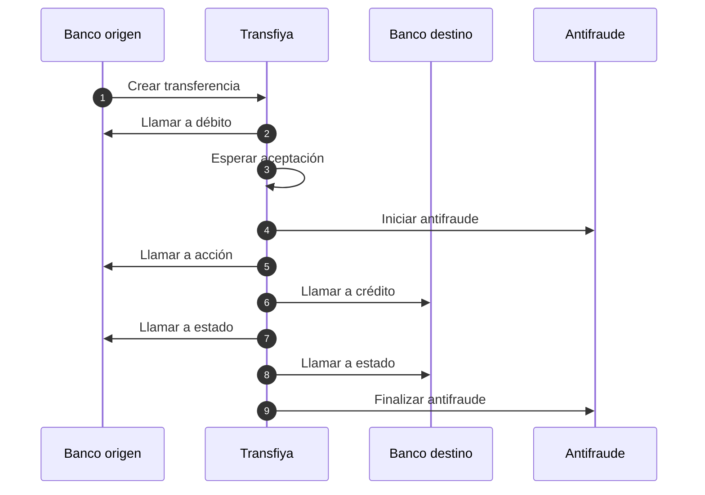
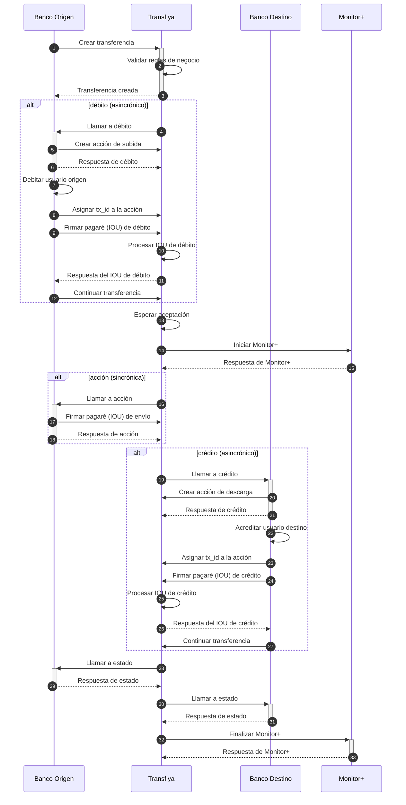

## Flujo actual de Transfiya

El flujo actual de procesamiento de transferencias tipo `SEND` en Transfiya funciona de la siguiente manera:

<Info>
Transfiya **no implementa actualmente** un protocolo de confirmación en dos fases (*two-phase commit*), aunque este podría incorporarse utilizando la llamada de `status` como segunda fase del proceso.
</Info>

Las entidades financieras realizan los movimientos centrales durante las llamadas de `debit` (débito) y `credit` (crédito), motivo por el cual **estas llamadas son asincrónicas**. En algunos sistemas bancarios, los movimientos contables pueden tardar en completarse.

La acción denominada `movement`, por su parte, **no tiene efecto sobre los saldos reales**; su único propósito es confirmar que los fondos pueden ser enviados al usuario destinatario.

<Tip>
Transfiya puede aceptar una transferencia automáticamente en casos donde existan firmantes por defecto, enlaces previos u otros mecanismos configurados.
</Tip>

Cuando el usuario tiene múltiples firmantes asociados, se le envía una **notificación para que confirme manualmente** la operación desde su aplicación bancaria.

El sistema de detección de fraude (**Monitor+**) se activa **únicamente después de que la transferencia ha sido aceptada**, ya que es en ese momento cuando se conoce con certeza el destinatario final. Antes de esa etapa, el destinatario puede ser un alias no registrado.

<Warning>
Las llamadas de `status` **no deben generar movimientos de saldo** en los sistemas bancarios. Estas llamadas se utilizan con fines informativos, como notificar al usuario o registrar el estado de la transacción.
</Warning>

### Vista general del proceso

A continuación, se presenta una vista general del procesamiento de transferencias desde una perspectiva de alto nivel.

**Diagrama detallado del procesamiento de transferencias:**
