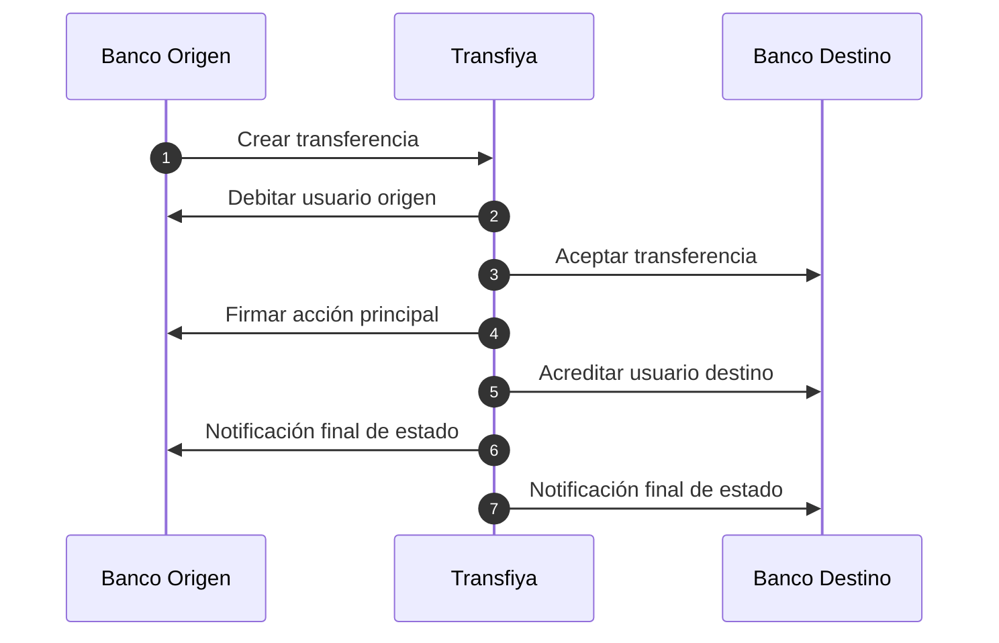

## Modelo de transferencia

### Concepto "Transfer"

Transfiya utiliza el concepto de "transfer" para iniciar pagos en el sistema.
El *Transfer* es un inciacion de pago compuesta de transacciones que representan dos o más movimientos de dinero entre los participantes.

Este modelo es agnóstico al caso de uso y soporta cualquier tipo de movimiento de fondos, dependiendo de las reglas configuradas del sistema sobre el flujo y las [llaves](../about/about-signers) de origen y destino.

Para crear transferencias se usa el interfaz aplicativo de crear un transfer.

<Note>
El uso del modelo de transfer para iniciar pagos en el sistema permite emplear el mismo protocolo y REST API para cualquier caso de uso o flujo de dinero, incluyendo el nuevo flujo regulatorio.
</Note>

### Origen y destino de transferencia

Plataforma de Transfiya permite envios entre diferentes llaves o credenciales de pago (signer) en el sistema desde su inicio representados por campos origen y destino.

Tipo de transferencia, por ejemplo p2p, b2p, p2b, g2p  se define en base de los tipos de participates (signers) y reglas asignadas a cada uno de ellos.

El principal uso de origen y destino es simplificar el proceso de envío y permitir cualquier tipo de movimiento de fondos sin necesidad de modificar la integración existente de los participantes.

<ResponseField name="source" type="string">
    Origen de la transferencia.
</ResponseField>

<ResponseField name="destination" type="string">
    Destino de la transferencia.
</ResponseField>

[Sobre llaves y credenciales de pago (signers)](../about/about-signers)

<Note>
Esta flexibilidad facilita la implementación de diferentes casos de uso de negocio sin la necesidad de modificar la integración existente de los participantes.
</Note>

