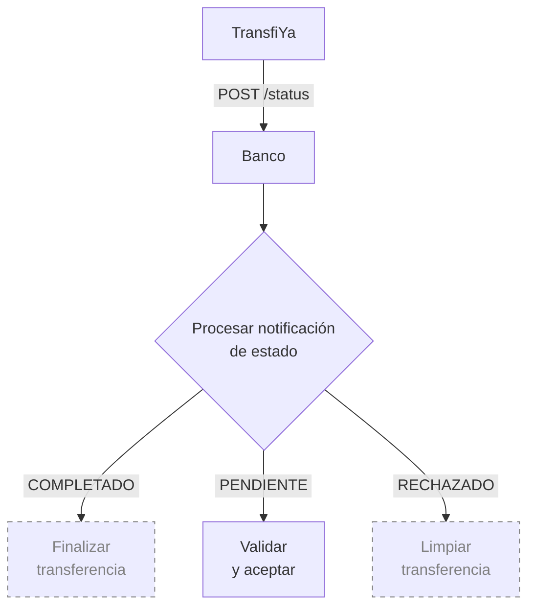
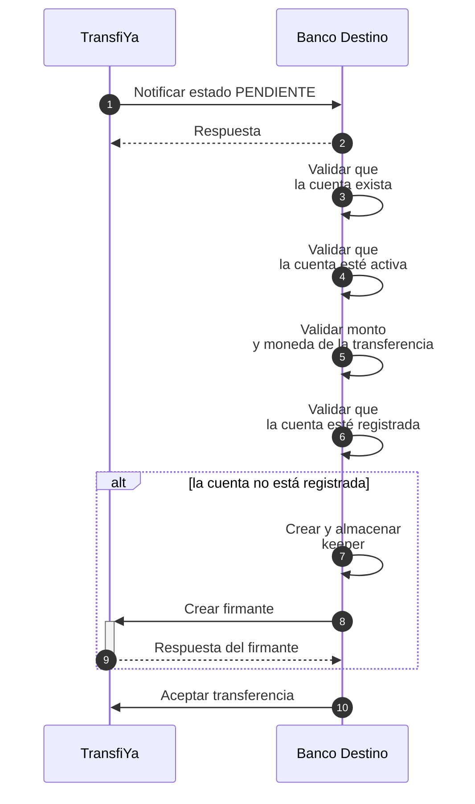

## Validación de aceptación por el banco destino
Una vez realizado el débito, TransfiYa ejecuta controles antifraude sobre la transferencia y contacta al banco destino para solicitar la aceptación del pago. Este paso permite al banco receptor validar la información de la cuenta destino y confirmar que el pago puede ser recibido correctamente.

<Info>
Durante esta etapa, el banco DEBE realizar las siguientes validaciones:

Que la cuenta destino exista.

Que la cuenta esté activa y habilitada para recibir pagos.

Que la moneda de la cuenta coincida con la moneda de la transferencia.

Que el monto de la transferencia no supere los límites previamente definidos.

</Info>
La notificación de este paso se realiza mediante el endpoint status. Este endpoint es utilizado por TransfiYa para comunicar los cambios de estado de las transferencias a las entidades participantes.

Los estados actualmente soportados por este endpoint son:

PENDING: la transferencia está pendiente de aceptación por parte del banco destino.

COMPLETED: la transferencia se ha completado exitosamente.

REJECTED: la transferencia fue rechazada debido a un error durante el procesamiento.

<Tip>
Las validaciones de aceptación DEBEN realizarse inmediatamente cuando la transferencia entra en estado PENDING.

</Tip>


Para aceptar una transferencia, el banco debe reaccionar a la notificación enviada por TransfiYa con estado PENDING. Esta notificación indica que la transferencia está en espera de validación por parte del banco destino.

<Info>
En este capítulo nos enfocaremos exclusivamente en el manejo del estado PENDING a través del endpoint status.
Los demás estados (COMPLETED y REJECTED) serán abordados más adelante en el flujo de procesamiento.

</Info>



## Aceptación de transferencia – Pasos detallados

Una vez realizado el débito al usuario origen y ejecutados los controles antifraude, TransfiYa contacta al banco destino para solicitar la aceptación de la transferencia. Esta etapa es crítica para asegurar que el pago pueda ser recibido correctamente.

Durante esta fase, el banco receptor debe validar la cuenta de destino, el monto, la moneda y el registro del usuario dentro del ecosistema TransfiYa. Esta validación se notifica mediante el endpoint status, el cual indica que la transferencia se encuentra en estado PENDING.

A continuación, se detallan los pasos que debe seguir el banco para aceptar correctamente una transferencia:

<Steps>

<Step title="TransfiYa llama al endpoint `status` del banco destino con estado `PENDING`">
  Se realiza una solicitud `POST` al endpoint del banco con todos los datos relevantes de la transferencia. El campo `labels.status` estará en `PENDING`.
  <Tabs>
    <Tab title="Request">
    ```json
    POST https://ban.co/transfiya/status
    {
        "source": "wXxwpxB32saqfmfMxAQD4SVWWhhn6akLC2",
        "target": "wRFmYXS2sP9ho9VCZ3j4FuP1j55ABeFvsF",
        "amount": "100.00",
        "symbol": "$tin",
        "labels": {
            "hash": "PENDING",
            "type": "SENDMOL",
            "domain": "tin",
            "flowId": "Lf13jsK83omPv3bOt",
            "status": "PENDING",
            "tx_ref": "Lf13jsK83omPv3bOt",
            "tx_id": "20250114890915944TFY123456789012345",
            "received": "2025-01-14T20:40:57.322-05:00",
            "dispatched": "2025-01-14T20:40:58.322-05:00",
            "delivered": "2025-01-14T20:40:58.522-05:00",
            "created": "2025-01-14T20:40:57.322-05:00",
            "updated": "2025-01-14T20:40:57.322-05:00",
            "description": "Payment for lunch",
            "sourceChannel": "APP",
            "deviceFingerPrint": {
            "city": "Bogotá",
            "hash": "26fff5af6441f8e15a71e8d62c361714484b1b308c99e8eb68ca85e2a7e0dc58",
            "model": "Huawei Mate 20 Pro",
            "country": "Colombia",
            "operator": "Bharti Airtel Limited",
            "SIMCardId": "8991101200003204510",
            "ipAddress": "2001:0db8:85a3:0000:0000:8a2e:0370:7334",
            "mobileDevice": "990000862471854"
            }
        },
        "snapshot": {
            "source": {
            "signer": {
                "handle": "wXxwpxB32saqfmfMxAQD4SVWWhhn6akLC2",
                "labels": {
                "name": "Maria Fernanda Gomez",
                "proprietary": "CC",
                    "identification": "2020202020",
                "bankAccountType": "SVGS",
                "bankAccountNumber": "95445654254",
                "bankId": "895554821",
                "targetSpbviCode": "TFY"
                }
            },
            },
            "symbol": {
            "signer": {
                "handle": "wMxKCAzsQBiUURDU3xD3xuSbVo1S9jmf3d",
                "labels": {
                "created": "2018-10-19T20:23:22.041Z",
                "createdBy": "ZhrQA3vcm17h2RRO4LrJ"
                }
            }
            },
            "target": {
            "signer": {
                "handle": "wRFmYXS2sP9ho9VCZ3j4FuP1j55ABeFvsF",
                "labels": {
                "name": "Jorge Alejandro Fernandez Garcia",
                "proprietary": "CC",
                    "identification": "1010101010",
                "bankAccountType": "SVGS",
                "bankAccountNumber": "12345654321",
                "bankId": "891234918",
                "targetSpbviCode": "TFY"
                }
            },
            }
        },
        "error": {
            "code": 0,
            "message": "Success"
        },
        "action_id": "35de4d3d-3aba-4fb3-b110-d004ce2aabb2",
        "id": "35de4d3d-3aba-4fb3-b110-d004ce2aabb2"
        }
    ```
    </Tab>
    <Tab title="Response">
    <Info>
    El banco destino responde para confirmar la recepción de la notificación. A partir de este punto, el procesamiento de la notificación es completamente asincrónico.
    </Info>
    ```json
    {
        "error": {
            "code": 0,
            "message": "Success"
        }
    }
    ```
    <Info>
    La respuesta no necesita contener un cuerpo; el banco solo debe devolver una respuesta HTTP `200` para confirmar la recepción del llamado.

    También se permite retornar un objeto JSON con el código de error `0` como indicación de que la llamada fue recibida sin errores.
    </Info>

    </Tab>
  </Tabs>
</Step>

<Step title="El banco valida que la cuenta de destino exista">
  Puede ser un `signer.handle` (si el usuario ya está registrado) o una referencia bancaria del tipo `tipo-cuenta:número-cuenta@dominio-banco`, por ejemplo: `svgs:1001001000@bank.io`.
</Step>

<Step title="Banco destino verifica que la cuenta esté activa y pueda recibir pagos">
  Si la cuenta está cerrada, bloqueada o suspendida, el banco debe rechazar la transferencia mediante el endpoint `/reject`, incluyendo un código como `307 - Inactive account`.
  <Tabs>
    <Tab title="Error Request">
    ```json
    curl -X POST \
        -H "Content-Type: application/json" \
        -H "x-api-key: <API_KEY>" \
        -H "Authorization: Bearer <TOKEN>" \
        -d '{
            "received": "2025-01-14T20:41:00.252-05:00",
            "dispatched": "2025-01-14T20:41:00.552-05:00",
            "error": {
            "code": 307,
            "message": "Inactive account"
            }
        }' "<TRANSFIYA URL>/v1/transfer/<tx_ref>/reject"
    ```
    <Info>
    Los bancos pueden rechazar transferencias llamando al endpoint `reject` de la transferencia e incluyendo un objeto `error` en el cuerpo con información adicional sobre el motivo del rechazo.

    Los códigos de error devueltos por los bancos deben estar dentro del rango `3xx`.
    </Info>
    | Field name     | Descripción en español                                                                 |
    |----------------|-----------------------------------------------------------------------------------------|
    | `<tx_ref>`     | El campo `<tx_ref>` en la URL representa la referencia de la transferencia, que puede encontrarse en `labels.tx_ref` del `mainAction`. |
    | `received`     | Marca de tiempo en formato ISO 8601. Representa el momento en que se recibió la llamada `status` desde TransfiYa. |
    | `dispatched`   | Marca de tiempo en formato ISO 8601. Representa el momento en que se envió la llamada `reject` hacia TransfiYa. |


    </Tab>
    <Tab title="">
    </Tab>
  </Tabs>  
</Step>

<Step title="Banco destino valida que la moneda y el monto sean válidos para la cuenta">
  En caso de discrepancia, la operación debe rechazarse con un código de error como `304 - Transfer information is invalid`.
  <Tabs>
    <Tab title="Error Request">
    <Info>
    Los bancos pueden rechazar transferencias llamando al endpoint `reject` de la transferencia y proporcionando un objeto `error` en el cuerpo con información adicional sobre el motivo del rechazo.

    Los códigos de error devueltos por los bancos deben estar en el rango `3xx`.
    </Info>
    ```json
    curl -X POST \
    -H "Content-Type: application/json" \
    -H "x-api-key: <API_KEY>" \
    -H "Authorization: Bearer <TOKEN>" \
    -d '{
        "received": "2025-01-14T20:41:00.252-05:00",
        "dispatched": "2025-01-14T20:41:00.552-05:00",
        "error": {
        "code": 304,
        "message": "Transfer information is invalid"
        }
    }' "<TRANSFIYA URL>/v1/transfer/<tx_ref>/reject"
    ```
    | Field name   | Descripción en español                                                                                       |
    |--------------|-------------------------------------------------------------------------------------------------------------|
    | `<tx_ref>`   | El campo `<tx_ref>` en la URL representa la referencia de la transferencia, que se encuentra en `labels.tx_ref` del `mainAction`. |
    | `received`   | Timestamp en formato ISO 8601. Representa el momento en que se recibió la llamada `status` desde TransfiYa. |
    | `dispatched` | Timestamp en formato ISO 8601. Representa el momento en que se envió la llamada `reject` a TransfiYa.       |

    </Tab>
    <Tab title="">
    </Tab>
  </Tabs>  
</Step>

<Step title="Banco Destino verifica si la cuenta está registrada en TransfiYa (onboarded)">
  Se valida que exista un `signer` en el sistema y que cuente con una clave pública (`keeper`) válida asociada.
</Step>

<Step title="Genera una clave privada (`keeper`) si la cuenta no está registrada">
  Cada cuenta debe tener una clave criptográfica única. Esta se usa para firmar operaciones bajo el modelo de TransfiYa.
  <Info>
La seguridad de TransfiYa se basa en criptografía de clave pública/privada. Esta clave se utiliza para autorizar cualquier pago asociado a la cuenta, por lo que **cada cuenta debe tener una clave única asociada**. Se recomienda utilizar los SDKs de TransfiYa para generar estas claves de manera segura.
</Info>
</Step>

<Step title="Banco Destino Registra el `signer` en TransfiYa">
  El firmante puede tener alias o no, dependiendo del consentimiento del usuario. El banco debe usar la clave pública correspondiente al `keeper` generado.
  <Tabs>
    <Tab title="Request Account Signer">
    <Info>
    No se requiere consentimiento del usuario para crear firmantes de cuenta que no estén vinculados a alias. Este tipo de firmantes son útiles para incorporar automáticamente cuentas de usuario sin necesidad de solicitar confirmación.
    </Info>
    ```json
    curl -X POST \
        -H "x-api-key: <API_KEY>" \
        -H "Authorization: Bearer <TOKEN>" \
        -H "Content-Type: application/json" \
        -d '{
        "labels": {
            "aliasType": "NONE",
            "type": "PERSON",
            "firstName": "Jorge",
            "secondName": "Alejandro",
            "lastName": "Fernandez",
            "secondLastName": "Garcia",
            "proprietary": "CC",
            "identification": "1010101010",
            "bankAccountType": "SVGS",
            "bankAccountNumber": "12345654321",
            "routerReference": "$bancorojo"
        },
        "keeper": [{
            "scheme": "ecdsa-ed25519",
            "public": "0463e75c8b975f069813ca8e6c36c0b6fd246eac708affb7ed2c6480fa201defe8725322d6380ec66e94f6dcb49f635c0ca51296e48da4a12b3ec66582a1297adf"
        }]
        }' "<TRANSFIYA URL>/v1/signer"
    ```
    </Tab>
    <Tab title="Response Account Signer">
    ```json
    curl -X POST \
    -H "x-api-key: <API_KEY>" \
    -H "Authorization: Bearer <TOKEN>" \
    -H "Content-Type: application/json" \
    -d '{
    "labels": {
        "aliasType": "NONE",
        "type": "PERSON",
        "firstName": "Jorge",
        "secondName": "Alejandro",
        "lastName": "Fernandez",
        "secondLastName": "Garcia",
        "proprietary": "CC",
        "identification": "1010101010",
        "bankAccountType": "SVGS",
        "bankAccountNumber": "12345654321",
        "routerReference": "$bancorojo"
    },
    "keeper": [{
        "scheme": "ecdsa-ed25519",
        "public": "0463e75c8b975f069813ca8e6c36c0b6fd246eac708affb7ed2c6480fa201defe8725322d6380ec66e94f6dcb49f635c0ca51296e48da4a12b3ec66582a1297adf"
    }]
    }' "<TRANSFIYA URL>/v1/signer"
    ```
    </Tab>
    <Tab title="Request Alias Signer">
    <Info>
    Se requiere consentimiento del usuario para crear firmantes con alias.
    </Info>
     ```json
     curl -X POST \
        -H "x-api-key: <API_KEY>" \
        -H "Authorization: Bearer <TOKEN>" \
        -H "Content-Type: application/json" \
        -d '{
        "labels": {
            "aliasType": "ALPHANUM",
            "aliasValue": "@jorge22",
            "type": "PERSON",
            "firstName": "Jorge",
            "secondName": "Alejandro",
            "lastName": "Fernandez",
            "secondLastName": "Garcia",
            "proprietary": "CC",
            "identification": "1010101010",
            "bankAccountType": "SVGS",
            "bankAccountNumber": "12345654321",
            "routerReference": "$bancorojo",
            "targetSpbviCode": "TFY"
            "consented": "2025-01-14T20:42:00.152-05:00",
            "received": "2025-01-14T20:41:00.252-05:00",
            "dispatched": "2025-01-14T20:41:00.552-05:00"
        },
        "keeper": [{
            "scheme": "ecdsa-ed25519",
            "public": "0463e75c8b975f069813ca8e6c36c0b6fd246eac708affb7ed2c6480fa201defe8725322d6380ec66e94f6dcb49f635c0ca51296e48da4a12b3ec66582a1297adf"
        }]
        }' "<TRANSFIYA URL>/v1/signer"
     ```
    | Field name | Valor del campo |
    | --- | --- |
    | `received` | Timestamp en formato ISO 8601. Representa el momento en que se recibió la llamada `status` desde TransfiYa. |
    | `dispatched` | Timestamp en formato ISO 8601. Representa el momento en que se envió la solicitud de creación del signer a TransfiYa. |

    </Tab>
     <Tab title="Response Alias Signer">
    ```json
    curl -X POST \
    -H "x-api-key: <API_KEY>" \
    -H "Authorization: Bearer <TOKEN>" \
    -H "Content-Type: application/json" \
    -d '{
    "labels": {
        "aliasType": "ALPHANUM",
        "aliasValue": "@jorge22",
        "type": "PERSON",
        "firstName": "Jorge",
        "secondName": "Alejandro",
        "lastName": "Fernandez",
        "secondLastName": "Garcia",
        "proprietary": "CC",
        "identification": "1010101010",
        "bankAccountType": "SVGS",
        "bankAccountNumber": "12345654321",
        "routerReference": "$bancorojo",
        "targetSpbviCode": "TFY"
        "consented": "2025-01-14T20:42:00.152-05:00",
        "received": "2025-01-14T20:41:00.252-05:00",
        "dispatched": "2025-01-14T20:41:00.552-05:00"
    },
    "keeper": [{
        "scheme": "ecdsa-ed25519",
        "public": "0463e75c8b975f069813ca8e6c36c0b6fd246eac708affb7ed2c6480fa201defe8725322d6380ec66e94f6dcb49f635c0ca51296e48da4a12b3ec66582a1297adf"
    }]
    }' "<TRANSFIYA URL>/v1/signer"
    ```
    </Tab>
    <Tab title="Error Response">
    ```json
    {
        "error": {
            "code": 118,
            "message": "Parameter labels.bankAccountNumber is required."
        }
    }
    ```
    </Tab>
  </Tabs>
</Step>

<Step title="El banco destino acepta la transferencia `PENDING`">
  El banco debe llamar al endpoint `/accept` incluyendo los campos `received`, `dispatched` y el `signer.handle` correspondiente.

  <Info>
  Esta aceptación es obligatoria antes de que se realice la operación de crédito que ocurre posterior a la liquidación con MOL.
  </Info>
  <Tabs>
    <Tab title="Request">
    ```diff
    curl -X POST \
    -H "Content-Type: application/json" \
    -H "x-api-key: <API_KEY>" \
    -H "Authorization: Bearer <TOKEN>" \
    -d '{
        "received": "2025-01-14T20:42:00.252-05:00",
        "dispatched": "2025-01-14T20:42:00.552-05:00",
        "signer": {
        "handle": "wRFmYXS2sP9ho9VCZ3j4FuP1j55ABeFvsF"
        }
    }' "<TRANSFIYA URL>/v1/transfer/<tx_ref>/accept"
    ```
    </Tab>
    <Tab title="">
    </Tab>
  </Tabs>
</Step>

</Steps>
