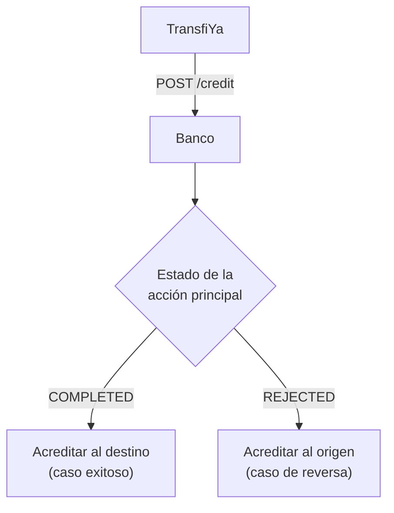
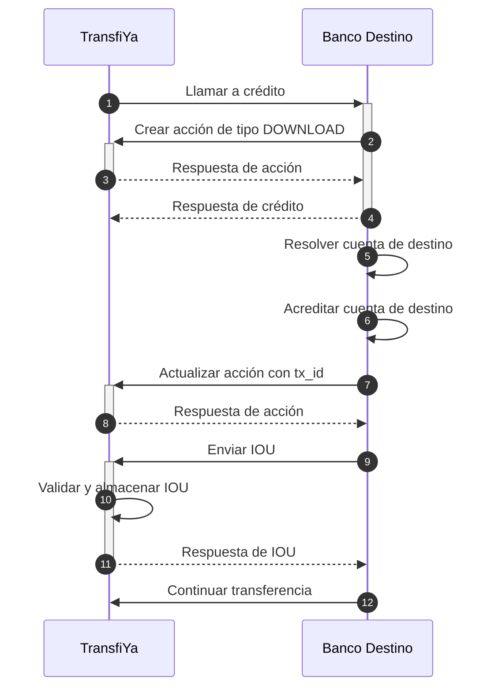

## Acreditar al usuario destino

Acreditar al usuario destino es el último paso en el procesamiento de la transferencia. Para realizar esta operación, <strong>TransfiYa</strong> llama al endpoint `credit` del banco destino y envía la acción principal (`main action`) en estado `COMPLETED` como payload.

El endpoint `credit` funciona de manera muy similar al endpoint `debit`, pero contempla un escenario adicional que debe ser manejado correctamente:

<Info>
El crédito se utiliza tanto para acreditar al usuario destino —que es el caso más común de este endpoint— como para <strong>acreditar al usuario origen</strong> en escenarios de error, cuando los fondos deben ser devueltos al origen.
</Info>


<Info>
La implementación de la operación es la misma; la única diferencia está en determinar si se debe acreditar al <strong>origen</strong> o al <strong>destino</strong> de la acción principal. Esta decisión se toma en función del estado de la acción principal:
  
- Si el estado de la acción principal es <code>COMPLETED</code> → caso exitoso, se debe acreditar al <strong>destino</strong> de la acción principal.
- Si el estado de la acción principal es <code>REJECTED</code> → caso de reversa, se debe acreditar al <strong>origen</strong> de la acción principal para devolver los fondos a la cuenta de origen en caso de errores durante el procesamiento.
</Info>




## Crédito al usuario destino
Una vez que la transferencia ha sido aprobada y confirmada por el banco originador, TransfiYa procede a acreditar los fondos en la cuenta del usuario receptor. Este proceso se realiza mediante una llamada al endpoint credit del banco destino, la cual activa una nueva acción de tipo DOWNLOAD en el sistema.

El flujo de acreditación contempla tanto casos exitosos como escenarios de reversa. En ambos casos, el procedimiento técnico es el mismo: el banco receptor valida la información de la cuenta, acredita los fondos y firma un objeto IOU que sirve como prueba criptográfica de la operación.

A continuación, se describe el paso a paso de este proceso:

<Steps>

<Step title="TransfiYa llama al banco destino para procesar la operación de abono.">
Se invoca el endpoint `credit` con todos los datos necesarios para iniciar el abono de fondos.
<Tabs>
    <Tab title="Request Exitoso">
    ```json
    POST https://ban.co/transfiya/credit
    {
        "source": "wXxwpxB32saqfmfMxAQD4SVWWhhn6akLC2",
        "target": "wRFmYXS2sP9ho9VCZ3j4FuP1j55ABeFvsF",
        "amount": "100.00",
        "symbol": "$tin",
        "labels": {
            "hash": "82de7c0b8b34c7ca6c52547161b2629b1c1e6bdef402999ad60266e6760e4d24",
            "type": "SENDMOL",
            "domain": "tin",
            "flowId": "Lf13jsK83omPv3bOt",
            "status": "COMPLETED",
            "tx_ref": "Lf13jsK83omPv3bOt",
            "tx_id": "20250114890915944TFY123456789012345",
            "created": "2025-01-14T20:40:57.322-05:00",
            "updated": "2025-01-14T20:41:00.841-05:00",
            "description": "Payment for lunch",
            "sourceChannel": "APP",
            "deviceFingerPrint": {
            "city": "Bogotá",
            "hash": "26fff5af6441f8e15a71e8d62c361714484b1b308c99e8eb68ca85e2a7e0dc58",
            "model": "Huawei Mate 20 Pro",
            "country": "Colombia",
            "operator": "Bharti Airtel Limited",
            "SIMCardId": "8991101200003204510",
            "ipAddress": "2001:0db8:85a3:0000:0000:8a2e:0370:7334",
            "mobileDevice": "990000862471854"
            }
        },
        "snapshot": {
            "source": {
            "signer": {
                "handle": "wXxwpxB32saqfmfMxAQD4SVWWhhn6akLC2",
                "labels": {
                "name": "Maria Fernanda Gomez",
                "proprietary": "CC",
                    "identification": "2020202020",
                "bankAccountType": "SVGS",
                "bankAccountNumber": "95445654254",
                "bankId": "895554821",
                "targetSpbviCode": "TFY"
                }
            },
            },
            "symbol": {
            "signer": {
                "handle": "wMxKCAzsQBiUURDU3xD3xuSbVo1S9jmf3d",
                "labels": {
                "created": "2018-10-19T20:23:22.041Z",
                "createdBy": "ZhrQA3vcm17h2RRO4LrJ"
                }
            }
            },
            "target": {
            "signer": {
                "handle": "wRFmYXS2sP9ho9VCZ3j4FuP1j55ABeFvsF",
                "labels": {
                "name": "Jorge Alejandro Fernandez Garcia",
                "proprietary": "CC",
                    "identification": "1010101010",
                "bankAccountType": "SVGS",
                "bankAccountNumber": "12345654321",
                "bankId": "891234918",
                "targetSpbviCode": "TFY"
                }
            },
            }
        },
        "error": {
            "code": 0,
            "message": "Success"
        },
        "action_id": "35de4d3d-3aba-4fb3-b110-d004ce2aabb2",
        "id": "35de4d3d-3aba-4fb3-b110-d004ce2aabb2"
        }
    ```
    </Tab>
    

    <Tab title="Request Reverse">
    ```json
    POST https://ban.co/transfiya/credit
    {
        "source": "wXxwpxB32saqfmfMxAQD4SVWWhhn6akLC2",
        "target": "wRFmYXS2sP9ho9VCZ3j4FuP1j55ABeFvsF",
        "amount": "100.00",
        "symbol": "$tin",
        "labels": {
            "hash": "PENDING",
            "type": "SENDMOL",
            "domain": "tin",
            "flowId": "Lf13jsK83omPv3bOt",
            "status": "ERROR",
            "tx_ref": "Lf13jsK83omPv3bOt",
            "tx_id": "20250114890915944TFY123456789012345",
            "created": "2025-01-14T20:40:57.322-05:00",
            "updated": "2025-01-14T20:41:00.841-05:00",
            "description": "Payment for lunch",
            "sourceChannel": "APP",
            "deviceFingerPrint": {
            "city": "Bogotá",
            "hash": "26fff5af6441f8e15a71e8d62c361714484b1b308c99e8eb68ca85e2a7e0dc58",
            "model": "Huawei Mate 20 Pro",
            "country": "Colombia",
            "operator": "Bharti Airtel Limited",
            "SIMCardId": "8991101200003204510",
            "ipAddress": "2001:0db8:85a3:0000:0000:8a2e:0370:7334",
            "mobileDevice": "990000862471854"
            }
        },
        "snapshot": {
            "source": {
            "signer": {
                "handle": "wXxwpxB32saqfmfMxAQD4SVWWhhn6akLC2",
                "labels": {
                "name": "Maria Fernanda Gomez",
                "proprietary": "CC",
                    "identification": "2020202020",
                "bankAccountType": "SVGS",
                "bankAccountNumber": "95445654254",
                "bankId": "895554821",
                "targetSpbviCode": "TFY"
                }
            },
            },
            "symbol": {
            "signer": {
                "handle": "wMxKCAzsQBiUURDU3xD3xuSbVo1S9jmf3d",
                "labels": {
                "created": "2018-10-19T20:23:22.041Z",
                "createdBy": "ZhrQA3vcm17h2RRO4LrJ"
                }
            }
            },
            "target": {
            "signer": {
                "handle": "wRFmYXS2sP9ho9VCZ3j4FuP1j55ABeFvsF",
                "labels": {
                "name": "Jorge Alejandro Fernandez Garcia",
                "proprietary": "CC",
                    "identification": "1010101010",
                "bankAccountType": "SVGS",
                "bankAccountNumber": "12345654321",
                "bankId": "891234918",
                "targetSpbviCode": "TFY"
                }
            },
            }
        },
        "error": {
            "code": 127,
            "message": "Action cannot be signed."
        },
        "action_id": "35de4d3d-3aba-4fb3-b110-d004ce2aabb2",
        "id": "35de4d3d-3aba-4fb3-b110-d004ce2aabb2"
        }
    ```
    </Tab>
  </Tabs>
</Step>

<Step title="El banco destino crea una acción de tipo `DOWNLOAD` en TransfiYa.">
Esta acción representa la operación de crédito y se registra con estado inicial `PENDING`.
<Tabs>
    <Tab title="Request Exitoso">
    <Info>
    `mainAction` en los valores hace referencia a los datos de la acción principal que se recibe desde TransfiYa. En otras palabras, representa el cuerpo de una llamada `POST https://ban.co/transfiya/credit`.
    </Info>

    <Info>
    `bankSigner` representa el firmante de liquidación que es registrado por el banco durante su incorporación con TransfiYa. Este firmante mantiene el balance total disponible para el banco dentro del sistema.
    </Info>

    ```json
    curl -X POST \
        -H "Content-Type: application/json" \
        -H "x-api-key: <API_KEY>" \
        -H "Authorization: Bearer <TOKEN>" \
        -d '{
            "source": "wRFmYXS2sP9ho9VCZ3j4FuP1j55ABeFvsF",
            "target": "wNbBi3CcZzggFJ9dvDWk35srVGgaAVLzUr",
            "symbol": "$tin",
            "amount": "100.00",
            "labels": {
            "type": "DOWNLOAD",
            "tx_ref": "Lf13jsK83omPv3bOt",
            "received": "2025-01-14T20:42:17.322-05:00",
            "dispatched": "2025-01-14T20:42:17.831-05:00"
            }
        }' "<TRANSFIYA URL>/v1/action"
    ```
    | Field name        | Descripción                                                                 |
    |-------------------|------------------------------------------------------------------------------|
    | `source`          | `mainAction.snapshot.target.signer.handle` — Usuario destino de la transferencia (cliente del banco). |
    | `target`          | `bankSigner.handle` — Firmante de liquidación del banco destino.             |
    | `symbol`          | `mainAction.symbol` — Moneda de la transferencia.                            |
    | `amount`          | `mainAction.amount` — Monto de la transferencia.                             |
    | `labels.type`     | `DOWNLOAD` — Siempre debe ser `DOWNLOAD` en operaciones de crédito.          |
    | `labels.tx_ref`   | `mainAction.labels.tx_ref` — Referencia única de la transferencia.           |
    | `labels.received` | Timestamp en formato ISO 8601 — Momento en que TransfiYa recibió la solicitud de abono. |
    | `labels.dispatched` | Timestamp en formato ISO 8601 — Momento en que se envió la solicitud de creación de la acción a TransfiYa. |
        
    </Tab>
    <Tab title="Response Exitoso">
    <Info>
    Pueden añadirse campos adicionales a estas respuestas como parte de nuevas funcionalidades. Las implementaciones de los bancos DEBEN ser resilientes ante la adición de nuevos campos.
    </Info>

    ```json
    {
        "source": "wRFmYXS2sP9ho9VCZ3j4FuP1j55ABeFvsF",
        "target": "wNbBi3CcZzggFJ9dvDWk35srVGgaAVLzUr",
        "amount": "100.00",
        "symbol": "$tin",
        "labels": {
            "hash": "PENDING",
            "type": "DOWNLOAD",
            "domain": "tin",
            "status": "PENDING",
            "tx_ref": "Lf13jsK83omPv3bOt",
            "received": "2025-01-14T20:42:17.322-05:00",
            "dispatched": "2025-01-14T20:42:17.831-05:00"
            "delivered": "2025-01-14T20:42:18.002-05:00",
            "created": "2025-01-14T20:42:18.305-05:00",
            "updated": "2025-01-14T20:42:18.305-05:00"
        },
        "snapshot": {
            "source": {
            "signer": {
                "handle": "wRFmYXS2sP9ho9VCZ3j4FuP1j55ABeFvsF",
                "labels": {
                "name": "Jorge Alejandro Fernandez Garcia",
                "proprietary": "CC",
                    "identification": "1010101010",
                "bankAccountType": "SVGS",
                "bankAccountNumber": "12345654321",
                "bankId": "891234918",
                "targetSpbviCode": "TFY"
                }
            }
            },
            "symbol": {
            "signer": {
                "handle": "wMxKCAzsQBiUURDU3xD3xuSbVo1S9jmf3d",
                "labels": {
                "created": "2018-10-19T20:23:22.041Z",
                "createdBy": "ZhrQA3vcm17h2RRO4LrJ"
                }
            }
            },
            "target": {
            "signer": {
                "handle": "wNbBi3CcZzggFJ9dvDWk35srVGgaAVLzUr",
                "labels": {
                "type": "TROUPE",
                "created": "2023-01-21T11:16:11-05:00",
                "bankName": "Banco Verde",
                "bankId": "801982554",
                "bankBicfi": "8924",
                "createdBy": "A16iU3t38Tygr70uO1qf",
                "routerReference": "$bancoverde",
                "bankAccountNumber": "100101"
                }
            }
            }
        },
        "error": {
            "code": 0,
            "message": "Success"
        },
        "action_id": "2aa49d5d-3dcc-4841-bb3e-baeb9fef4278"
        }
    ```
    </Tab>
    <Tab title="Request Reverse">
    <Info>
    `mainAction` se utiliza para hacer referencia a los datos de la acción principal recibida desde TransfiYa. En otras palabras, representa el cuerpo de una llamada  
    **`POST` https://ban.co/transfiya/credit**
    </Info>

    <Info>
    `bankSigner` representa el firmante de liquidación que es registrado por el banco durante el proceso de incorporación con TransfiYa. Este firmante mantiene el saldo total disponible para el banco dentro del sistema.
    </Info>

    <Info>
    Una acción `DOWNLOAD` en un flujo de reversa es exactamente lo opuesto a la acción `UPLOAD` de la fase de débito. Los fondos se devuelven desde el firmante usuario de origen hacia el firmante de liquidación del banco de origen.
    </Info>

    ```json
    curl -X POST \
        -H "Content-Type: application/json" \
        -H "x-api-key: <API_KEY>" \
        -H "Authorization: Bearer <TOKEN>" \
        -d '{
            "source": "wXxwpxB32saqfmfMxAQD4SVWWhhn6akLC2",
            "target": "wSjXPK5uocHQdY81THFG3VL8G5vN6mU7Ro",
            "symbol": "$tin",
            "amount": "100.00",
            "labels": {
            "type": "DOWNLOAD",
            "tx_ref": "Lf13jsK83omPv3bOt",
            "received": "2025-01-14T20:42:17.322-05:00",
            "dispatched": "2025-01-14T20:42:17.831-05:00"
            }
        }' "<TRANSFIYA URL>/v1/action"
    ```
    | Field name         | Descripción                                                                                       |
    |--------------------|---------------------------------------------------------------------------------------------------|
    | `source`           | `mainAction.snapshot.source.signer.handle`<br />Origen de la transferencia (usuario del banco).   |
    | `target`           | `bankSigner.handle`<br />Firmante de liquidación del banco de origen.                            |
    | `symbol`           | `mainAction.symbol`<br />Moneda de la transferencia.                                              |
    | `amount`           | `mainAction.amount`<br />Monto de la transferencia.                                               |
    | `labels.type`      | `DOWNLOAD`<br />Siempre debe ser `DOWNLOAD` para créditos.                                        |
    | `labels.tx_ref`    | `mainAction.labels.tx_ref`<br />Referencia de la transferencia.                                   |
    | `labels.received`  | Timestamp en formato ISO 8601<br />Momento en que se recibió esta llamada de crédito desde TransfiYa. |
    | `labels.dispatched`| Timestamp en formato ISO 8601<br />Momento en que se envió esta solicitud de creación de acción a TransfiYa. |

    </Tab>
     <Tab title="Response Reverse">
    <Info>
    Pueden agregarse campos adicionales a estas respuestas como parte de nuevas funcionalidades. Las implementaciones bancarias DEBEN ser resilientes ante la adición de nuevos campos.
    </Info>

    ```json
    {
        "source": "wXxwpxB32saqfmfMxAQD4SVWWhhn6akLC2",
        "target": "wSjXPK5uocHQdY81THFG3VL8G5vN6mU7Ro",
        "amount": "100.00",
        "symbol": "$tin",
        "labels": {
            "hash": "PENDING",
            "type": "DOWNLOAD",
            "domain": "tin",
            "status": "PENDING",
            "tx_ref": "Lf13jsK83omPv3bOt",
            "received": "2025-01-14T20:42:17.322-05:00",
            "dispatched": "2025-01-14T20:42:17.831-05:00"
            "delivered": "2025-01-14T20:42:18.002-05:00",
            "created": "2025-01-14T20:42:18.305-05:00",
            "updated": "2025-01-14T20:42:18.305-05:00"
        },
        "snapshot": {
            "source": {
            "signer": {
                "handle": "wXxwpxB32saqfmfMxAQD4SVWWhhn6akLC2",
                "labels": {
                "name": "Maria Fernanda Gomez",
                "proprietary": "CC",
                    "identification": "2020202020",
                "bankAccountType": "SVGS",
                "bankAccountNumber": "95445654254",
                "bankId": "895554821",
                "targetSpbviCode": "TFY"
                }
            }
            },
            "symbol": {
            "signer": {
                "handle": "wMxKCAzsQBiUURDU3xD3xuSbVo1S9jmf3d",
                "labels": {
                "created": "2018-10-19T20:23:22.041Z",
                "createdBy": "ZhrQA3vcm17h2RRO4LrJ"
                }
            }
            },
            "target": {
            "signer": {
                "handle": "wSjXPK5uocHQdY81THFG3VL8G5vN6mU7Ro",
                "labels": {
                "type": "TROUPE",
                "created": "2022-06-10T10:46:35-05:00",
                "bankName": "Banco Rojo",
                "bankId": "895554821",
                "bankBicfi": "9574",
                "createdBy": "A16iU3t38Tygr70uO1qf",
                "routerReference": "$bancorojo",
                "bankAccountNumber": "160101"
                }
            }
            }
        },
        "error": {
            "code": 0,
            "message": "Success"
        },
        "action_id": "2aa49d5d-3dcc-4841-bb3e-baeb9fef4278"
        }
    ```
    </Tab>
    <Tab title="Error Response">
    <Info>
    La respuesta de error se devuelve cuando una solicitud no es válida, cuando quien llama no tiene los permisos suficientes o cuando el sistema se encuentra en mantenimiento.
    </Info>

    <Info>
    El código de estado HTTP para errores será `4xx` o `5xx`. El cuerpo de la respuesta puede incluir información adicional del error en el formato descrito anteriormente, si dicha información está disponible.
    </Info>

     ```json
     {
        "error": {
            "code": 121,
            "message": "Signer not found in database."
        }
    }

    ```
    </Tab>
  </Tabs>
</Step>

<Step title="El banco responde a la llamada inicial de abono.">
Esta respuesta cierra la parte síncrona de la operación; el resto se ejecuta de forma asíncrona.
<Tabs>
    <Tab title="Response Exitoso">
    ```json
    {
    "action_id": "2aa49d5d-3dcc-4841-bb3e-baeb9fef4278"
    }
    ```
    </Tab>
    <Tab title="Error Response">
    <Info>
    En caso de errores irrecuperables durante el procesamiento, se puede retornar un objeto `error` a TransfiYa.

    El campo `action_id` es opcional en caso de errores, pero debe incluirse si el error ocurrió después de que la acción fue creada exitosamente.

    Los códigos de error retornados por los bancos deben estar en el rango `3xx`.
    </Info>

    ```json
    {
        "action_id": "2aa49d5d-3dcc-4841-bb3e-baeb9fef4278", // If available
        "error": {
            "code": 300,
            "message": "Transfer timeout"
        }
    }
    ```
    | Field name      | Descripción del valor del campo                                                                 |
    |------------------|------------------------------------------------------------------------------------------------|
    | `error.code`     | Código de error válido soportado por TransfiYa que representa el error ocurrido.              |
    | `error.message`  | Mensaje con información adicional acerca del error ocurrido.                                   |

    </Tab>
  </Tabs>
</Step>

<Step title="El banco determina a quién abonar según el estado de la acción principal.">
- Si `COMPLETED` → se abona al `target`.  
- Si `REJECTED` → se abona al `source`.
</Step>

<Step title="El banco valida la información de la cuenta de abono y acredita el monto.">
La cuenta debe existir, estar activa y tener condiciones válidas para recibir el abono.
</Step>

<Step title="El banco actualiza la acción con un `tx_id`.">
Este identificador permite rastrear y conciliar la operación dentro del sistema bancario.
<Tabs>
    <Tab title="Request">
    ```json
    curl -X PUT \
    -H "Content-Type: application/json" \
    -H "x-api-key: <API_KEY>" \
    -H "Authorization: Bearer <TOKEN>" \
    -d '{
        "labels": {
        "tx_id": "39288282838"
        }
    }' "<TRANSFIYA URL>/v1/action/<download_action_id>"
    ```
    | Field name             | Descripción del valor del campo                                                                                      |
    |------------------------|------------------------------------------------------------------------------------------------------------------------|
    | `<download_action_id>` | El `<download_action_id>` en la URL representa el ID de la acción de tipo `DOWNLOAD` creada en el paso 2. En el ejemplo, este valor es `2aa49d5d-3dcc-4841-bb3e-baeb9fef4278`. |
    | `labels.tx_id`         | Identificador único de la transacción que el banco ejecutó para acreditar los fondos en la cuenta de destino.        |

    </Tab>
    <Tab title="Response">
    ```json
    {
        "source": "wRFmYXS2sP9ho9VCZ3j4FuP1j55ABeFvsF",
        "target": "wNbBi3CcZzggFJ9dvDWk35srVGgaAVLzUr",
        "amount": "100.00",
        "symbol": "$tin",
        "labels": {
            "hash": "PENDING",
            "type": "DOWNLOAD",
            "domain": "tin",
            "status": "PENDING",
            "tx_ref": "Lf13jsK83omPv3bOt",
            "tx_id": "39288282838",
            "created": "2025-01-14T20:42:18.305-05:00",
            "updated": "2025-01-14T20:42:20.174-05:00"
        },
        "snapshot": {
            "source": {
            "signer": {
                "handle": "wRFmYXS2sP9ho9VCZ3j4FuP1j55ABeFvsF",
                "labels": {
                "name": "Jorge Alejandro Fernandez Garcia",
                "proprietary": "CC",
                    "identification": "1010101010",
                "bankAccountType": "SVGS",
                "bankAccountNumber": "12345654321",
                "bankId": "891234918",
                "targetSpbviCode": "TFY"
                }
            }
            },
            "symbol": {
            "signer": {
                "handle": "wMxKCAzsQBiUURDU3xD3xuSbVo1S9jmf3d",
                "labels": {
                "created": "2018-10-19T20:23:22.041Z",
                "createdBy": "ZhrQA3vcm17h2RRO4LrJ"
                }
            }
            },
            "target": {
            "signer": {
                "handle": "wNbBi3CcZzggFJ9dvDWk35srVGgaAVLzUr",
                "labels": {
                "type": "TROUPE",
                "created": "2023-01-21T11:16:11-05:00",
                "bankName": "Banco Verde",
                "bankId": "801982554",
                "bankBicfi": "8924",
                "createdBy": "A16iU3t38Tygr70uO1qf",
                "routerReference": "$bancoverde",
                "bankAccountNumber": "100101"
                }
            }
            }
        },
        "error": {
            "code": 0,
            "message": "Success"
        },
        "action_id": "2aa49d5d-3dcc-4841-bb3e-baeb9fef4278"
        }
    ```
    </Tab>
  </Tabs>
</Step>

<Step title="El banco crea y firma un objeto IOU como prueba de la operación.">
El IOU incluye los datos del abono y debe ser firmado criptográficamente.
<Tabs>
    <Tab title="Request">
    <Info>
    TransfiYa valida la firma del objeto IOU recibido y lo almacena en el libro mayor si todo es válido. Esta operación también marca la acción `DOWNLOAD` como `COMPLETED`.
    </Info>

    <Info>
    El IOU se utiliza como prueba de que una operación ha sido realizada en el core bancario. Debe coincidir exactamente con la acción que representa. Por este motivo, la mayoría de los datos del IOU se copian desde el objeto `downloadAction`.

    TransfiYa utiliza firmas criptográficas como prueba de que los participantes autorizaron los movimientos de saldo. Los datos se hashean primero y luego se firman utilizando claves privadas que **nunca deben compartirse** con TransfiYa. Los algoritmos de firma y hash están documentados, y los SDKs de TransfiYa permiten realizar estas operaciones de forma sencilla para facilitar la integración.
    </Info>

    ```json
    curl -X POST \
        -H "Content-Type: application/json" \
        -H "x-api-key: <API_KEY>" \
        -H "Authorization: Bearer <TOKEN>" \
        -d '{
            "hash": {
            "types": "sha256:sha256",
            "steps": "stringify:data",
            "value": "cacb220e5efe342b0a82f3e932fd3eb22d8d153de210736b80050e4fc2b488ab"
            },
            "data": {
            "source": "wRFmYXS2sP9ho9VCZ3j4FuP1j55ABeFvsF",
            "target": "wNbBi3CcZzggFJ9dvDWk35srVGgaAVLzUr",
            "symbol": "wMxKCAzsQBiUURDU3xD3xuSbVo1S9jmf3d",
            "amount": "100.00",
            "domain": "tin",
            "expiry": "2025-01-14T20:43:19.122-05:00",
            "random": "226bf3dd2033ff6ae837"
            },
            "meta": {
            "signatures": [
                {
                "scheme": "ecdsa-ed25519",
                "signer": "wRFmYXS2sP9ho9VCZ3j4FuP1j55ABeFvsF",
                "public": "040644265c15370ddc3e73f86699bbe0e221bec50ff06862787408c63aa835306278acccce5b4e6765018aee748cd7682e7100b915590ee074138d4ec60a2e0fd5",
                "string": "3044022002d97125f106bf60c652152d19387ec4f503e6e8710214d37993dbe9571a8098022003890339168fde030100402cda929883ca7ba815a971cf4ad7cce48c128e8ac9",
                }
            ]
            }
        }' "<TRANSFIYA URL>/v1/action/<download_action_id>/sendit"
    ```
    | Field name         | Descripción del valor del campo                                                                                                      |
    |--------------------|---------------------------------------------------------------------------------------------------------------------------------------|
    | `<download_action_id>` | El `<download_action_id>` en la URL es el ID de la acción de tipo `DOWNLOAD` creada en el paso 2. En el ejemplo es `2aa49d5d-3dcc-4841-bb3e-baeb9fef4278`. |
    | `data.source`      | `downloadAction.snapshot.source.signer.handle` – Firmante fuente del abono.                                                          |
    | `data.target`      | `downloadAction.snapshot.target.signer.handle` – Firmante destino del abono.                                                         |
    | `data.symbol`      | `downloadAction.snapshot.symbol.signer.handle` – Identificador del símbolo o moneda.                                                 |
    | `data.amount`      | `downloadAction.amount` – Monto a acreditar.                                                                                         |
    | `data.domain`      | `downloadAction.labels.domain` – Dominio asociado a la transacción.                                                                 |
    | `data.expiry`      | `currentTime + 1 minuto` en formato ISO 8601 – Momento a partir del cual TransfiYa puede expirar una operación pendiente.            |
    | `hash`             | Hash del objeto `data`, generado por los SDKs. `hash.value` es el valor calculado, y los demás campos indican los pasos de hash.     |
    | `meta.signatures`  | Firma del `hash` generada con la clave privada del firmante fuente. Incluye: `schema` (algoritmo), `signer`, `public` (clave pública) y `string` (firma). |

    </Tab>
    <Tab title="Response Exitoso">
    ```json
    {
        "source": "wRFmYXS2sP9ho9VCZ3j4FuP1j55ABeFvsF",
        "target": "wNbBi3CcZzggFJ9dvDWk35srVGgaAVLzUr",
        "amount": "100.00",
        "symbol": "$tin",
        "labels": {
            "hash": "320224cb6dd4b8a656baea948222c1263c1dd49f7151f4304880fe3226728579",
            "iouHash":"cacb220e5efe342b0a82f3e932fd3eb22d8d153de210736b80050e4fc2b488ab",
            "type": "DOWNLOAD",
            "domain": "tin",
            "status": "COMPLETED",
            "tx_ref": "Lf13jsK83omPv3bOt",
            "created": "2025-01-14T20:42:18.305-05:00",
            "updated": "2025-01-14T20:42:58.151-05:00"
        },
        "snapshot": {
            "source": {
            "signer": {
                "handle": "wRFmYXS2sP9ho9VCZ3j4FuP1j55ABeFvsF",
                "labels": {
                "name": "Jorge Alejandro Fernandez Garcia",
                "proprietary": "CC",
                    "identification": "1010101010",
                "bankAccountType": "SVGS",
                "bankAccountNumber": "12345654321",
                "bankId": "891234918",
                "targetSpbviCode": "TFY"
                }
            }
            },
            "symbol": {
            "signer": {
                "handle": "wMxKCAzsQBiUURDU3xD3xuSbVo1S9jmf3d",
                "labels": {
                "created": "2018-10-19T20:23:22.041Z",
                "createdBy": "ZhrQA3vcm17h2RRO4LrJ"
                }
            }
            },
            "target": {
            "signer": {
                "handle": "wNbBi3CcZzggFJ9dvDWk35srVGgaAVLzUr",
                "labels": {
                "type": "TROUPE",
                "created": "2023-01-21T11:16:11-05:00",
                "bankName": "Banco Verde",
                "bankId": "801982554",
                "bankBicfi": "8924",
                "createdBy": "A16iU3t38Tygr70uO1qf",
                "routerReference": "$bancoverde",
                "bankAccountNumber": "100101"
                }
            }
            }
        },
        "error": {
            "code": 0,
            "message": "Success"
        },
        "action_id": "2aa49d5d-3dcc-4841-bb3e-baeb9fef4278"
        }
    ```
    </Tab>
    <Tab title="Error Response">
    ```json
    {
        "source": "wRFmYXS2sP9ho9VCZ3j4FuP1j55ABeFvsF",
        "target": "wNbBi3CcZzggFJ9dvDWk35srVGgaAVLzUr",
        "amount": "100.00",
        "symbol": "$tin",
        "labels": {
            "hash": "PENDING",
            "type": "DOWNLOAD",
            "domain": "tin",
            "status": "ERROR",
            "tx_ref": "Lf13jsK83omPv3bOt",
            "created": "2025-01-14T20:42:18.305-05:00",
            "updated": "2025-01-14T20:42:58.151-05:00"
        },
        "snapshot": {
            "source": {
            "signer": {
                "handle": "wRFmYXS2sP9ho9VCZ3j4FuP1j55ABeFvsF",
                "labels": {
                "name": "Jorge Alejandro Fernandez Garcia",
                "proprietary": "CC",
                    "identification": "1010101010",
                "bankAccountType": "SVGS",
                "bankAccountNumber": "12345654321",
                "bankId": "891234918",
                "targetSpbviCode": "TFY"
                }
            }
            },
            "symbol": {
            "signer": {
                "handle": "wMxKCAzsQBiUURDU3xD3xuSbVo1S9jmf3d",
                "labels": {
                "created": "2018-10-19T20:23:22.041Z",
                "createdBy": "ZhrQA3vcm17h2RRO4LrJ"
                }
            }
            },
            "target": {
            "signer": {
                "handle": "wNbBi3CcZzggFJ9dvDWk35srVGgaAVLzUr",
                "labels": {
                "type": "TROUPE",
                "created": "2023-01-21T11:16:11-05:00",
                "bankName": "Banco Verde",
                "bankId": "801982554",
                "bankBicfi": "8924",
                "createdBy": "A16iU3t38Tygr70uO1qf",
                "routerReference": "$bancoverde",
                "bankAccountNumber": "100101"
                }
            }
            }
        },
        "error": {
            "code": 127,
            "message": "Action cannot be signed."
        },
        "action_id": "2aa49d5d-3dcc-4841-bb3e-baeb9fef4278"
        }
    ```
    </Tab>
  </Tabs>
</Step>

<Step title="El banco realiza validaciones finales y envía una llamada `continue`.">
Esta llamada indica que el flujo puede continuar. Debe incluir los campos `received` y `dispatched` requeridos por regulación.
<Tabs>
    <Tab title="Request">
    <Info>
    Para continuar con el procesamiento de la transferencia, basta con llamar al endpoint `continue` y proporcionar las marcas de tiempo requeridas por la regulación.
    </Info>

    ```json
    curl -X POST \
    -H "Content-Type: application/json" \
    -H "x-api-key: <API_KEY>" \
    -H "Authorization: Bearer <TOKEN>" \
    -d '{
        "received": "2025-01-14T20:42:58.252-05:00",
        "dispatched": "2025-01-14T20:42:58.552-05:00",
    }' "<TRANSFIYA URL>/v1/transfer/<tx_ref>/continue"
    ```
    | Field name      | Valor del campo                                                                                  |
    |-----------------|--------------------------------------------------------------------------------------------------|
    | `<tx_ref>`      | El campo `<tx_ref>` en la URL representa la referencia de la transferencia, ubicada en `labels.tx_ref` del `mainAction`. |
    | `received`      | Timestamp en formato ISO 8601. Representa el momento en que se recibió la última respuesta de TransfiYa (llamada `sendit`). |
    | `dispatched`    | Timestamp en formato ISO 8601. Representa el momento en que se envió la llamada `continue` a TransfiYa. |

    </Tab>
    <Tab title="Response">
    <Info>
    Los bancos pueden reportar errores en la parte asincrónica del procesamiento de una transferencia llamando al endpoint `continue` e incluyendo un objeto `error` en el cuerpo de la solicitud con información adicional sobre el error.
    </Info>

    <Info>
    Los códigos de error devueltos por los bancos deben estar en el rango `3xx`.
    </Info>

    ```json
    curl -X POST \
    -H "Content-Type: application/json" \
    -H "x-api-key: <API_KEY>" \
    -H "Authorization: Bearer <TOKEN>" \
    -d '{
        "received": "2025-01-14T20:42:58.252-05:00",
        "dispatched": "2025-01-14T20:42:58.552-05:00",
        "error": {
        "code": 300,
        "message": "Transfer timeout"
        }
    }' "<TRANSFIYA URL>/v1/transfer/<tx_ref>/continue"
    ```
    | Field name       | Descripción                                                                                      |
    |------------------|--------------------------------------------------------------------------------------------------|
    | `<tx_ref>`       | El campo `<tx_ref>` en la URL representa la referencia de la transferencia. Se encuentra en `labels.tx_ref` del `mainAction`. |
    | `received`       | Marca de tiempo en formato ISO 8601. Representa el momento en que se recibió la respuesta de la última llamada de TransfiYa (`sendit`). |
    | `dispatched`     | Marca de tiempo en formato ISO 8601. Representa el momento en que se envió la llamada `continue` a TransfiYa. |
    | `error.code`     | Código de error válido, soportado por TransfiYa, correspondiente a un error ocurrido.             |
    | `error.message`  | Mensaje con información adicional sobre el error ocurrido.                                       |

    </Tab>
  </Tabs>
</Step>

</Steps>
