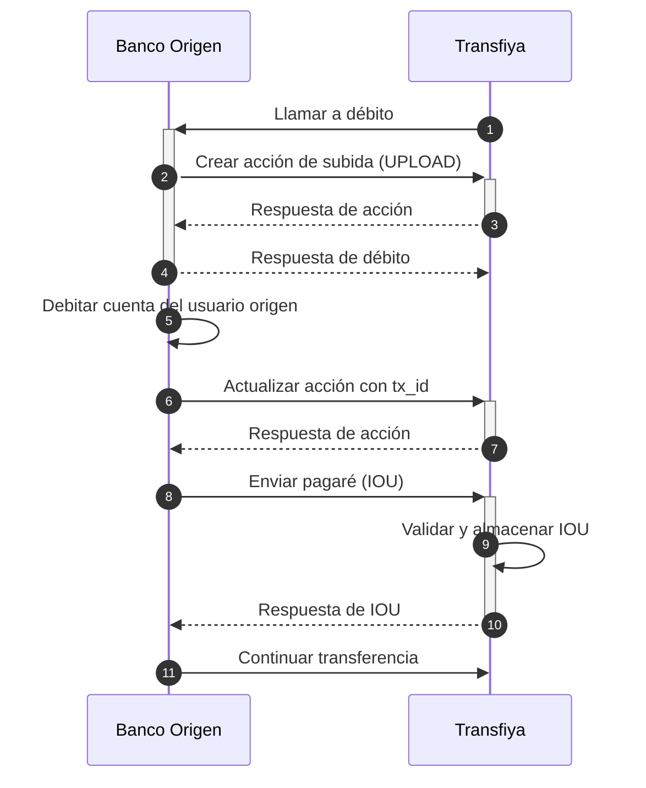

## Débito al usuario origen

El endpoint de débito se invoca al inicio del procesamiento de una transferencia, con el objetivo de debitar la cuenta del usuario origen. Este endpoint debe garantizar que la cuenta esté activa y sea válida, y debe **reservar los fondos necesarios** para que la operación pueda ejecutarse.

<Info icon="shield-check">
  Los bancos pueden optar por registrar la transacción de forma definitiva o simplemente realizar una reserva de fondos.
</Info>

En cualquiera de los casos, esta operación debe ser **finalizada una vez que la transferencia se haya completado**, o bien los fondos deben ser **liberados obligatoriamente** en caso de que ocurra un error durante el proceso.

En Transfiya, una operación de débito se representa como una acción de tipo `UPLOAD`. Si esta acción se marca como `COMPLETED` exitosamente, pero más adelante ocurre un error en el procesamiento, Transfiya ejecutará una operación opuesta (de tipo `credit`) para **revertir el movimiento de saldo** y restablecer el estado original de la cuenta.

**Flujo de debito al usuario origen**

## Proceso de débito paso a paso

A continuación, se describe detalladamente el flujo de procesamiento para una transferencia tipo `SEND`, enfocándonos en la etapa de **débito al usuario origen**. Este flujo se ejecuta en múltiples etapas, combinando interacciones entre TransfiYa y el banco originador, tanto en fases síncronas como asincrónicas.

El objetivo principal de este proceso es asegurar que los fondos del usuario origen estén disponibles y sean reservados o debitados correctamente antes de avanzar con el resto de la operación. El flujo también contempla los mecanismos necesarios para revertir movimientos en caso de errores, así como el uso de pruebas criptográficas (IOU) y el cumplimiento de los tiempos regulatorios.

Cada paso está alineado con los lineamientos del nuevo modelo SPI (Sistema de Pagos Inmediatos) y busca mantener la compatibilidad con la arquitectura existente de TransfiYa. A continuación se detallan las acciones involucradas, junto con ejemplos prácticos y consideraciones técnicas relevantes.




<Steps>
  <Step title="TransfiYa llama al banco origen para procesar la operación de débito">
    TransfiYa inicia el proceso mediante una solicitud **POST** al endpoint de débito del banco origen, con la información completa de la transferencia.
    <Tabs>
        <Tab title="Request">
        ```json
        POST https://ban.co/transfiya/debit
        {
        "source": "wXxwpxB32saqfmfMxAQD4SVWWhhn6akLC2",
        "target": "wRFmYXS2sP9ho9VCZ3j4FuP1j55ABeFvsF",
        "amount": "100.00",
        "symbol": "$tin",
        "labels": {
            "hash": "PENDING",
            "type": "SENDMOL",
            "domain": "tin",
            "flowId": "Lf13jsK83omPv3bOt",
            "status": "PENDING",
            "tx_ref": "Lf13jsK83omPv3bOt",
            "tx_id": "20250114890915944TFY123456789012345",
            "created": "2025-01-14T20:40:57.322-05:00",
            "updated": "2025-01-14T20:40:57.322-05:00",
            "description": "Payment for lunch",
            "sourceChannel": "APP",
            "deviceFingerPrint": {
            "city": "Bogotá",
            "hash": "26fff5af6441f8e15a71e8d62c361714484b1b308c99e8eb68ca85e2a7e0dc58",
            "model": "Huawei Mate 20 Pro",
            "country": "Colombia",
            "operator": "Bharti Airtel Limited",
            "SIMCardId": "8991101200003204510",
            "ipAddress": "2001:0db8:85a3:0000:0000:8a2e:0370:7334",
            "mobileDevice": "990000862471854"
            }
        },
        "snapshot": {
            "source": {
            "signer": {
                "handle": "wXxwpxB32saqfmfMxAQD4SVWWhhn6akLC2",
                "labels": {
                "name": "Maria Fernanda Gomez",
                "proprietary": "CC",
                    "identification": "2020202020",
                "bankAccountType": "SVGS",
                "bankAccountNumber": "95445654254",
                "bankId": "895554821",
                "targetSpbviCode": "TFY"
                }
            },
            },
            "symbol": {
            "signer": {
                "handle": "wMxKCAzsQBiUURDU3xD3xuSbVo1S9jmf3d",
                "labels": {
                "created": "2018-10-19T20:23:22.041Z",
                "createdBy": "ZhrQA3vcm17h2RRO4LrJ"
                }
            }
            },
            "target": {
            "signer": {
                "handle": "wRFmYXS2sP9ho9VCZ3j4FuP1j55ABeFvsF",
                "labels": {
                "name": "Jorge Alejandro Fernandez Garcia",
                "proprietary": "CC",
                    "identification": "1010101010",
                "bankAccountType": "SVGS",
                "bankAccountNumber": "12345654321",
                "bankId": "891234918",
                "targetSpbviCode": "TFY"
                }
            },
            }
        },
        "error": {
            "code": 0,
            "message": "Success"
        },
        "action_id": "35de4d3d-3aba-4fb3-b110-d004ce2aabb2",
        "id": "35de4d3d-3aba-4fb3-b110-d004ce2aabb2"
        }
        ```
        </Tab>
        <Tab title="Response">
        ```diff
        ```
        </Tab>
    </Tabs>
  </Step>

  <Step title="El banco origen crea una acción tipo `UPLOAD` en TransfiYa">
    Esto representa la reserva o débito de fondos. Se debe generar una acción usando el API de TransfiYa, referenciando la transferencia original.
    <Tabs>
        <Tab title="Request">
        ```diff
        curl -X POST \
        -H "Content-Type: application/json" \
        -H "x-api-key: <API_KEY>" \
        -H "Authorization: Bearer <TOKEN>" \
        -d '{
            "source": "wSjXPK5uocHQdY81THFG3VL8G5vN6mU7Ro",
            "target": "wXxwpxB32saqfmfMxAQD4SVWWhhn6akLC2",
            "symbol": "$tin",
            "amount": "100.00",
            "labels": {
            "type": "UPLOAD",
            "tx_ref": "Lf13jsK83omPv3bOt"
            }
        }' "URL/v1/action"
        ```
                | Atributo        | Valor                                                                 |
        |-----------------|------------------------------------------------------------------------|
        | `source`        | `bankSigner.handle` — Bank settlement signer.                          |
        | `target`        | `mainAction.snapshot.source.signer.handle` — Source of the transfer (bank user). |
        | `symbol`        | `mainAction.symbol` — Currency of the transfer.                        |
        | `labels.type`   | `UPLOAD` — Always `UPLOAD` for debits.                                 |
        | `labels.tx_ref` | `mainAction.labels.tx_ref` — Transfer reference.                       |

        <Info>
        `mainAction` en los valores se utiliza al hacer referencia a los datos de la acción principal recibida desde TransfiYa. En otras palabras, representa el cuerpo de una llamada **POST** a `https://ban.co/transfiya/debit`.
        </Info>

        <Info>
        `bankSigner` representa el firmante de liquidación que es registrado por el banco durante el proceso de incorporación con TransfiYa. Este firmante mantiene el balance total disponible para el banco dentro del sistema.
        </Info>
        </Tab>
        <Tab title="Response">
        ```json
        {
            "source": "wSjXPK5uocHQdY81THFG3VL8G5vN6mU7Ro",
            "target": "wXxwpxB32saqfmfMxAQD4SVWWhhn6akLC2",
            "amount": "100.00",
            "symbol": "$tin",
            "labels": {
                "hash": "PENDING",
                "type": "UPLOAD",
                "domain": "tin",
                "status": "PENDING",
                "tx_ref": "Lf13jsK83omPv3bOt",
                "created": "2025-01-14T20:40:57.322-05:00",
                "updated": "2025-01-14T20:40:57.322-05:00"
            },
            "snapshot": {
                "source": {
                "signer": {
                    "handle": "wSjXPK5uocHQdY81THFG3VL8G5vN6mU7Ro",
                    "labels": {
                    "type": "TROUPE",
                    "created": "2022-06-10T10:46:35-05:00",
                    "bankName": "Banco Rojo",
                    "bankId": "895554821",
                    "bankBicfi": "9574",
                    "createdBy": "A16iU3t38Tygr70uO1qf",
                    "routerReference": "$bancorojo",
                    "bankAccountNumber": "160101"
                    }
                }
                },
                "symbol": {
                "signer": {
                    "handle": "wMxKCAzsQBiUURDU3xD3xuSbVo1S9jmf3d",
                    "labels": {
                    "created": "2018-10-19T20:23:22.041Z",
                    "createdBy": "ZhrQA3vcm17h2RRO4LrJ"
                    }
                }
                },
                "target": {
                "signer": {
                    "handle": "wXxwpxB32saqfmfMxAQD4SVWWhhn6akLC2",
                    "labels": {
                    "name": "Maria Fernanda Gomez",
                    "proprietary": "CC",
                        "identification": "2020202020",
                    "bankAccountType": "SVGS",
                    "bankAccountNumber": "95445654254",
                    "bankId": "895554821",
                    "targetSpbviCode": "TFY"
                    }
                }
                }
            },
            "error": {
                "code": 0,
                "message": "Success"
            },
            "action_id": "5954ac04-b4db-4c6f-86f6-43df30f6bacb"
            }
        ```
        </Tab>
         <Tab title="Error">
        ```json
        {
            "error": {
                "code": 121,
                "message": "Signer not found in database."
            }
        }
        ```
        </Tab>
    </Tabs>    
  </Step>

  <Step title="El banco origen responde a la solicitud inicial de débito">
    Esta respuesta marca el cierre de la fase síncrona. El campo obligatorio es `action_id`.
    <Tabs>
        <Tab title="Exitosa">
        ```json
        {
        "action_id": "5954ac04-b4db-4c6f-86f6-43df30f6bacb"
        }
        ```
       <Info>
        Se pueden incluir campos adicionales en la respuesta, pero solo `action_id` es obligatorio.
        </Info>

        </Tab>
        <Tab title="Fallida">
        ```json
        {
            "action_id": "5954ac04-b4db-4c6f-86f6-43df30f6bacb", // If available
            "error": {
                "code": 300,
                "message": "Transfer timeout"
            }
        }
        ```
       <Info>
        En caso de errores no recuperables durante el procesamiento, se puede devolver un objeto `error` a TransfiYa.
        </Info>

        <Info>
        El campo `action_id` es opcional en caso de errores, pero debe incluirse si el error ocurrió después de que la acción fue creada exitosamente.
        </Info>

        <Info>
        Los códigos de error devueltos por los bancos deben estar en el rango de `3xx`.
        </Info>

        </Tab>
    </Tabs>
  </Step>

  <Step title="El banco valida la cuenta origen y debita el monto correspondiente">
    Se realizan validaciones sobre la cuenta y se ejecuta la operación interna de débito.
  </Step>

  <Step title="El banco actualiza la acción `UPLOAD` con el `tx_id` de la transacción interna">
    <Info>
    El identificador `tx_id` permite posteriores conciliaciones entre TransfiYa y el banco.
    </Info>
  </Step>

  <Step title="TransfiYa responde con la acción actualizada">
    La acción incluirá el nuevo campo `tx_id` como parte de los metadatos.
    <Tabs>
        <Tab title="Exitosa">
        ```json
        {
        "source": "wSjXPK5uocHQdY81THFG3VL8G5vN6mU7Ro",
        "target": "wXxwpxB32saqfmfMxAQD4SVWWhhn6akLC2",
        "amount": "100.00",
        "symbol": "$tin",
        "labels": {
            "hash": "PENDING",
            "type": "UPLOAD",
            "domain": "tin",
            "status": "PENDING",
            "tx_ref": "Lf13jsK83omPv3bOt",
            "tx_id": "K3.392894.29480",
            "created": "2025-01-14T20:40:57.322-05:00",
            "updated": "2025-01-14T20:40:58.581-05:00"
        },
        "snapshot": {
            "source": {
            "signer": {
                "handle": "wSjXPK5uocHQdY81THFG3VL8G5vN6mU7Ro",
                "labels": {
                "type": "TROUPE",
                "created": "2022-06-10T10:46:35-05:00",
                "bankName": "Banco Rojo",
                "bankId": "895554821",
                "bankBicfi": "9574",
                "createdBy": "A16iU3t38Tygr70uO1qf",
                "routerReference": "$bancorojo",
                "bankAccountNumber": "160101"
                }
            }
            },
            "symbol": {
            "signer": {
                "handle": "wMxKCAzsQBiUURDU3xD3xuSbVo1S9jmf3d",
                "labels": {
                "created": "2018-10-19T20:23:22.041Z",
                "createdBy": "ZhrQA3vcm17h2RRO4LrJ"
                }
            }
            },
            "target": {
            "signer": {
                "handle": "wXxwpxB32saqfmfMxAQD4SVWWhhn6akLC2",
                "labels": {
                "name": "Maria Fernanda Gomez",
                "proprietary": "CC",
                    "identification": "2020202020",
                "bankAccountType": "SVGS",
                "bankAccountNumber": "95445654254",
                "bankId": "895554821",
                "targetSpbviCode": "TFY"
                }
            }
            }
        },
        "error": {
            "code": 0,
            "message": "Success"
        },
        "action_id": "5954ac04-b4db-4c6f-86f6-43df30f6bacb"
        }
        ```
        </Tab>
    </Tabs>
  </Step>

  <Step title="El banco crea y firma un objeto IOU como prueba criptográfica">
    Este IOU contiene la información de la transacción y su firma digital, generada con claves privadas del firmante.
    <Tabs>
        <Tab title="Request">
         <Info>
        TransfiYa valida la firma del objeto IOU recibido y lo almacena en el libro mayor, si todo es válido. Esta operación también marca la acción `UPLOAD` como `COMPLETED`.
        </Info>
        ```json
        curl -X POST \
            -H "Content-Type: application/json" \
            -H "x-api-key: <API_KEY>" \
            -H "Authorization: Bearer <TOKEN>" \
            -d '{
                "hash": {
                "types": "sha256:sha256",
                "steps": "stringify:data",
                "value": "263b8cebe62473ad9bb6ca6a92db7e5c8b16492b359515375ae8bf05094c3a14"
                },
                "data": {
                "source": "wSjXPK5uocHQdY81THFG3VL8G5vN6mU7Ro",
                "target": "wXxwpxB32saqfmfMxAQD4SVWWhhn6akLC2",
                "symbol": "wMxKCAzsQBiUURDU3xD3xuSbVo1S9jmf3d",
                "amount": "100.00",
                "domain": "tin",
                "expiry": "2025-01-14T20:41:59.122-05:00",
                "random": "7f19c57edb362726da0c"
                },
                "meta": {
                "signatures": [
                    {
                    "scheme": "ecdsa-ed25519",
                    "signer": "wSjXPK5uocHQdY81THFG3VL8G5vN6mU7Ro",
                    "public": "046a23ccc4585f6105a199ec5202d4019d589a3370b52a783268016751e2db9281371fe2cc28901e24ece5d47b29ed0b7d741d17dd8221b9735bf922dc40a621b1",
                    "string": "3043021f17472d781f6873203671439fc1277b085971f38928da9165ab4f386117966302200c518cfef98841aa353eb0832a87eca44929df7d2d475c70203effca27ca6241",
                    }
                ]
                }
            }' "<TRANSFIYA URL>/v1/action/<upload_action_id>/sendit"
        ```
       
        </Tab>
        <Tab title="Response">
        <Info>
        TransfiYa devuelve una acción con estado `COMPLETED` al banco o una acción con estado `ERROR` en caso de errores.
        </Info>
        ```json
        {
        "source": "wSjXPK5uocHQdY81THFG3VL8G5vN6mU7Ro",
        "target": "wXxwpxB32saqfmfMxAQD4SVWWhhn6akLC2",
        "amount": "100.00",
        "symbol": "$tin",
        "labels": {
            "hash": "3ca7af8dcccaed3f7f1821456eaece8746310b566687401ae11c0b22624874a9",
            "iouHash": "263b8cebe62473ad9bb6ca6a92db7e5c8b16492b359515375ae8bf05094c3a14",
            "type": "UPLOAD",
            "domain": "tin",
            "status": "COMPLETED",
            "tx_ref": "Lf13jsK83omPv3bOt",
            "created": "2025-01-14T20:40:57.322-05:00",
            "updated": "2025-01-14T20:41:00.152-05:00"
        },
        "snapshot": {
            "source": {
            "signer": {
                "handle": "wSjXPK5uocHQdY81THFG3VL8G5vN6mU7Ro",
                "labels": {
                "type": "TROUPE",
                "created": "2022-06-10T10:46:35-05:00",
                "bankName": "Banco Rojo",
                "bankId": "895554821",
                "bankBicfi": "9574",
                "createdBy": "A16iU3t38Tygr70uO1qf",
                "routerReference": "$bancorojo",
                "bankAccountNumber": "160101"
                }
            },
            },
            "symbol": {
            "signer": {
                "handle": "wMxKCAzsQBiUURDU3xD3xuSbVo1S9jmf3d",
                "labels": {
                "created": "2018-10-19T20:23:22.041Z",
                "createdBy": "ZhrQA3vcm17h2RRO4LrJ"
                }
            }
            },
            "target": {
            "signer": {
                "handle": "wXxwpxB32saqfmfMxAQD4SVWWhhn6akLC2",
                "labels": {
                "name": "Maria Fernanda Gomez",
                "proprietary": "CC",
                    "identification": "2020202020",
                "bankAccountType": "SVGS",
                "bankAccountNumber": "95445654254",
                "bankId": "895554821",
                "targetSpbviCode": "TFY"
                }
            },
            }
        },
        "error": {
            "code": 0,
            "message": "Success"
        },
        "action_id": "5954ac04-b4db-4c6f-86f6-43df30f6bacb"
        }
        ```
        </Tab>
        <Tab title="Error">
         <Info>
        TransfiYa devuelve una acción con estado `COMPLETED` al banco o una acción con estado `ERROR` en caso de errores.
        </Info>
         ```json
         {
            "source": "wSjXPK5uocHQdY81THFG3VL8G5vN6mU7Ro",
            "target": "wXxwpxB32saqfmfMxAQD4SVWWhhn6akLC2",
            "amount": "100.00",
            "symbol": "$tin",
            "labels": {
                "hash": "PENDING",
                "type": "UPLOAD",
                "domain": "tin",
                "status": "ERROR",
                "tx_ref": "Lf13jsK83omPv3bOt",
                "created": "2025-01-14T20:40:57.322-05:00",
                "updated": "2025-01-14T20:41:00.152-05:00"
            },
            "snapshot": {
                "source": {
                "signer": {
                    "handle": "wSjXPK5uocHQdY81THFG3VL8G5vN6mU7Ro",
                    "labels": {
                    "type": "TROUPE",
                    "created": "2022-06-10T10:46:35-05:00",
                    "bankName": "Banco Rojo",
                    "bankId": "895554821",
                    "bankBicfi": "9574",
                    "createdBy": "A16iU3t38Tygr70uO1qf",
                    "routerReference": "$bancorojo",
                    "bankAccountNumber": "160101"
                    }
                },
                },
                "symbol": {
                "signer": {
                    "handle": "wMxKCAzsQBiUURDU3xD3xuSbVo1S9jmf3d",
                    "labels": {
                    "created": "2018-10-19T20:23:22.041Z",
                    "createdBy": "ZhrQA3vcm17h2RRO4LrJ"
                    }
                }
                },
                "target": {
                "signer": {
                    "handle": "wXxwpxB32saqfmfMxAQD4SVWWhhn6akLC2",
                    "labels": {
                    "name": "Maria Fernanda Gomez",
                    "proprietary": "CC",
                        "identification": "2020202020",
                    "bankAccountType": "SVGS",
                    "bankAccountNumber": "95445654254",
                    "bankId": "895554821",
                    "targetSpbviCode": "TFY"
                    }
                },
                }
            },
            "error": {
                "code": 127,
                "message": "Action cannot be signed."
            },
            "action_id": "5954ac04-b4db-4c6f-86f6-43df30f6bacb"
            }
         ```
        </Tab>
    </Tabs>
  </Step>

  <Step title="El banco realiza validaciones finales y llama al endpoint `continue`">
    Esta llamada debe incluir los campos `received` y `dispatched`. Se puede incluir un objeto `error` si aplica.
    <Tabs>
        <Tab title="Request">
         <Info>
        Para continuar con el procesamiento de la transferencia, es suficiente con llamar al endpoint `continue` y proporcionar las marcas de tiempo requeridas por la regulación.
        </Info>
        ```json       
        curl -X POST \
            -H "Content-Type: application/json" \
            -H "x-api-key: <API_KEY>" \
            -H "Authorization: Bearer <TOKEN>" \
            -d '{
                "received": "2025-01-14T20:41:00.252-05:00",
                "dispatched": "2025-01-14T20:41:00.552-05:00",
            }' "<TRANSFIYA URL>/v1/transfer/<tx_ref>/continue"
        ```
        | Field name   | Descripción                                                                                      |
        |--------------|--------------------------------------------------------------------------------------------------|
        | `<tx_ref>`   | El campo `<tx_ref>` en la URL representa la referencia de la transferencia, que se encuentra en `labels.tx_ref` del `mainAction`. |
        | `received`   | Marca de tiempo en formato ISO 8601. Representa el momento en que se recibió la última respuesta de TransfiYa (llamada `sendit`). |
        | `dispatched` | Marca de tiempo en formato ISO 8601. Representa el momento en que se envió la llamada `continue` a TransfiYa. |

        </Tab>
        <Tab title="Error Request">
        <Info>
        Los bancos pueden reportar errores en la parte asincrónica del procesamiento de la transferencia llamando al endpoint `continue` y proporcionando el objeto `error` en el cuerpo de la solicitud, con información adicional sobre el problema.
        </Info>

        <Info>
        Los códigos de error devueltos por los bancos deben estar en el rango `3xx`.
        </Info>

         ```json
         curl -X POST \
            -H "Content-Type: application/json" \
            -H "x-api-key: <API_KEY>" \
            -H "Authorization: Bearer <TOKEN>" \
            -d '{
                "received": "2025-01-14T20:41:00.252-05:00",
                "dispatched": "2025-01-14T20:41:00.552-05:00",
                "error": {
                "code": 300,
                "message": "Transfer timeout"
                }
            }' "<TRANSFIYA URL>/v1/transfer/<tx_ref>/continue"
        ```
        | Field name     | Descripción en español                                                                                       |
        |----------------|--------------------------------------------------------------------------------------------------------------|
        | `<tx_ref>`     | El campo `<tx_ref>` en la URL representa la referencia de la transferencia, que se encuentra en `labels.tx_ref` del `mainAction`. |
        | `received`     | Timestamp en formato ISO 8601. Representa la hora en que se recibió la respuesta de la última llamada de TransfiYa (`sendit`). |
        | `dispatched`   | Timestamp en formato ISO 8601. Representa la hora en que se envió la llamada `continue` a TransfiYa.         |
        | `error.code`   | Un código de error válido soportado por TransfiYa que describe el error ocurrido.                            |
        | `error.message`| Un mensaje con información adicional sobre el error.                                                         |

        </Tab>
    </Tabs>
  </Step>
</Steps>


