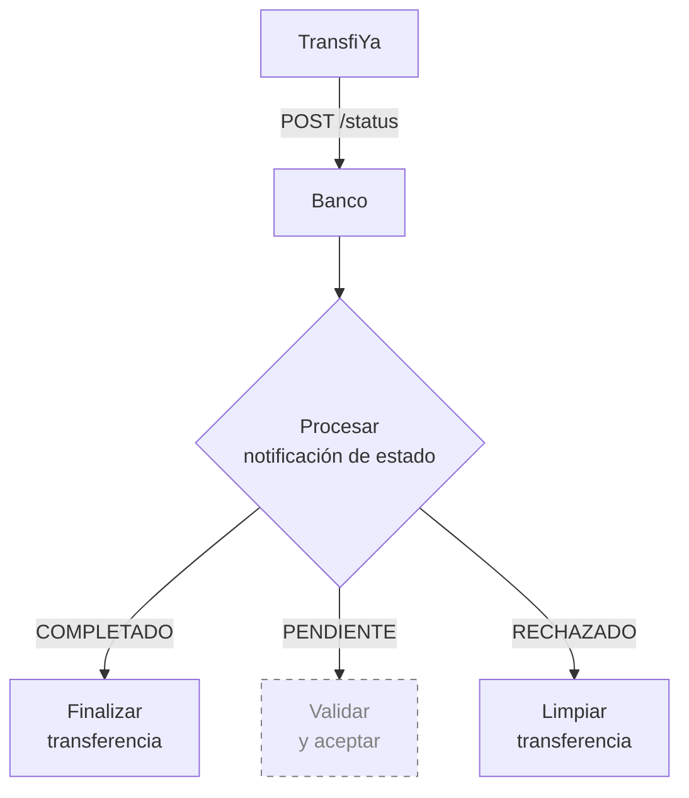
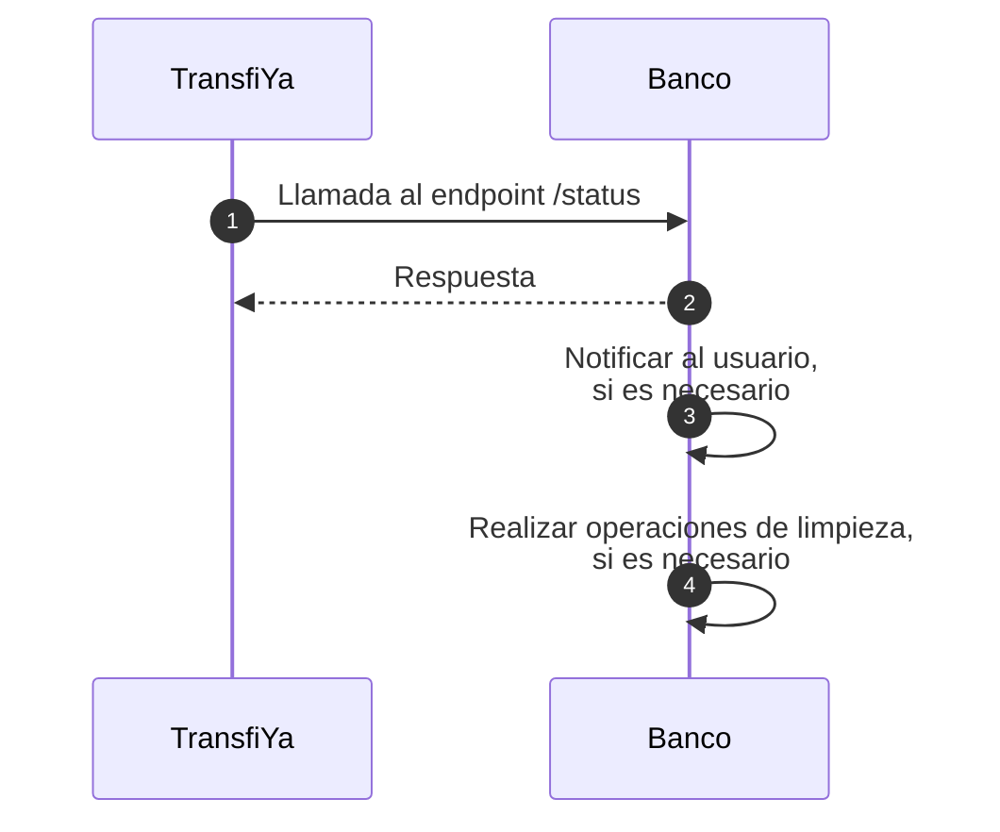

## Notificación final de estado

La última llamada del procesamiento de una transferencia es una notificación al endpoint `status`, el cual ya fue cubierto anteriormente. En este paso final, TransfiYa llama al endpoint `status` con una transferencia en uno de los siguientes estados:

- `COMPLETED`: si el procesamiento fue exitoso.
- `REJECTED`: si ocurrió un error, pero la transferencia fue correctamente revertida y todos los movimientos de saldo fueron deshechos.

Esta notificación es enviada tanto al banco **origen** como al banco **destino**.

<Info>
**Acciones esperadas por parte del banco:**

- Notificar al usuario final que la transferencia ha sido **finalizada**, ya sea con éxito o con rechazo.
- Ejecutar cualquier **limpieza final** o actualización interna relacionada con la transferencia.
</Info>


<Info>
La implementación recomendada en este caso es notificar al usuario únicamente sobre el estado final de la operación, **si esta fue realizada con retraso**.
</Info>




### Notificación final del estado de la transferencia

Una vez que el procesamiento de la transferencia ha concluido, **TransfiYa notifica tanto al banco origen como al banco destino** mediante una llamada al endpoint `status`. Esta llamada incluye toda la información relevante de la transferencia y su estado final, el cual puede ser:

- `COMPLETED`: si la operación fue exitosa.
- `REJECTED`: si la operación fue revertida correctamente tras un fallo en el proceso.

A partir de esta notificación, el banco debe confirmar su recepción, y de forma opcional, realizar tareas como la notificación al usuario o limpieza de recursos internos.

<Steps>

<Step title="TransfiYa llama al endpoint `status` con la transferencia finalizada">
TransfiYa realiza una solicitud `POST` al endpoint `status` del banco origen y del banco destino con una transferencia marcada como `COMPLETED` o `REJECTED`, según sea el caso.
<Tabs>
    <Tab title="Request Completed">
    ```json
    POST https://ban.co/transfiya/status
    {
        "source": "wXxwpxB32saqfmfMxAQD4SVWWhhn6akLC2",
        "target": "wRFmYXS2sP9ho9VCZ3j4FuP1j55ABeFvsF",
        "amount": "100.00",
        "symbol": "$tin",
        "labels": {
            "hash": "82de7c0b8b34c7ca6c52547161b2629b1c1e6bdef402999ad60266e6760e4d24",
            "iouHash": "31abac5167fbb603d9300e9dfaf94b721efdc12c0728a615f9717b944a3fa779",
            "type": "SENDMOL",
            "domain": "tin",
            "flowId": "Lf13jsK83omPv3bOt",
            "status": "COMPLETED",
            "tx_ref": "Lf13jsK83omPv3bOt",
            "tx_id": "20250114890915944TFY123456789012345",
            "created": "2025-01-14T20:40:57.322-05:00",
            "updated": "2025-01-14T20:43:00.483-05:00",
            "description": "Payment for lunch",
            "sourceChannel": "APP",
            "deviceFingerPrint": {
            "city": "Bogotá",
            "hash": "26fff5af6441f8e15a71e8d62c361714484b1b308c99e8eb68ca85e2a7e0dc58",
            "model": "Huawei Mate 20 Pro",
            "country": "Colombia",
            "operator": "Bharti Airtel Limited",
            "SIMCardId": "8991101200003204510",
            "ipAddress": "2001:0db8:85a3:0000:0000:8a2e:0370:7334",
            "mobileDevice": "990000862471854"
            }
        },
        "snapshot": {
            "source": {
            "signer": {
                "handle": "wXxwpxB32saqfmfMxAQD4SVWWhhn6akLC2",
                "labels": {
                "name": "Maria Fernanda Gomez",
                "proprietary": "CC",
                    "identification": "2020202020",
                "bankAccountType": "SVGS",
                "bankAccountNumber": "95445654254",
                "bankId": "895554821",
                "targetSpbviCode": "TFY"
                }
            },
            },
            "symbol": {
            "signer": {
                "handle": "wMxKCAzsQBiUURDU3xD3xuSbVo1S9jmf3d",
                "labels": {
                "created": "2018-10-19T20:23:22.041Z",
                "createdBy": "ZhrQA3vcm17h2RRO4LrJ"
                }
            }
            },
            "target": {
            "signer": {
                "handle": "wRFmYXS2sP9ho9VCZ3j4FuP1j55ABeFvsF",
                "labels": {
                "name": "Jorge Alejandro Fernandez Garcia",
                "proprietary": "CC",
                    "identification": "1010101010",
                "bankAccountType": "SVGS",
                "bankAccountNumber": "12345654321",
                "bankId": "891234918",
                "targetSpbviCode": "TFY"
                }
            },
            }
        },
        "error": {
            "code": 0,
            "message": "Success"
        },
        "action_id": "35de4d3d-3aba-4fb3-b110-d004ce2aabb2",
        "id": "35de4d3d-3aba-4fb3-b110-d004ce2aabb2"
        }
    ```
    </Tab>
    <Tab title="Request Rejected">
    ```json
    POST https://ban.co/transfiya/status
    {
        "source": "wXxwpxB32saqfmfMxAQD4SVWWhhn6akLC2",
        "target": "wRFmYXS2sP9ho9VCZ3j4FuP1j55ABeFvsF",
        "amount": "100.00",
        "symbol": "$tin",
        "labels": {
            "hash": "82de7c0b8b34c7ca6c52547161b2629b1c1e6bdef402999ad60266e6760e4d24",
            "iouHash": "31abac5167fbb603d9300e9dfaf94b721efdc12c0728a615f9717b944a3fa779",
            "type": "SENDMOL",
            "domain": "tin",
            "flowId": "Lf13jsK83omPv3bOt",
            "status": "REJECTED",
            "tx_ref": "Lf13jsK83omPv3bOt",
            "tx_id": "20250114890915944TFY123456789012345",
            "created": "2025-01-14T20:40:57.322-05:00",
            "updated": "2025-01-14T20:43:00.483-05:00",
            "description": "Payment for lunch",
            "sourceChannel": "APP",
            "deviceFingerPrint": {
            "city": "Bogotá",
            "hash": "26fff5af6441f8e15a71e8d62c361714484b1b308c99e8eb68ca85e2a7e0dc58",
            "model": "Huawei Mate 20 Pro",
            "country": "Colombia",
            "operator": "Bharti Airtel Limited",
            "SIMCardId": "8991101200003204510",
            "ipAddress": "2001:0db8:85a3:0000:0000:8a2e:0370:7334",
            "mobileDevice": "990000862471854"
            }
        },
        "snapshot": {
            "source": {
            "signer": {
                "handle": "wXxwpxB32saqfmfMxAQD4SVWWhhn6akLC2",
                "labels": {
                "name": "Maria Fernanda Gomez",
                "proprietary": "CC",
                    "identification": "2020202020",
                "bankAccountType": "SVGS",
                "bankAccountNumber": "95445654254",
                "bankId": "895554821",
                "targetSpbviCode": "TFY"
                }
            },
            },
            "symbol": {
            "signer": {
                "handle": "wMxKCAzsQBiUURDU3xD3xuSbVo1S9jmf3d",
                "labels": {
                "created": "2018-10-19T20:23:22.041Z",
                "createdBy": "ZhrQA3vcm17h2RRO4LrJ"
                }
            }
            },
            "target": {
            "signer": {
                "handle": "wRFmYXS2sP9ho9VCZ3j4FuP1j55ABeFvsF",
                "labels": {
                "name": "Jorge Alejandro Fernandez Garcia",
                "proprietary": "CC",
                    "identification": "1010101010",
                "bankAccountType": "SVGS",
                "bankAccountNumber": "12345654321",
                "bankId": "891234918",
                "targetSpbviCode": "TFY"
                }
            },
            }
        },
        "error": {
            "code": 300,
            "message": "Transfer timeout."
        },
        "action_id": "35de4d3d-3aba-4fb3-b110-d004ce2aabb2",
        "id": "35de4d3d-3aba-4fb3-b110-d004ce2aabb2"
        }
    ```
    </Tab>
    <Tab title="Response">
    ```json
    {
        "error": {
            "code": 0,
            "message": "Success"
        }
    }
    ```
    </Tab>
  </Tabs>
</Step>

<Step title="El banco responde confirmando la recepción de la notificación">
El banco debe responder con un HTTP `200 OK`. También puede incluir un objeto `error` con código `0` como confirmación explícita de éxito. A partir de este punto, el procesamiento es completamente asincrónico.
</Step>

<Step title="El banco notifica al usuario final (si es necesario)">
Si la transferencia fue completada con retraso, se recomienda notificar al usuario con un mensaje final. Si el usuario ya visualizó el resultado en pantalla, no es necesario enviar otra notificación.
</Step>

<Step title="El banco realiza limpieza o actualizaciones internas (si aplica)">
El banco puede llevar a cabo operaciones de cierre, auditoría, registros contables o cualquier otro proceso que dependa del estado final de la transferencia.
</Step>

</Steps>
