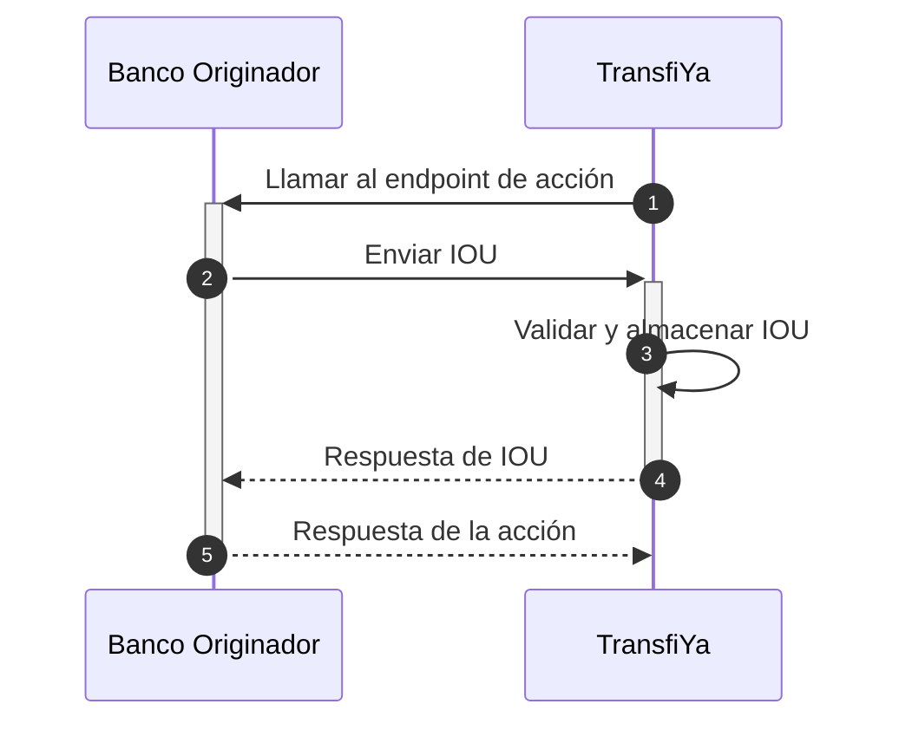

Autorización de movimiento de fondos (action)
Una vez se han completado con éxito todas las validaciones relacionadas con el procesamiento de la transferencia y la información del destinatario ha sido completamente resuelta, TransfiYa realiza una llamada al endpoint action del banco originador.

<Info> El propósito de esta operación es autorizar el movimiento de los fondos hacia la custodia del banco destinatario. </Info>
Esta operación no requiere que el banco originador realice movimientos contables en su sistema interno. Su único objetivo es autorizar el movimiento de saldos dentro del sistema de TransfiYa, desde el usuario originador (cuya clave es gestionada por el banco de origen) hacia el usuario destinatario (cuya clave es gestionada por el banco de destino).

<Info> Al momento de invocar el endpoint `action`, todos los datos tanto del usuario de origen como del destinatario ya están completamente resueltos. Antes de este punto, en algunos casos de uso, la información del destinatario podría no estar completamente disponible si aún no había sido registrado en el sistema. </Info>



## Firma de la acción principal (Sign main action)
Una vez TransfiYa ha resuelto completamente la información de origen y destino, se procede a autorizar el movimiento de fondos dentro del sistema. Esta operación consiste en la firma de la acción principal por parte del banco originador. La firma se realiza a través de un objeto IOU (prueba criptográfica), que garantiza que el banco autoriza la transacción y que esta no fue modificada.

Este proceso tiene como finalidad asegurar la integridad y validez de la operación antes de que se ejecute el movimiento final hacia el banco destinatario.

<Steps>

<Step title="TransfiYa llama al endpoint `/action` del banco originador">
TransfiYa realiza una solicitud al endpoint `/action` del banco originador, incluyendo todos los datos relevantes de la acción principal. Esta llamada tiene como objetivo solicitar autorización para mover fondos entre usuarios.
<Tabs>
    <Tab title="Request">
    ```json
    POST https://ban.co/transfiya/action
    {
        "source": "wXxwpxB32saqfmfMxAQD4SVWWhhn6akLC2",
        "target": "wRFmYXS2sP9ho9VCZ3j4FuP1j55ABeFvsF",
        "amount": "100.00",
        "symbol": "$tin",
        "labels": {
            "hash": "PENDING",
            "type": "SENDMOL",
            "domain": "tin",
            "flowId": "Lf13jsK83omPv3bOt",
            "status": "PENDING",
            "tx_ref": "Lf13jsK83omPv3bOt",
            "tx_id": "20250114890915944TFY123456789012345",
            "created": "2025-01-14T20:40:57.322-05:00",
            "updated": "2025-01-14T20:40:57.322-05:00",
            "description": "Payment for lunch",
            "sourceChannel": "APP",
            "deviceFingerPrint": {
            "city": "Bogotá",
            "hash": "26fff5af6441f8e15a71e8d62c361714484b1b308c99e8eb68ca85e2a7e0dc58",
            "model": "Huawei Mate 20 Pro",
            "country": "Colombia",
            "operator": "Bharti Airtel Limited",
            "SIMCardId": "8991101200003204510",
            "ipAddress": "2001:0db8:85a3:0000:0000:8a2e:0370:7334",
            "mobileDevice": "990000862471854"
            }
        },
        "snapshot": {
            "source": {
            "signer": {
                "handle": "wXxwpxB32saqfmfMxAQD4SVWWhhn6akLC2",
                "labels": {
                "name": "Maria Fernanda Gomez",
                "proprietary": "CC",
                    "identification": "2020202020",
                "bankAccountType": "SVGS",
                "bankAccountNumber": "95445654254",
                "bankId": "895554821",
                "targetSpbviCode": "TFY"
                }
            },
            },
            "symbol": {
            "signer": {
                "handle": "wMxKCAzsQBiUURDU3xD3xuSbVo1S9jmf3d",
                "labels": {
                "created": "2018-10-19T20:23:22.041Z",
                "createdBy": "ZhrQA3vcm17h2RRO4LrJ"
                }
            }
            },
            "target": {
            "signer": {
                "handle": "wRFmYXS2sP9ho9VCZ3j4FuP1j55ABeFvsF",
                "labels": {
                "name": "Jorge Alejandro Fernandez Garcia",
                "proprietary": "CC",
                    "identification": "1010101010",
                "bankAccountType": "SVGS",
                "bankAccountNumber": "12345654321",
                "bankId": "891234918",
                "targetSpbviCode": "TFY"
                }
            },
            }
        },
        "error": {
            "code": 0,
            "message": "Success"
        },
        "action_id": "35de4d3d-3aba-4fb3-b110-d004ce2aabb2",
        "id": "35de4d3d-3aba-4fb3-b110-d004ce2aabb2"
        }
    ```
    </Tab>
    <Tab title="">
    </Tab>
  </Tabs>
</Step>

<Step title="El banco origen genera un objeto IOU, lo firma y lo envía a TransfiYa">
El banco crea un objeto IOU con los datos de la acción principal, lo firma con la clave privada asociada al firmante origen y lo envía a TransfiYa para su validación.
<Tabs>
    <Tab title="Request">
    <Info>
    La variable `mainAction` representa el payload enviado al banco en el endpoint `/action`.
    </Info>

    <Info>
    El objeto IOU se utiliza para autorizar un movimiento de saldo entre los firmantes de usuario origen y destino en TransfiYa. Este objeto DEBE reflejar fielmente la acción principal que representa. Por ello, la mayoría de los datos del IOU se copian desde `mainAction`.
    </Info>

    <Info>
    TransfiYa utiliza firmas criptográficas como prueba de que los participantes autorizaron movimientos de saldo. Los datos se hashean primero y luego se firman usando claves privadas, las cuales nunca deben compartirse con TransfiYa. Los algoritmos de firma y hash están documentados, y los SDKs de TransfiYa ofrecen soporte para simplificar estas integraciones.
    </Info>
    <Info>
    TransfiYa validates the signature of the received IOU object and stores it in the ledger, if everything is valid. This operation also marks the main action as COMPLETED.
    </Info>

    ```json
    curl -X POST \
        -H "Content-Type: application/json" \
        -H "x-api-key: <API_KEY>" \
        -H "Authorization: Bearer <TOKEN>" \
        -d '{
            "hash": {
            "types": "sha256:sha256",
            "steps": "stringify:data",
            "value": "31abac5167fbb603d9300e9dfaf94b721efdc12c0728a615f9717b944a3fa779"
            },
            "data": {
            "source": "wXxwpxB32saqfmfMxAQD4SVWWhhn6akLC2",
            "target": "wRFmYXS2sP9ho9VCZ3j4FuP1j55ABeFvsF",
            "symbol": "wMxKCAzsQBiUURDU3xD3xuSbVo1S9jmf3d",
            "amount": "100.00",
            "domain": "tin",
            "expiry": "2025-01-14T20:41:11.812-05:00",
            "random": "d50860eb2209de5cfbfd"
            },
            "meta": {
            "signatures": [
                {
                "scheme": "ecdsa-ed25519",
                "signer": "wXxwpxB32saqfmfMxAQD4SVWWhhn6akLC2",
                "public": "0420b4b9dc4b022b5251aacee333f496f9c7fe6555824be9ecf96bc9adbcd5e7a813e7e03d63542a240ed4d58f0f079fe36c2a73e9c9a9068606f1a8f5aba9f243",
                "string": "304402200fd7a0cef6e4ab4936aa2d15be933a5aab82cd556bf98fd5090e779819cb1afe02200e327d0b3ce44291c23bff4387ee9cd8cdb7308fa0453f4bac007d0c621c1a13",
                }
            ]
            }
        }' "<TRANSFIYA URL>/v1/action/<main_action_id>/sendit"
    ```
    | Field name         | Descripción en español                                                                                                                           |
    |--------------------|--------------------------------------------------------------------------------------------------------------------------------------------------|
    | `<main_action_id>` | ID de la acción principal que se usa en la URL. Esta es la acción recibida como payload en la llamada a `/action`. En el ejemplo es `35de4d3d-3aba-4fb3-b110-d004ce2aabb2`. |
    | `data.source`      | `mainAction.snapshot.source.signer.handle`                                                                                                       |
    | `data.target`      | `mainAction.snapshot.target.signer.handle`                                                                                                       |
    | `data.symbol`      | `mainAction.snapshot.symbol.signer.handle`                                                                                                       |
    | `data.amount`      | `mainAction.amount`                                                                                                                              |
    | `data.domain`      | `mainAction.labels.domain`                                                                                                                       |
    | `data.expiry`      | `currentTime + 1 minuto` en formato ISO 8601. Indica el momento a partir del cual TransfiYa puede expirar la operación pendiente.               |
    | `hash`             | Un hash del objeto `data`, que puede ser generado utilizando los SDKs. El campo `hash.value` es el hash en sí; los demás campos son metadatos de hashing. |
    | `meta.signatures`  | Firma del hash generada con la clave privada del firmante (IOU source). Estas firmas pueden ser generadas con los SDKs. `schema`: algoritmo usado. `signer`: handle del firmante. `public`: clave pública. `string`: valor de la firma. |

    </Tab>
    <Tab title="Response">
    ```json
    {
        "source": "wXxwpxB32saqfmfMxAQD4SVWWhhn6akLC2",
        "target": "wRFmYXS2sP9ho9VCZ3j4FuP1j55ABeFvsF",
        "amount": "100.00",
        "symbol": "$tin",
        "labels": {
            "hash": "82de7c0b8b34c7ca6c52547161b2629b1c1e6bdef402999ad60266e6760e4d24",
            "iouHash": "31abac5167fbb603d9300e9dfaf94b721efdc12c0728a615f9717b944a3fa779",
            "type": "SENDMOL",
            "domain": "tin",
            "flowId": "Lf13jsK83omPv3bOt",
            "status": "COMPLETED",
            "tx_ref": "Lf13jsK83omPv3bOt",
            "tx_id": "20250114890915944TFY123456789012345",
            "created": "2025-01-14T20:40:57.322-05:00",
            "updated": "2025-01-14T20:41:00.841-05:00",
            "description": "Payment for lunch",
            "sourceChannel": "APP",
            "deviceFingerPrint": {
            "city": "Bogotá",
            "hash": "26fff5af6441f8e15a71e8d62c361714484b1b308c99e8eb68ca85e2a7e0dc58",
            "model": "Huawei Mate 20 Pro",
            "country": "Colombia",
            "operator": "Bharti Airtel Limited",
            "SIMCardId": "8991101200003204510",
            "ipAddress": "2001:0db8:85a3:0000:0000:8a2e:0370:7334",
            "mobileDevice": "990000862471854"
            }
        },
        "snapshot": {
            "source": {
            "signer": {
                "handle": "wXxwpxB32saqfmfMxAQD4SVWWhhn6akLC2",
                "labels": {
                "name": "Maria Fernanda Gomez",
                "proprietary": "CC",
                    "identification": "2020202020",
                "bankAccountType": "SVGS",
                "bankAccountNumber": "95445654254",
                "bankId": "895554821",
                "targetSpbviCode": "TFY"
                }
            },
            },
            "symbol": {
            "signer": {
                "handle": "wMxKCAzsQBiUURDU3xD3xuSbVo1S9jmf3d",
                "labels": {
                "created": "2018-10-19T20:23:22.041Z",
                "createdBy": "ZhrQA3vcm17h2RRO4LrJ"
                }
            }
            },
            "target": {
            "signer": {
                "handle": "wRFmYXS2sP9ho9VCZ3j4FuP1j55ABeFvsF",
                "labels": {
                "name": "Jorge Alejandro Fernandez Garcia",
                "proprietary": "CC",
                    "identification": "1010101010",
                "bankAccountType": "SVGS",
                "bankAccountNumber": "12345654321",
                "bankId": "891234918",
                "targetSpbviCode": "TFY"
                }
            },
            }
        },
        "error": {
            "code": 0,
            "message": "Success"
        },
        "action_id": "35de4d3d-3aba-4fb3-b110-d004ce2aabb2",
        "id": "35de4d3d-3aba-4fb3-b110-d004ce2aabb2"
        }
    ```
    </Tab>
    <Tab title="Error Response">
    ```json
    {
        "source": "wXxwpxB32saqfmfMxAQD4SVWWhhn6akLC2",
        "target": "wRFmYXS2sP9ho9VCZ3j4FuP1j55ABeFvsF",
        "amount": "100.00",
        "symbol": "$tin",
        "labels": {
            "hash": "PENDING",
            "type": "SENDMOL",
            "domain": "tin",
            "flowId": "Lf13jsK83omPv3bOt",
            "status": "ERROR",
            "tx_ref": "Lf13jsK83omPv3bOt",
            "tx_id": "20250114890915944TFY123456789012345",
            "created": "2025-01-14T20:40:57.322-05:00",
            "updated": "2025-01-14T20:41:00.841-05:00",
            "description": "Payment for lunch",
            "sourceChannel": "APP",
            "deviceFingerPrint": {
            "city": "Bogotá",
            "hash": "26fff5af6441f8e15a71e8d62c361714484b1b308c99e8eb68ca85e2a7e0dc58",
            "model": "Huawei Mate 20 Pro",
            "country": "Colombia",
            "operator": "Bharti Airtel Limited",
            "SIMCardId": "8991101200003204510",
            "ipAddress": "2001:0db8:85a3:0000:0000:8a2e:0370:7334",
            "mobileDevice": "990000862471854"
            }
        },
        "snapshot": {
            "source": {
            "signer": {
                "handle": "wXxwpxB32saqfmfMxAQD4SVWWhhn6akLC2",
                "labels": {
                "name": "Maria Fernanda Gomez",
                "proprietary": "CC",
                    "identification": "2020202020",
                "bankAccountType": "SVGS",
                "bankAccountNumber": "95445654254",
                "bankId": "895554821",
                "targetSpbviCode": "TFY"
                }
            },
            },
            "symbol": {
            "signer": {
                "handle": "wMxKCAzsQBiUURDU3xD3xuSbVo1S9jmf3d",
                "labels": {
                "created": "2018-10-19T20:23:22.041Z",
                "createdBy": "ZhrQA3vcm17h2RRO4LrJ"
                }
            }
            },
            "target": {
            "signer": {
                "handle": "wRFmYXS2sP9ho9VCZ3j4FuP1j55ABeFvsF",
                "labels": {
                "name": "Jorge Alejandro Fernandez Garcia",
                "proprietary": "CC",
                    "identification": "1010101010",
                "bankAccountType": "SVGS",
                "bankAccountNumber": "12345654321",
                "bankId": "891234918",
                "targetSpbviCode": "TFY"
                }
            },
            }
        },
        "error": {
            "code": 127,
            "message": "Action cannot be signed."
        },
        "action_id": "35de4d3d-3aba-4fb3-b110-d004ce2aabb2",
        "id": "35de4d3d-3aba-4fb3-b110-d004ce2aabb2"
        }
    ```
    </Tab>
  </Tabs>
</Step>

<Step title="El banco originador responde confirmando el ID de la acción">
Para finalizar el proceso, el banco responde confirmando el `action_id` recibido, cerrando así la etapa de firma de la acción principal.
<Tabs>
    <Tab title="Response Exitoso">
    <Info>
    Pueden devolverse campos adicionales en la respuesta, pero solo el campo `action_id` es obligatorio.
    </Info>

    ```json
        {
        "action_id": "35de4d3d-3aba-4fb3-b110-d004ce2aabb2"
        }
    ```
    </Tab>
    <Tab title="Error Response">
    <Info>
    En caso de errores no recuperables durante el procesamiento, se puede devolver un objeto `error` a TransfiYa como parte de la respuesta.

    Los códigos de error devueltos por los bancos deben estar en el rango `3xx`.
    </Info>

    ```json
     {
        "action_id": "35de4d3d-3aba-4fb3-b110-d004ce2aabb2",
        "error": {
            "code": 300,
            "message": "Transfer timeout"
        }
    }
    ```
    | Field name      | Descripción                                                                 |
    |----------------|------------------------------------------------------------------------------|
    | `error.code`   | Un código de error válido soportado por TransfiYa que indica el error ocurrido. |
    | `error.message`| Un mensaje con información adicional sobre el error.                        |

    </Tab>
  </Tabs>
</Step>

</Steps>