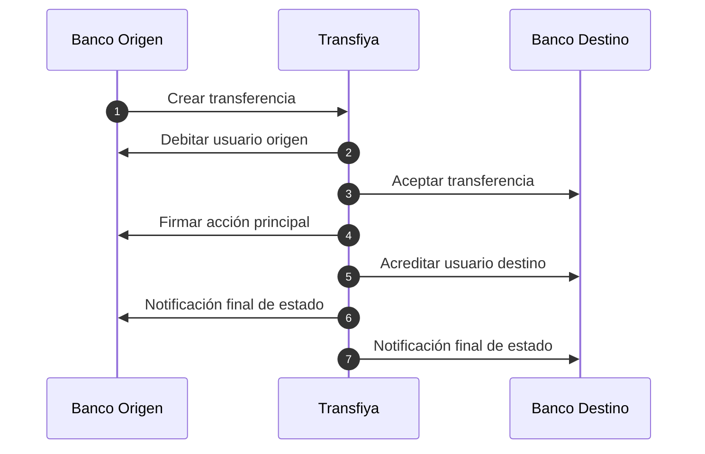

El flujo completo para procesar una transferencia en Transfiya bajo el modelo regulado involucra varios pasos distribuidos entre el banco origen, Transfiya, MOL y el banco destino. A continuación se describen las etapas principales desde una perspectiva de alto nivel:

<Steps>

<Step title="Creación de la transferencia">
El usuario inicia una transferencia desde su aplicación bancaria. El banco origen comunica la solicitud a TransfiYa, quien valida reglas de negocio internas y devuelve una respuesta para confirmar la creación.
</Step>

<Step title="Débito del usuario origen">
TransfiYa solicita al banco origen ejecutar la operación de débito. El banco crea una acción de tipo `UPLOAD`, debita los fondos y responde con un IOU firmado que TransfiYa valida.
</Step>

<Step title="Aceptación de la transferencia">
Si se requiere aceptación, TransfiYa notifica al banco destino con estado `PENDING`. Este valida la cuenta, registra el firmante si es necesario y acepta la operación para continuar.
</Step>

<Step title="Firma y autorización de la acción principal">
TransfiYa llama al banco origen para firmar la acción principal (`mainAction`). El banco genera y firma un IOU con los detalles de la operación, el cual TransfiYa valida y marca como `COMPLETED`.
</Step>

<Step title="Crédito al usuario destino">
TransfiYa llama al banco destino para acreditar los fondos. Este crea una acción `DOWNLOAD`, acredita la cuenta y envía un IOU firmado que TransfiYa valida.
</Step>

<Step title="Notificación de estado final">
TransfiYa envía una notificación de estado `COMPLETED` (o `REJECTED` si hubo un error) a ambos bancos para cerrar el proceso. Cada banco puede notificar al usuario y realizar tareas internas de limpieza si lo requiere.
</Step>

</Steps>

<Info>
Este flujo está diseñado para asegurar consistencia y trazabilidad completa en cada paso, incluyendo criptografía para garantizar integridad y autenticación en las operaciones.
</Info>

## Modelo de transferencia

### Concepto "Transfer"

Transfiya utiliza el concepto de "transfer" para iniciar pagos en el sistema.
El *Transfer* es un inciacion de pago compuesta de transacciones que representan dos o más movimientos de dinero entre los participantes.

Este modelo es agnóstico al caso de uso y soporta cualquier tipo de movimiento de fondos, dependiendo de las reglas configuradas del sistema sobre el flujo y las [llaves](../about/about-signers) de origen y destino.

Para crear transferencias se usa el interfaz aplicativo de crear un transfer.

<Note>
El uso del modelo de transfer para iniciar pagos en el sistema permite emplear el mismo protocolo y REST API para cualquier caso de uso o flujo de dinero, incluyendo el nuevo flujo regulatorio.
</Note>

### Origen y destino de transferencia

La plataforma de Transfiya permite, desde sus inicios, realizar envíos de fondos entre diferentes credenciales de pago registradas en el sistema, conocidas como signers. Estas se representan a través de los campos source (origen) y target (destino).

El tipo de transferencia —por ejemplo, P2P, B2P, P2B o G2P— se determina en función del tipo de participantes involucrados (es decir, el tipo de signer) y de las reglas asociadas a cada uno.

El modelo basado en source y target tiene como objetivo simplificar la integración para los participantes, permitiendo cualquier tipo de movimiento de fondos entre entidades sin necesidad de realizar modificaciones adicionales en sus integraciones actuales.

<ResponseField name="source" type="string">
    Origen de la transferencia.
</ResponseField>

<ResponseField name="destination" type="string">
    Destino de la transferencia.
</ResponseField>

[Sobre llaves y credenciales de pago (signers)](../about/about-signers)

<Note>
Esta flexibilidad facilita la implementación de diferentes casos de uso de negocio sin la necesidad de modificar la integración existente de los participantes.
</Note>

