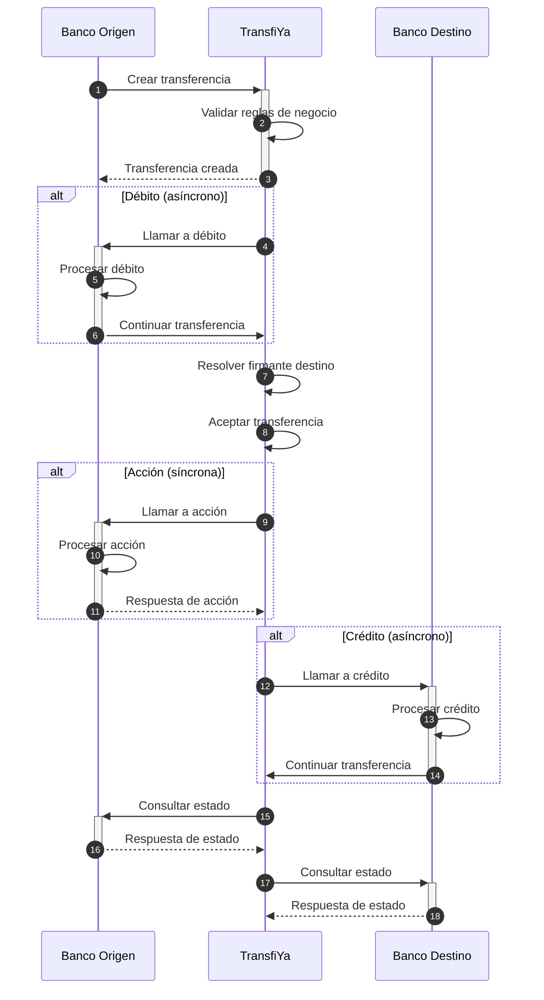

Para soportar los modelos de transferencia en Transfiya para Empresas, es necesario permitir la referencia directa a cuentas bancarias en los campos `source` y `target` de cada transacción. La estructura de estas referencias debe contener información sobre el tipo de cuenta, el número de cuenta y el banco al cual pertenece.

## 📌 Sintaxis de Referencia


- **accountType**: tipo de cuenta (en minúsculas), basado en los valores estándar de Transfiya.
- **accountNumber**: número de cuenta bancaria (coincide con `labels.bankAccountNumber` del firmante).
- **bankReference**: dominio DNS válido del banco receptor.

<Info>
Este formato unificado garantiza consistencia y compatibilidad con los mecanismos de enrutamiento de Transfiya, facilitando la interoperabilidad entre participantes.
</Info>

## 🏦 Tipos de Cuenta Soportados

A continuación se listan los tipos de cuenta reconocidos en Transfiya:

| Nombre                     | Valor |
|---------------------------|--------|
| Cuenta de ahorros         | `svgs` |
| Cuenta corriente          | `cacc` |
| Depósito de bajo monto    | `dbmo` |
| Depósito ordinario        | `dord` |
| Depósito inclusivo bajo monto | `dbmi` |

<Tip>
Estos valores deben utilizarse exclusivamente en minúsculas y reflejan el tipo de cuenta real registrada por el firmante en el sistema financiero.
</Tip>

## 🌐 Referencia Bancaria

El identificador del banco (`bankReference`) debe ser un dominio DNS válido, que permita una resolución clara y única del participante receptor.


## ✅ Ejemplo de referencia válida

svgs:10010010001@bancodebogota.co


Transferencias cuenta a cuenta con y sin signer de tipo cuenta
<Info>
Cuando el usuario receptor ya está registrado en TransfiYa, la transferencia se acepta automáticamente tras la validación de reglas y ejecución del débito.
Sin embargo, si el usuario aún no está registrado, el flujo requiere una etapa adicional de onboarding:

TransfiYa notifica al banco destino que existe una transferencia pendiente.

El banco destino debe validar los datos y crear el firmante (usuario).

Una vez completado el onboarding, el banco acepta la transferencia manualmente.

</Info>
Esta diferencia impacta directamente en los tiempos de procesamiento y en la lógica de integración de los participantes, ya que se introduce una validación activa del banco destino antes de continuar con las siguientes fases (acción, crédito y estado).


<Tabs>
    <Tab title="Flujo con Signer Registrado">

</Tab>
 <Tab title="Flujo sin Signer Registrado">
 ```mermaid
sequenceDiagram
  autonumber
  participant sb as Banco Origen
  participant ty as TransfiYa
  participant tb as Banco Destino

  sb ->>+ ty: Crear transferencia
  ty ->> ty: Validar reglas de negocio
  ty -->>- sb: Transferencia creada

  alt Débito (asíncrono)
    ty ->>+ sb: Llamar a débito
    sb ->> sb: Procesar débito
    sb ->> -ty: Continuar transferencia
  end

  ty ->> ty: Resolver firmante destino

  alt Onboarding (asíncrono)
    ty ->>+ tb: Consultar estado (PENDING)
    tb -->> ty: Confirmar recepción
    tb ->> tb: Validar cuenta
    tb ->>+ ty: Crear firmante
    ty -->>- tb: Respuesta de creación
    tb ->> -ty: Aceptar transferencia
  end

  alt Acción (síncrona)
    ty ->>+ sb: Llamar a acción
    sb ->> sb: Procesar acción
    sb -->>- ty: Respuesta de acción
  end

  alt Crédito (asíncrono)
    ty ->>+ tb: Llamar a crédito
    tb ->> tb: Procesar crédito
    tb ->> -ty: Continuar transferencia
  end

  ty ->>+ sb: Consultar estado
  sb -->>- ty: Respuesta de estado

  ty ->>+ tb: Consultar estado
  tb -->>- ty: Respuesta de estado
```
 </Tab>
</Tabs>

Crear una transferencia hacia una cuenta bancaria se realiza de la misma forma que cualquier otra transferencia en TransfiYa. La única diferencia es que, en el campo `target`, no se utiliza un **alias**, sino una **referencia directa a la cuenta bancaria**.

<Info>
Este tipo de transferencia es útil cuando se conoce directamente el número de cuenta, tipo de cuenta y banco destino, sin necesidad de pasar por el directorio de alias.
</Info>

<Tabs>
    <Tab title="Request">
    ```json
    curl -X POST \
-H "Content-Type: application/json" \
-H "x-api-key: <API_KEY>" \
-H "Authorization: Bearer <TOKEN>" \
-d '{
"source": "wXxwpxB32saqfmfMxAQD4SVWWhhn6akLC2",
  "target": "svgs:10010010001@bbva.co",
  "amount": "100.00",
  "symbol": "$tin",
  "labels": {
    "type": "SEND",
    "domain": "tin",
    "description": "Salary for March",
    "sourceChannel": "APP",
"tx_id": "20250114890915944TFY123456789012345",
"received": "2025-01-14T20:40:57.322-05:00",
"dispatched": "2025-01-14T20:40:58.322-05:00",
"deviceFingerPrint": {
  "hash": "26fff5af6441f8e15a71e8d62c361714484b1b308c99e8eb68ca85e2a7e0dc58",
  "ipAddress": "2001:0db8:85a3:0000:0000:8a2e:0370:7334",
  "country": "Colombia",
  "city": "Bogotá",
  "mobileDevice": "990000862471854",
  "SIMCardId": "8991101200003204510",
  "model": "Huawei Mate 20 Pro",
  "operator": "Bharti Airtel Limited"
}
}
}' "<TRANSFIYA URL>/v1/transfer"
    ```
    </Tab>
    <Tab title="Response">
    ```json
    {
  "source": "wXxwpxB32saqfmfMxAQD4SVWWhhn6akLC2",
  "target": "wfvmRir8XxRtoEuUBDkv3BP4T7BQezwm1f",
  "amount": "100.00",
  "symbol": "$tin",
  "labels": {
    "hash": "PENDING",
    "type": "SEND",
    "domain": "tin",
    "flowId": "Lf13jsK83omPv3bOt",
    "status": "PENDING",
    "tx_ref": "Lf13jsK83omPv3bOt",
   "received": "2025-01-14T20:40:57.322-05:00",
   "dispatched": "2025-01-14T20:40:57.322-05:00",
    "created": "2025-01-14T20:40:57.322-05:00",
    "updated": "2025-01-14T20:40:57.322-05:00",
    "description": "DEV - SEND trx 01",
    "sourceChannel": "APP",
    "deviceFingerPrint": {
      "city": "Bogotá",
      "hash": "26fff5af6441f8e15a71e8d62c361714484b1b308c99e8eb68ca85e2a7e0dc58",
      "model": "Huawei Mate 20 Pro",
      "country": "Colombia",
      "operator": "Bharti Airtel Limited",
      "SIMCardId": "8991101200003204510",
      "ipAddress": "2001:0db8:85a3:0000:0000:8a2e:0370:7334",
      "mobileDevice": "990000862471854"
    }
  },
  "snapshot": {
    "source": {
      "signer": {
        "handle": "wXxwpxB32saqfmfMxAQD4SVWWhhn6akLC2",
        "labels": {
          "name": "Jorge Alejandro Fernandez Garcia",
        "proprietary": "CC",
	        "identification": "1010101010",
        "bankAccountType": "SVGS",
        "bankAccountNumber": "12345654321",
	      "bankId": "891234918",
         "targetSpbviCode": "TFY",
        }
      },
    },
    "target": {
      "signer": {
       "handle": "wfvmRir8XxRtoEuUBDkv3BP4T7BQezwm1f",
        "labels": {
          "name": "Jorge Alejandro Fernandez Garcia",
        "proprietary": "CC",
	        "identification": "1010101010",
         "bankAccountType": "SVGS",
         "bankAccountNumber": "12345654321",
	      "bankId": "891234918",
         "targetSpbviCode": "TFY",

        }
      },
    }
  },
  "error": {
    "code": 0,
    "message": "Success"
  },
  "action_id": "35de4d3d-3aba-4fb3-b110-d004ce2aabb2",
  "id": "35de4d3d-3aba-4fb3-b110-d004ce2aabb2"
}
```
    </Tab>
</Tabs>    