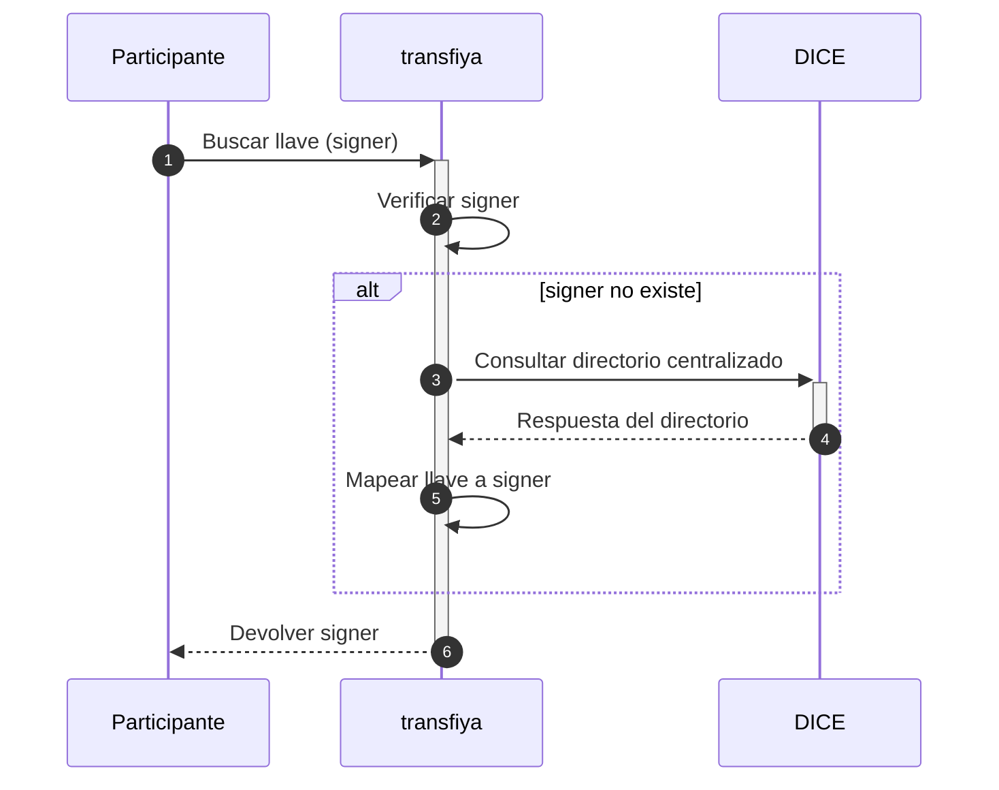

## Introducción

El flujo regulatorio exige la resolución de llaves como requisito previo al inicio de cualquier transferencia, constituyendo el cambio fundamental para los participantes de Transfiya.

Actualmente, el sistema Transfiya permite a los usuarios realizar transferencias monetarias a llaves como ser el numero de teléfono, lo que simplifica significativamente tanto la experiencia de usuario como el proceso de incorporación al sistema.

Transfiya permite el envío de transferencias directamente a los signers, lo que permite completar transacciones de forma inmediata sin requerir la aceptación del destinatario.

Este último modelo, regulado por la normativa Bre-B, establece como obligatoria la resolución de la llave antes de proceder con cualquier operación de transferencia.

Cualquier nuevo participante puede adoptar el modelo regulado y, simultáneamente, continuar enviando y recibiendo transferencias con los participantes existentes, independientemente de si éstos han migrado al nuevo flujo regulado.

## Flujo regulado

Los cambios de regulación requiren resolución de llaves antes de iniciar una transferencia.



Si no se encuentra la llave activa, significa que el usuario no está registrado en el sistema y la transferencia no puede procesarse bajo el modelo regulado.

Los participantes pueden migrar al nuevo flujo de forma independiente, sin necesidad de esperar otros participantes.

<Info>
	Las transferencias a billeteras con aceptación seguirán funcionando hasta la implementación completa de la regulación, garantizando la compatibilidad con los participantes actuales del sistema.
</Info>

## Ejemplos del API

### Obtener signers para un alias

```javascript HTTP
POST /v1/signer/lookup.dice
```
Los signers pueden consultarse a través del endpoint v1/signer/lookup.dice, enviando los parametros correspondientes. Para verificar el estado de un signer, revise el campo `labels.status`

<Info>
Para cubrir el caso de incorporación (onboarding), TransfiYa añade nuevas etiquetas al payload del firmante. Estas etiquetas representan las marcas de tiempo que los participantes necesitan recopilar:

- **received** → el momento en que un participante recibió una solicitud del usuario para incorporarse, cuando el usuario hace clic en la aplicación  
- **dispatched** → el momento en que un participante envió una solicitud de incorporación a Transfiya, cuando se llama a la API de creación de firmante
</Info>

---

| Parameter         | Type   | Description             |
| ----------------- | ------ | ----------------------- |
| aliasValue | string | Alias value. |
| received | string | Date of reception in ISO 8601 with milliseconds precision. |
| dispatched | string | Date of dispatch in ISO 8601 with milliseconds precision. |

---

<Tabs>
		<Tab title="Request">
			```js
			curl --location '{{url}}/v1/signer/lookup.dice' \
        --header 'Content-Type: application/json' \
        --header 'Authorization: Bearer <token>' \
        --data-raw '{
            "aliasValue": "@testing",
            "received": "2025-04-10T15:49:15.015-05:00",
            "dispatched": "2025-04-10T15:49:15.015-05:00"
        }'
			```
		</Tab>
		<Tab title="Response">
      ```json
     {
      "requestId": "019617d6-bac4-7150-8610-0dc60a0f1bc2",
      "signer_id": "0195b009-a139-7ff2-adac-15e3c3ecfc88",
      "id": "0195b009-a139-7ff2-adac-15e3c3ecfc88",
      "handle": "wYe6h63CNqoLxJet5jP1WWLhGi8D11ZGij",
      "keeper": [
        {
          "public": "7ef44ee7ff1f4527ef44ee7ff1f4527ef44ee7ff1f4527ef44ee7ff1f4527ef4",
          "scheme": "ecdsa-ed25519"
        }
      ],
      "labels": {
        "type": "PERSON",
        "status": "ACTIVE",
        "created": "2025-03-19T15:12:55.993-05:00",
        "updated": "2025-03-19T15:12:55.993-05:00",
        "createdBy": "mSJkneiASd",
        "aliasType": "ALPHANUM",
        "aliasValue": "@jorge",
        "proprietary": "CC",
        "identification": "1010101010",
        "firstName": "Jorge",
        "lastName": "Diaz",
        "bankId": "900123456",
        "bankAccountType": "SVGS",
        "bankAccountNumber": "4123456789",
        "routerReference": "$bancorojo",
        "targetSpbviCode": "TFY",
        "consented": "2025-03-13T20:38:07-05:00",
        "received": "2025-03-13T20:38:07.123-05:00",
        "dispatched": "2025-03-13T20:38:10.123-05:00"
      },
      "error": {
        "code": 0,
        "message": "Success"
      }
    }
      ```
		</Tab>
</Tabs>

### Códigos de Error

---

| Error Code | HTTP Status | Description                                      |
| ---------- | ----------- | ------------------------------------------------ |
| 99         | 400         | Unexpected server error                          |
| 100        | 403         | You don't have permissions to access this method |
| 100        | 500         | Runtime error |

---
