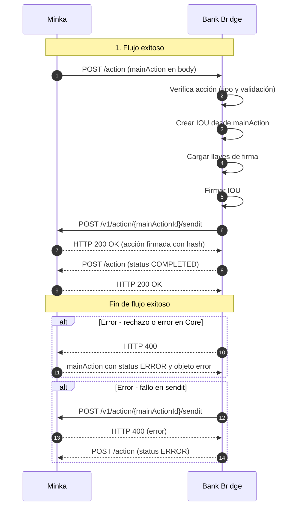

<Info>
⚠️ **IMPORTANTE:**  
Los objetos de error mostrados en los diagramas son ilustrativos. Pueden variar según la causa del error. El banco debe enviar el objeto de error correspondiente a la causa específica del fallo.
</Info>

TIN Cloud enviará acciones al banco a través de este endpoint para que sean firmadas.



## Solicitud de Minka en una transferencia tipo SEND

```json
{
   "source":"wLd9MEASjQQTYywoXnDNwTRpgwiDfyHj6U",
   "target":"$573123224353",
   "amount":"200.00",
   "symbol":"$tin",
   "labels":{
      "hash":"PENDING",
      "type":"SEND",
      "domain":"tin",
      "flowId":"buDwBxynDK4hvumBG",
      "status":"PENDING",
      "tx_ref":"buDwBxynDK4hvumBG",
      "created":"2022-08-04T10:46:51-05:00",
      "updated":"2022-08-04T10:47:59-05:00",
      "description":"DEV - REQUEST trx 01",
      "sourceChannel":"APP",
      "deviceFingerPrint":{
         "city":"Bogotá",
         "hash":"26fff5af6441f8e15a71e8d62c361714484b1b308c99e8eb68ca85e2a7e0dc58",
         "model":"Huawei Mate 20 Pro",
         "country":"Colombia",
         "operator":"Bharti Airtel Limited",
         "SIMCardId":"8991101200003204510",
         "ipAddress":"2001:0db8:85a3:0000:0000:8a2e:0370:7334",
         "mobileDevice":"990000862471854"
      }
   },
   "snapshot":{
      "source":{
         "signer":{
            "handle":"wLd9MEASjQQTYywoXnDNwTRpgwiDfyHj6U",
            "labels":{
               "type":"PERSON",
               "email":"Florida_Sawayn@yahoo.com",
               "mobile":"573123224352",
               "created":"2022-06-10T09:50:25-05:00",
               "bankName":"bancosanti",
               "lastName":"Sanford",
               "bankBicfi":"9574",
               "createdBy":"A16iU3t38Tygr70uO1qf",
               "firstName":"Cale",
               "description":"Investor",
               "proprietary":"CC",
               "identification":"1231231",
               "bankAccountType":"SVGS",
               "routerReference":"$bancosanti",
               "bankAccountNumber":"689",
               "countryOfResidence":"CO"
            }
         },
         "wallet":{
            "handle":"$573123224352",
            "labels":{
               "type":"PERSON",
               "created":"2022-06-10T09:54:42-05:00",
               "updated":"2022-06-10T09:54:42-05:00",
               "channelSms":"573123224352"
            },
            "signer":[
               "wLd9MEASjQQTYywoXnDNwTRpgwiDfyHj6U"
            ]
         }
      },
      "symbol":{
         "signer":{
            "handle":"wMxKCAzsQBiUURDU3xD3xuSbVo1S9jmf3d",
            "labels":{
               "created":"2018-10-19T20:23:22.041Z",
               "createdBy":"ZhrQA3vcm17h2RRO4LrJ"
            }
         },
         "wallet":{
            "handle":"$tin",
            "labels":{
               "type":"SYMBOL",
               "created":"2018-10-19T20:22:48.350Z",
               "updated":"1970-01-01T15:38:20-05:00",
               "createdBy":"ZhrQA3vcm17h2RRO4LrJ"
            },
            "signer":[
               "wMxKCAzsQBiUURDU3xD3xuSbVo1S9jmf3d"
            ],
            "default":"wMxKCAzsQBiUURDU3xD3xuSbVo1S9jmf3d"
         }
      },
      "target":{
         "signer":{
            "handle":"wVVPzAGAkv5a2AANEdmeActMpWhbByQ81v",
            "labels":{
               "firstName":"Otha",
               "lastName":"Lehner",
               "identification":"123456",
               "bankBicfi":"9574",
               "bankName":"bancosanti",
               "proprietary":"CC"
            }
         },
         "wallet":{
            "handle":"$573123224353",
            "labels":{
               "type":"PERSON",
               "created":"2022-06-10T09:57:21-05:00",
               "updated":"2022-06-10T11:19:10-05:00"
            },
            "signer":[
               "wVVPzAGAkv5a2AANEdmeActMpWhbByQ81v",
               "wVXQDT59RzXdPZD4CyK6z8FWebZmyZ9aHm"
            ]
         }
      }
   },
   "action_id":"bbffb8db-466c-403f-8c60-0bbd06261a6e",
   "error":{
      "code":0,
      "message":"Success"
   },
   "id":"bbffb8db-466c-403f-8c60-0bbd06261a6e"
}
```

<Steps>
<Step title="Leer datos locales del firmante">
El endpoint debe cargar la información local desde la base de datos usando `action.snapshot.source.signer.handle` y la cuenta bancaria relacionada.
</Step>

<Step title="Decidir aceptar o rechazar la transferencia">
Con base en la información cargada, el banco debe determinar si acepta o rechaza la transferencia.
</Step>

<Step title="Seleccionar el Keeper según el tipo de acción (labels.type)">
Dependiendo del tipo de acción (`action.labels.type`), el endpoint debe cargar el Keeper correspondiente:

- **SEND**: Cargar el Keeper del firmante del usuario origen.
- **REQUEST**: Cargar el Keeper del firmante del usuario origen.
- **REJECT**: Cargar el Keeper del firmante del usuario origen.
- **WITHDRAW**: Cargar el Keeper de la cuenta de liquidación del banco.
- **UPLOAD**: Cargar el Keeper de la cuenta de liquidación del banco. Esta acción se envía para firma en caso de transferencias fallidas en proceso. Es importante que el banco registre esta llamada, pero no debe ejecutar ningún movimiento en su core bancario. Solo debe firmar la acción con el Keeper correspondiente.
- **DOWNLOAD**: Cargar el Keeper del firmante del usuario origen. Al igual que UPLOAD, se usa para firmar transferencias fallidas. No se deben ejecutar movimientos en el core bancario, solo firmar la acción.
- **CLAIM**: Cargar el Keeper de la cuenta de liquidación del banco. Este tipo de acción se firma en caso de reclamos para devolver fondos luego de que la transferencia esté en estado COMPLETED. Este proceso es gestionado entre los bancos y se administra a través del Dashboard.
</Step>

</Steps>

<Info icon="info">
Si se recibe un error como respuesta a esta llamada, se puede reintentar de forma segura usando exactamente la misma solicitud.
</Info>

<Info icon="info">
El banco firma la acción con las llaves mencionadas anteriormente y envía el IOU firmado a `POST /v1/action/{action_id}/sendit`.
</Info>

### Crear Claims

```json
{
  "source": action.snapshot.source.signer.handle, //Bank Signer Handle
  "target": action.snapshot.target.signer.handle, //User Signer Handle
  "symbol": action.snapshot.symbol.signer.handle, //Symbol Signer Handle
  "amount": action.amount,
  "domain": "tin",
  "expiry": "${expirationTime}" // currentTime + 1 minute in ISO8601 format, example "2021-11-03T13:50:41.431Z"
}
```

### Cargar las llaves (dependiendo del caso descrito en el paso 3)

```json
[
  {
    "public": "PUBLIC_KEY",
    "secret": "SECRET_KEY",
    "scheme": "KEEPER_SCHEME",
    "signer": "SIGNER_HANDLE"
  }
]
```

## Firmar el IOU

```json
{
  "hash": {
    "types": "sha256:sha256",
    "steps": "stringify:data",
    "value": "31abac5167fbb603d9300e9dfaf94b721efdc12c0728a615f9717b944a3fa779"
  },
  "data": {
    "source": "wLd9MEASjQQTYywoXnDNwTRpgwiDfyHj6U",
    "target": "wVVPzAGAkv5a2AANEdmeActMpWhbByQ81v",
    "symbol": "wMxKCAzsQBiUURDU3xD3xuSbVo1S9jmf3d",
    "amount": "200.00",
    "domain": "tin",
    "expiry": "2022-08-04T16:36:56.631Z",
    "random": "d50860eb2209de5cfbfd"
  },
  "meta": {
    "signatures": [
      {
        "scheme": "ecdsa-ed25519",
        "signer": "wLd9MEASjQQTYywoXnDNwTRpgwiDfyHj6U",
        "public": "0420b4b9dc4b022b5251aacee333f496f9c7fe6555824be9ecf96bc9adbcd5e7a813e7e03d63542a240ed4d58f0f079fe36c2a73e9c9a9068606f1a8f5aba9f243",
        "string": "304402200fd7a0cef6e4ab4936aa2d15be933a5aab82cd556bf98fd5090e779819cb1afe02200e327d0b3ce44291c23bff4387ee9cd8cdb7308fa0453f4bac007d0c621c1a13",
        "linker": "sha256:ripemd160"
      }
    ]
  }
}
```

## Enviar IOU firmado a /v1/action/{action_id}/sendit y recibir acción con estado COMPLETED

```json
{
  "source": "wLd9MEASjQQTYywoXnDNwTRpgwiDfyHj6U",
  "target": "$573123224353",
  "amount": "200.00",
  "symbol": "$tin",
  "labels": {
    "hash": "82de7c0b8b34c7ca6c52547161b2629b1c1e6bdef402999ad60266e6760e4d24",
    "type": "SEND",
    "domain": "tin",
    "flowId": "buDwBxynDK4hvumBG",
    "status": "COMPLETED",
    "tx_ref": "buDwBxynDK4hvumBG",
    "created": "2022-08-04T10:46:51-05:00",
    "updated": "2022-08-04T10:47:59-05:00",
    "description": "DEV - REQUEST trx 01",
    "sourceChannel": "APP",
    "deviceFingerPrint": {
      "city": "Bogotá",
      "hash": "26fff5af6441f8e15a71e8d62c361714484b1b308c99e8eb68ca85e2a7e0dc58",
      "model": "Huawei Mate 20 Pro",
      "country": "Colombia",
      "operator": "Bharti Airtel Limited",
      "SIMCardId": "8991101200003204510",
      "ipAddress": "2001:0db8:85a3:0000:0000:8a2e:0370:7334",
      "mobileDevice": "990000862471854"
    },
    "iouHash": "31abac5167fbb603d9300e9dfaf94b721efdc12c0728a615f9717b944a3fa779"
  },
  "error": {
    "code": 0,
    "message": "Success"
  }
}
```
Respuesta 400 - ERROR
```json
{
  "action_id": "ee991f91-e118-4ecf-9fa7-fadd36a15c0e",
  "source": "wsource_user_bridge_address",
  "target": "$target_user_phone_number",
  "symbol": "$tin",
  "amount": "AMOUNT",
  "labels": {
    "tx_ref": "CUS",
    "type": "SEND",
    "status": "ERROR",
    ...
  },
  "error": {
    "code": 3XX,
    "message": "BANK_ERROR_MESSAGE"
  }
}
```