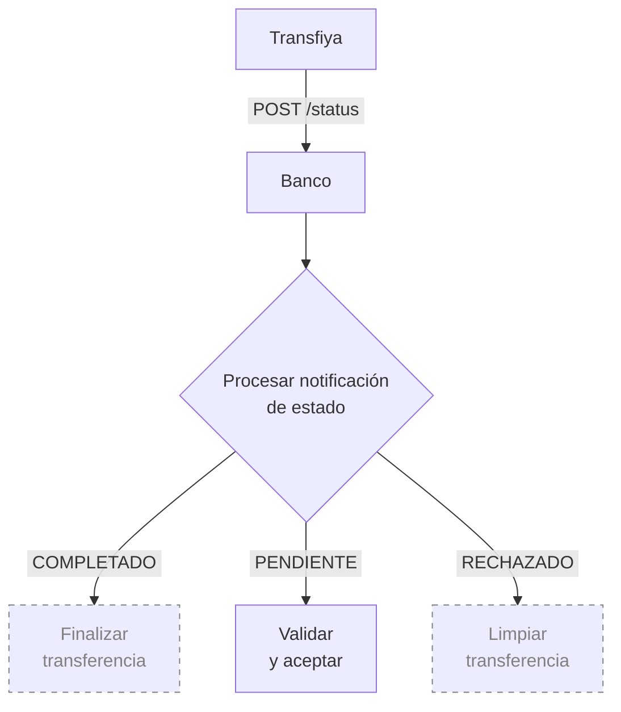
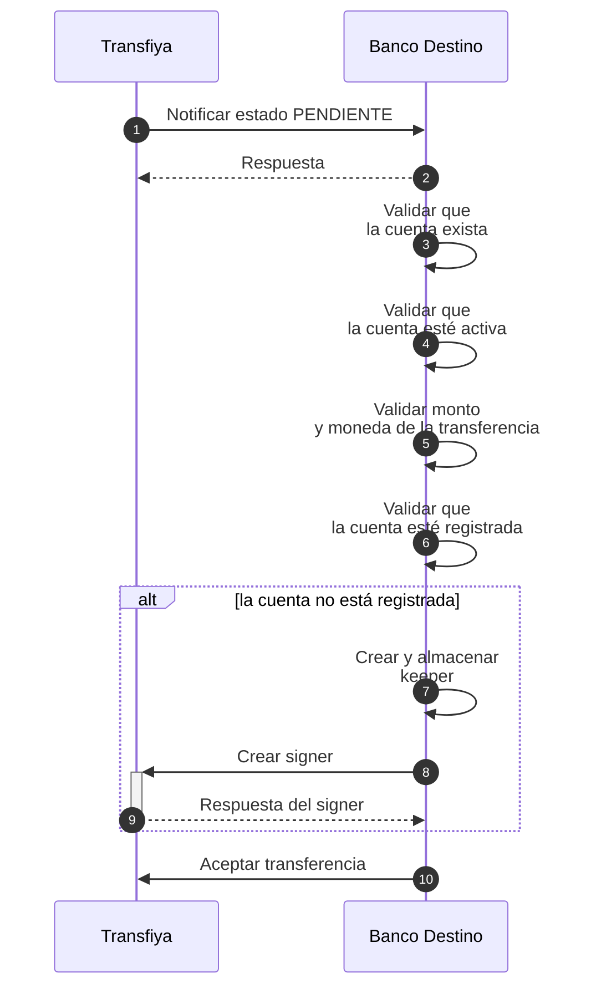

## Validación de aceptación por el banco destino

Una vez realizado el débito, Transfiya ejecuta controles antifraude sobre la transferencia y contacta al banco destino para solicitar la aceptación del pago. Este paso permite al banco receptor validar la información de la cuenta destino y confirmar que el pago puede ser recibido correctamente.

<Info>
  Durante esta etapa, el banco DEBE realizar las siguientes validaciones:

  Que la cuenta destino exista.

  Que la cuenta esté activa y habilitada para recibir pagos.

  Que la moneda de la cuenta coincida con la moneda de la transferencia.

  Que el monto de la transferencia no supere los límites previamente definidos.
</Info>

La notificación de este paso se realiza mediante el endpoint status. Este endpoint es utilizado por Transfiya para comunicar los cambios de estado de las transferencias a las entidades participantes.

Los estados actualmente soportados por este endpoint son:

PENDING: la transferencia está pendiente de aceptación por parte del banco destino.

COMPLETED: la transferencia se ha completado exitosamente.

REJECTED: la transferencia fue rechazada debido a un error durante el procesamiento.

<Tip>
  Las validaciones de aceptación DEBEN realizarse inmediatamente cuando la transferencia entra en estado PENDING.
</Tip>

Para aceptar una transferencia, el banco debe reaccionar a la notificación enviada por Transfiya con estado PENDING. Esta notificación indica que la transferencia está en espera de validación por parte del banco destino.

<Info>
  En este capítulo nos enfocaremos exclusivamente en el manejo del estado PENDING a través del endpoint status. Los demás estados (COMPLETED y REJECTED) serán abordados más adelante en el flujo de procesamiento.
</Info>

## Aceptación de transferencia – Pasos detallados

<Info>
  A continuación detallamos los pasos del diagrama de secuencia con el detalle tecnico.
</Info>

Una vez realizado el débito al usuario origen y ejecutados los controles antifraude, Transfiya contacta al banco destino para solicitar la aceptación de la transferencia. Esta etapa es crítica para asegurar que el pago pueda ser recibido correctamente.

Durante esta fase, el banco receptor debe validar la cuenta de destino, el monto, la moneda y el registro del usuario dentro del ecosistema Transfiya. Esta validación se notifica mediante el endpoint status, el cual indica que la transferencia se encuentra en estado PENDING.

A continuación, se detallan los pasos que debe seguir el banco para aceptar correctamente una transferencia:
