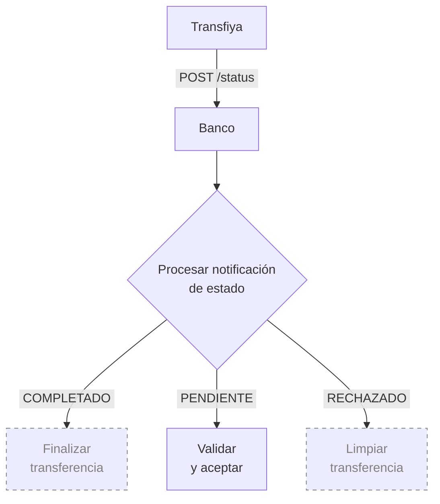
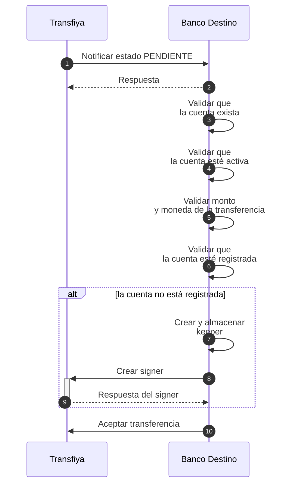

## Validación de aceptación por el banco destino

Una vez realizado el débito, Transfiya ejecuta controles antifraude sobre la transferencia y contacta al banco destino para solicitar la aceptación del pago. Este paso permite al banco receptor validar la información de la cuenta destino y confirmar que el pago puede ser recibido correctamente.

<Info>
  Durante esta etapa, el banco DEBE realizar las siguientes validaciones:

  Que la cuenta destino exista.

  Que la cuenta esté activa y habilitada para recibir pagos.

  Que la moneda de la cuenta coincida con la moneda de la transferencia.

  Que el monto de la transferencia no supere los límites previamente definidos.
</Info>

La notificación de este paso se realiza mediante el endpoint status. Este endpoint es utilizado por Transfiya para comunicar los cambios de estado de las transferencias a las entidades participantes.

Los estados actualmente soportados por este endpoint son:

PENDING: la transferencia está pendiente de aceptación por parte del banco destino.

COMPLETED: la transferencia se ha completado exitosamente.

REJECTED: la transferencia fue rechazada debido a un error durante el procesamiento.

<Tip>
  Las validaciones de aceptación DEBEN realizarse inmediatamente cuando la transferencia entra en estado PENDING.
</Tip>



Para aceptar una transferencia, el banco debe reaccionar a la notificación enviada por Transfiya con estado PENDING. Esta notificación indica que la transferencia está en espera de validación por parte del banco destino.

<Info>
  En este capítulo nos enfocaremos exclusivamente en el manejo del estado PENDING a través del endpoint status. Los demás estados (COMPLETED y REJECTED) serán abordados más adelante en el flujo de procesamiento.
</Info>

## Aceptación de transferencia – Pasos detallados



<Info>
  A continuación detallamos los pasos del diagrama de secuencia con el detalle tecnico.
</Info>

Una vez realizado el débito al usuario origen y ejecutados los controles antifraude, Transfiya contacta al banco destino para solicitar la aceptación de la transferencia. Esta etapa es crítica para asegurar que el pago pueda ser recibido correctamente.

Durante esta fase, el banco receptor debe validar la cuenta de destino, el monto, la moneda y el registro del usuario dentro del ecosistema Transfiya. Esta validación se notifica mediante el endpoint status, el cual indica que la transferencia se encuentra en estado PENDING.

A continuación, se detallan los pasos que debe seguir el banco para aceptar correctamente una transferencia:

<Steps>
  <Step title="Transfiya llama al endpoint `status` del banco destino con estado `PENDING`">
    Se realiza una solicitud `POST` al endpoint del banco con todos los datos relevantes de la transferencia. El campo `labels.status` estará en `PENDING`.

    <Tabs>
      <Tab title="Request">
        ```json
        POST https://ban.co/transfiya/status
        {
            "source": "wXxwpxB32saqfmfMxAQD4SVWWhhn6akLC2",
            "target": "wRFmYXS2sP9ho9VCZ3j4FuP1j55ABeFvsF",
            "amount": "100.00",
            "symbol": "$tin",
            "labels": {
                "hash": "PENDING",
                "type": "SENDMOL",
                "domain": "tin",
                "flowId": "Lf13jsK83omPv3bOt",
                "status": "PENDING",
                "tx_ref": "Lf13jsK83omPv3bOt",
                "tx_id": "20250114890915944TFY123456789012345",
                "received": "2025-01-14T20:40:57.322-05:00",
                "dispatched": "2025-01-14T20:40:58.322-05:00",
                "delivered": "2025-01-14T20:40:58.522-05:00",
                "created": "2025-01-14T20:40:57.322-05:00",
                "updated": "2025-01-14T20:40:57.322-05:00",
                "description": "Payment for lunch",
                "sourceChannel": "APP",
                "deviceFingerPrint": {
                "city": "Bogotá",
                "hash": "26fff5af6441f8e15a71e8d62c361714484b1b308c99e8eb68ca85e2a7e0dc58",
                "model": "Huawei Mate 20 Pro",
                "country": "Colombia",
                "operator": "Bharti Airtel Limited",
                "SIMCardId": "8991101200003204510",
                "ipAddress": "2001:0db8:85a3:0000:0000:8a2e:0370:7334",
                "mobileDevice": "990000862471854"
                }
            },
            "snapshot": {
                "source": {
                "signer": {
                    "handle": "wXxwpxB32saqfmfMxAQD4SVWWhhn6akLC2",
                    "labels": {
                    "name": "Maria Fernanda Gomez",
                    "proprietary": "CC",
                        "identification": "2020202020",
                    "bankAccountType": "SVGS",
                    "bankAccountNumber": "95445654254",
                    "bankId": "895554821",
                    "targetSpbviCode": "TFY"
                    }
                },
                },
                "symbol": {
                "signer": {
                    "handle": "wMxKCAzsQBiUURDU3xD3xuSbVo1S9jmf3d",
                    "labels": {
                    "created": "2018-10-19T20:23:22.041Z",
                    "createdBy": "ZhrQA3vcm17h2RRO4LrJ"
                    }
                }
                },
                "target": {
                "signer": {
                    "handle": "wRFmYXS2sP9ho9VCZ3j4FuP1j55ABeFvsF",
                    "labels": {
                    "name": "Jorge Alejandro Fernandez Garcia",
                    "proprietary": "CC",
                        "identification": "1010101010",
                    "bankAccountType": "SVGS",
                    "bankAccountNumber": "12345654321",
                    "bankId": "891234918",
                    "targetSpbviCode": "TFY"
                    }
                },
                }
            },
            "error": {
                "code": 0,
                "message": "Success"
            },
            "action_id": "35de4d3d-3aba-4fb3-b110-d004ce2aabb2",
            "id": "35de4d3d-3aba-4fb3-b110-d004ce2aabb2"
            }
        ```
      </Tab>
      <Tab title="Response">
        <Info>
          El banco destino responde para confirmar la recepción de la notificación. A partir de este punto, el procesamiento de la notificación es completamente asincrónico.
        </Info>
        ```json
        {
            "error": {
                "code": 0,
                "message": "Success"
            }
        }
        ```

        <Info>
          La respuesta no necesita contener un cuerpo; el banco solo debe devolver una respuesta HTTP `200` para confirmar la recepción del llamado.

          También se permite retornar un objeto JSON con el código de error `0` como indicación de que la llamada fue recibida sin errores.
        </Info>
      </Tab>
    </Tabs>
  </Step>
  <Step title="El banco valida que la cuenta de destino exista">
    Puede ser un `signer.handle` (si el usuario ya está registrado) o una referencia bancaria del tipo `tipo-cuenta:número-cuenta@dominio-banco`, por ejemplo: `svgs:1001001000@bank.io`.
  </Step>
  <Step title="Banco destino verifica que la cuenta esté activa y pueda recibir pagos">
    Si la cuenta está cerrada, bloqueada o suspendida, el banco debe rechazar la transferencia mediante el endpoint `/reject`, incluyendo un código como `825 - `**Target account validation error.**

    <Tabs>
      <Tab title="Error Request">
        ```json
        curl -X POST \
            -H "Content-Type: application/json" \
            -H "x-api-key: <API_KEY>" \
            -H "Authorization: Bearer <TOKEN>" \
            -d '{
                "received": "2025-01-14T20:41:00.252-05:00",
                "dispatched": "2025-01-14T20:41:00.552-05:00",
                "error": {
                "code": 825,
                "message": "Target account validation error"
                }
            }' "<TRANSFIYA URL>/v1/transfer/<tx_ref>/reject"
        ```

        <Info>
          Los bancos pueden rechazar transferencias llamando al endpoint `reject` de la transferencia e incluyendo un objeto `error` en el cuerpo con información adicional sobre el motivo del rechazo.

          Los códigos de error devueltos por los bancos deben estar dentro del rango `3xx`.
        </Info>
        | Field name   | Descripción en español                                                                                                                 |
        | ------------ | -------------------------------------------------------------------------------------------------------------------------------------- |
        | `<tx_ref>`   | El campo `<tx_ref>` en la URL representa la referencia de la transferencia, que puede encontrarse en `labels.tx_ref` del `mainAction`. |
        | `received`   | Marca de tiempo en formato ISO 8601. Representa el momento en que se recibió la llamada `status` desde Transfiya.                      |
        | `dispatched` | Marca de tiempo en formato ISO 8601. Representa el momento en que se envió la llamada `reject` hacia Transfiya.                        |
      </Tab>
      <Tab title>
        
      </Tab>
    </Tabs>
  </Step>
  <Step title="Banco destino valida que la moneda y el monto sean válidos para la cuenta">
    En caso de discrepancia, la operación debe rechazarse con un código de error como **834**`-`**Exceeds target bank maximum amount.**
