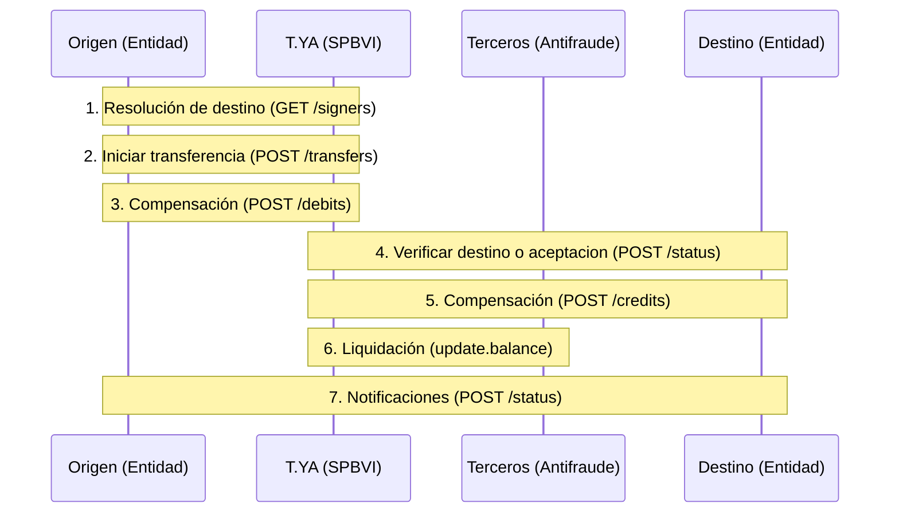
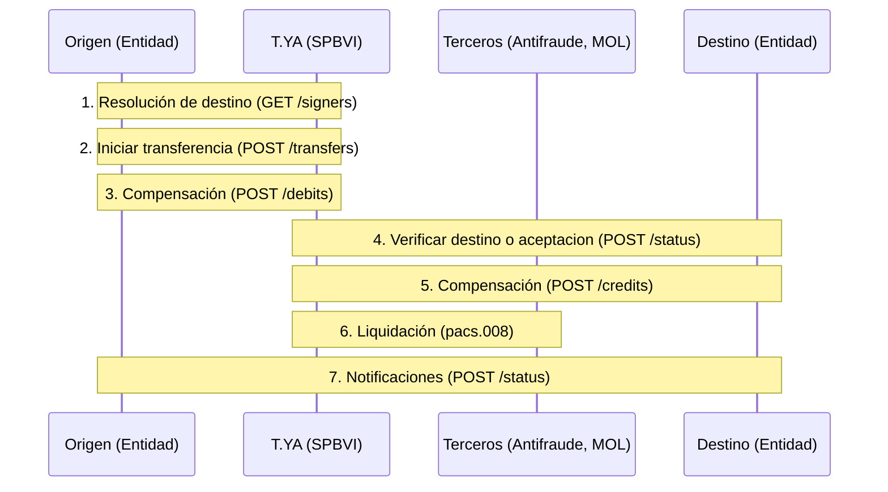

# Sobre flujos

## ¿Como funciona un flujo de pago en Transfiya?

Un sistema de pagos en tiempo real es responsable para orchestrar transferencias entre las participantes, calcular posiciones de participantes y realizar pagos en tiempo real.

Transfiya usa el modelo de orchestracion que coordina debitos, creditos y sistemas externos usando un modelo de flujos.

Flujo de transferencias en tiempo real incluye los siguientes pasos:
1. **Resolución de destino**: El sistema de pagos en tiempo real verifica la validez de la cuenta destino. (Opcional)
2. **Iniciacion de transferncia**: El sistema calcula las posiciones de las participantes en función de las transferencias realizadas.
3. **Compensación (debito)**: El sistema orchestra el debito por parte de participantes.
4. **Validacion de cuenta destino**: El sistema valida la cuenta destino usando el proceso de aceptacion automatico o manual por lado del usuario. (Aceptacion)
5. **Liquidacion (Confirmacion)**: El sistema realiza los pagos en tiempo real a las participantes. (Sobre garantias)
6. **Compensacion (creidto)**: El sistema realiza los pagos en tiempo real a las participantes.
7. **Notificaciones**: El sistema realiza los pagos en tiempo real a las participantes.

Siguiendo mejores prácticas, Transfiya coordina los débitos para todos los casos de uso, incluyendo pagos Pull y solicitudes de pago.

El modelo de aceptación de Transfiya permite transferencias a cuentas o llaves no registradas en el sistema.

Transfiya implementa un modelo de garantías que asegura la liquidación en tiempo real para todos los participantes.

## ¿Que diferencias tiene flujo regulado?

Sistema Bre-B no regula los interaciones internas de sistemas de SPBVI y es enfocado en temas de interoperabilidad de directorios y liquidacion.

Las diferencias clave entre el flujo actual de Transfiya y el flujo regulado incluyen: la resolución de destino obligatoria, la validación obligatoria de la cuenta destino, y la liquidación a través de un sistema de banco central.

> El flujo actual de los participantes, que incluye procesos de débito, crédito y aceptación (verificación), permite que las entidades cumplan con los requisitos operativos sin necesidad de realizar cambios en la integración de sus sistemas core.

Flujo de transferencias regulados tiene siguientes cambios:
1. **Resolución de destino**: El sistema de pagos en tiempo real verifica la validez de la cuenta destino. (Resolucion de llave)
2. **Iniciacion de transferencia**: El sistema calcula las posiciones de las participantes en función de las transferencias realizadas.
3. **Compensación (debito)**: El sistema realiza los pagos en tiempo real a las participantes. (Regulacion actual asume que debito fue realizado)
4. **Validacion de cuenta destino**: El sistema realiza los pagos en tiempo real a las participantes. (Verificacion de cuenta)
5. **Liquidacion (Confirmacion)**: El sistema realiza los pagos en tiempo real a las participantes. (Sobre Mol)
6. **Compensacion (credito)**: El sistema realiza los pagos en tiempo real a las participantes.
7. **Notificaciones**: El sistema realiza los pagos en tiempo real a las participantes.

## ¿Como funcionan transfernecias entre sistemas SPBVI ?

## ¿Cual es la diferencia entre flujos regulados y no regulados?

Transfiya es una empresa de servicios de pago en línea que cumple con la regulación de SPI. La empresa ofrece una plataforma segura y confiable para realizar pagos en línea y transferencias de fondos.
